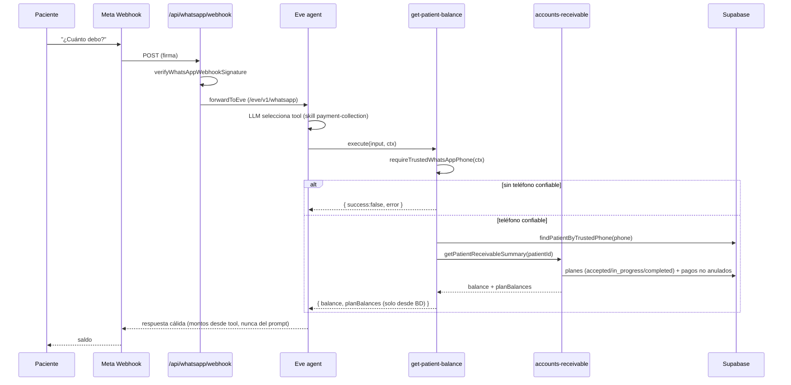
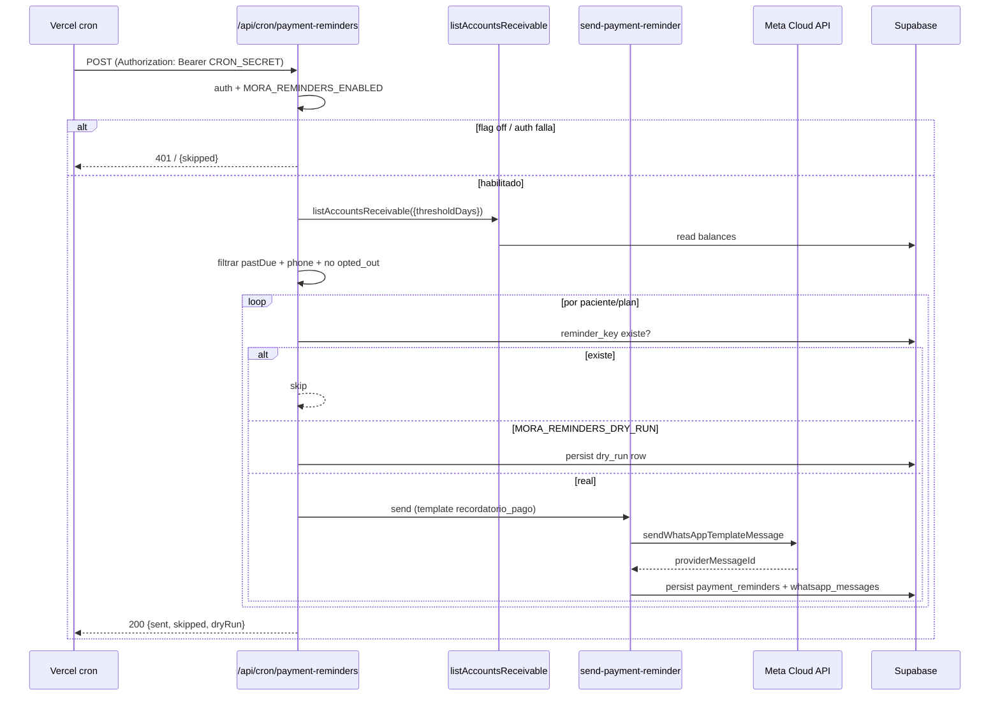

# Design: Fase 4 — "Mora" payments & arrears agent over WhatsApp

## Technical Approach

Extend the single existing Eve agent with collections capability rather than add a second agent. Four new
capabilities are delivered: two read tools (`get-patient-balance`, `list-overdue-balances`), one write tool
(`register-payment-intent`), and one deterministic outbound action (`send-payment-reminder`) that is *not* a
patient-facing tool but the server-side send primitive behind a greenfield Vercel cron. All balance reads reuse
`src/lib/admin/accounts-receivable.ts` unchanged (its `ELIGIBLE_PLAN_STATUSES` and non-voided-payment filtering are
the guardrail), and every balance reveal is gated by `requireTrustedWhatsAppPhone` exactly as
`list-my-appointments` does today. No amounts are ever passed through the prompt as inputs; the backend computes
every figure from the DB and the LLM only formats the reply.

The three open decisions from the proposal resolve as: (a) same-agent tools (Approach 1), (b) Vercel cron →
new API route → new Meta **template** send primitive (with a dry-run default until template approval), and
(c) a dedicated `payment_intents` table (plus a `payment_reminders` table for scheduler idempotency).

This matches the `mora-agent` delta spec (new capability). No change to `whatsapp-inbound-automation` is required
under Approach 1 because intent routing is the single agent's tool selection, not webhook-level routing; the
closed `whatsapp_intents.intent_type` CHECK enum is therefore **not** extended.

---

## Architecture Decisions

### Decision 1: Agent topology — extend the same Eve agent (Approach 1)

**Choice**: Add the collections tools and skill to the existing Eve agent (`agent/`). No second agent, no subagent.

**Alternatives considered**:
- *Separate "Mora" agent with its own `agent/` module sharing the WhatsApp number, routed at the webhook.*
  Rejected: `app/api/whatsapp/webhook/route.ts` routes only `Eve` vs `legacy` (lines 38-47); there is no
  agent-vs-agent routing and no precedent for two agents binding one WhatsApp number/route. `agent/channels/whatsapp.ts`
  binds the single number via `chatSdkChannel` + `createWhatsAppAdapter`; a second binding risks double-binding
  `/eve/v1/*`.
- *Eve subagent for collections.* Rejected: `agent/eve-shim.d.ts` declares only `defineAgent`, `defineTool`,
  `chatSdkChannel` — **no subagent API**. Subagents are documented (`docs/eve/eve-migration-plan.md` §6.5) but
  unexercised: no `agent/subagents/`, no shim, no tests. Betting the change on it is speculative.

**Rationale**: Zero routing change (tools are auto-discovered from `agent/tools/*.ts`; there is no manifest and no
`agent.ts` edit needed). `accounts-receivable` is a drop-in read source; `requireTrustedWhatsAppPhone` and the
read-only `findPatientByTrustedPhone` helper (already used by `list-my-appointments.ts` lines 48-57) are reused
unchanged. `list-my-appointments.ts` is the exact template for the two read tools. This is the lowest-risk path and
matches the stage-by-stage SDD precedent (`eve-stage-1..6`).

**Mitigation for the "instructions.md grows long" con**: the collections guardrails live in a distinct
`## Colecciones / Mora` section of `instructions.md` that *delegates* the procedure to `payment-collection.md`,
mirroring how `clinical-escalation`/`booking-flow` are already structured (skills carry detail, instructions carry
the guardrail + pointer).

---

### Decision 2: Outbound mechanism — Vercel cron → new route → Meta template send (dry-run default)

**Choice**: Vercel cron (`vercel.json` `crons`) hitting a new `app/api/cron/payment-reminders/route.ts`, sending via
a new `sendWhatsAppTemplateMessage` primitive. Frequency: daily at **09:00 `America/Mexico_City`** (= `0 15 * * *`
UTC; Mexico City no longer observes DST, so the offset is fixed at UTC-6). Default to **dry-run** until the Meta
template is approved.

**Alternatives considered**:
- *`pg_cron`.* Rejected: no Postgres scheduler exists anywhere (exploration: repo-wide grep for `cron`/`pg_cron`/
  `scheduled` finds nothing scheduling-related), and `vercel.json` is already the deploy config — a `crons` entry is
  the smallest greenfield addition.
- *Free-form `sendWhatsAppTextMessage` for proactive reminders.* Rejected as the *primary* path: proactive
  reminders are business-initiated and Meta requires an approved **template/HSM**; `sendWhatsAppTextMessage`
  (`src/lib/whatsapp/client.ts` lines 41-106) sends only `type: "text"`. Free-form text is only legal inside the
  customer-service window (24h after an inbound message), which a fixed daily cron cannot guarantee.

**Rationale**: Smallest greenfield addition, no new infrastructure, idempotent and flag-gated. The template is the
hard external dependency, so the job ships in dry-run and only flips to real sends once Meta approves the template.

**Template / HSM compliance (resolved)**:
- Add `sendWhatsAppTemplateMessage` to `src/lib/whatsapp/client.ts`: POST `type: "template"` with
  `template: { name, language: { code: "es_MX" }, components: [{ type: "body", parameters: [...] }] }`, mirroring
  the existing credential resolution and error contract of `sendWhatsAppTextMessage`.
- Template name `recordatorio_pago` (body placeholders `{{1}}` = patient name, `{{2}}` = balance MXN,
  `{{3}}` = days overdue). This template MUST be approved in the Meta WhatsApp Manager before the flag flips out of
  dry-run.
- **Fallback if template approval stalls**: keep the job in dry-run; the *human-initiated* path remains fully
  functional (a patient asking "¿cuánto debo?" gets an in-window free-form reply via the agent tools). Proactive
  reminders simply do not send until approval. No free-form outbound is attempted outside the customer-service window.

**Feature flags** (mirror `WHATSAPP_EVE_ENABLED`/`isEveWhatsAppEnabled` truthiness):
- `MORA_REMINDERS_ENABLED` — gates whether the cron route performs any work.
- `MORA_REMINDERS_DRY_RUN` — default `true`: compute + persist `payment_reminders` rows with `dry_run=true`, send
  nothing. `false` (only after template approval) sends real template messages.
- `CRON_SECRET` — the route rejects requests whose `Authorization: Bearer` does not match (Vercel cron auth).

**Idempotency**: `payment_reminders.reminder_key` (unique) is `patient:{id}:plan:{planId}:{periodStart}` where the
period is weekly (remind a patient at most once per 7 days per plan). Dedupe happens **before** send (unique key) and
**after** send (provider message id) to keep the job safe on cron re-runs.

---

### Decision 3: Payment-intent storage — new `payment_intents` table

**Choice**: Introduce a dedicated `payment_intents` table (structured `amount`, optional `treatment_plan_id`,
`status`, timestamps, WhatsApp linkage), plus a `payment_reminders` table for scheduler idempotency. One migration
(`0017`).

**Alternatives considered**:
- *Reuse `whatsapp_escalations` + a note.* Rejected: `whatsapp_escalations` (migration `0006` lines 84-99) has
  `reason, priority, status, summary, assigned_to, message_id, intent_id` — **no amount or plan column**. Reuse would
  force the amount/plan into free-text `summary`, losing structured queryability and the admin UI's ability to
  filter by amount/plan. The escalation still fires *alongside* the intent (see `register-payment-intent`), but the
  structured record lives in its own table.
- *Extend `whatsapp_intents.intent_type` with a `payment` value.* Rejected as unnecessary: under Approach 1 the
  collection flow runs inside Eve, whose escalation path already writes `whatsapp_intents` with `intent: 'support'`
  (a valid enum value). No new enum value is needed, so the closed CHECK (migration `0006` line 74) is left intact.

**Rationale**: Structured amount/plan/status is the point of "intent to pay" (it must be surfaced and triaged in the
WCC, then reconciled against the Fase-3 `payments` ledger by a human). A dedicated table mirrors the existing
`wcc-escalations` data-layer pattern and costs exactly one migration + one data layer + one WCC section. `payments`
remains the *actual* ledger; `payment_intents` never moves money.

---

### Supporting decisions

- **`send-payment-reminder` is NOT a patient-facing tool.** It is the deterministic outbound action invoked by the
  cron route (`src/lib/payments/send-payment-reminder.ts`). Exposing it as an agent tool would let any patient
  trigger business-initiated messaging (template abuse) and invert the "backend decides, backend executes" principle.
  The agent therefore gains **3** new tools; the 4th capability is the server-side reminder sender.
- **`list-overdue-balances` is patient-scoped, not staff-scoped.** The patient agent MUST NOT surface
  `listAccountsReceivable` (which returns every patient) — that would be a PII leak. `list-overdue-balances` returns
  only the *trusted caller's own* overdue plans (`getPatientReceivableSummary(...).planBalances.filter(isPastDue)`).
  Staff-wide listing stays in the existing admin API `/api/admin/accounts-receivable`.
- **Balance vs "no precios" guardrail.** The existing rule "no dar precios ni costos definitivos" forbids *new*
  price quoting. Stating a DB-derived balance of an already-`accepted` plan is allowed and is the whole point of
  Mora. The instructions are updated to make this distinction explicit: reveal balances of accepted/in-progress/
  completed plans only; never quote new prices, non-accepted plans, or invent amounts.

---

## Data Flow

### Inbound balance inquiry (same agent, tool selection)

```
Patient ──▶ Meta Webhook ──▶ /api/whatsapp/webhook (signature verify)
        ──▶ forwardToEve (/eve/v1/whatsapp) ──▶ Eve agent (single agent)
              LLM selects tool via payment-collection.md skill
              get-patient-balance / list-overdue-balances / register-payment-intent
                └─ requireTrustedWhatsAppPhone(ctx)  [identity lock]
                └─ findPatientByTrustedPhone(phone)  [read-only]
                └─ getPatientReceivableSummary(patientId, {thresholdDays})
                     └─ accounts-receivable: ELIGIBLE_PLAN_STATUSES + non-voided payments
                └─ (write) insert payment_intents + createEveWhatsAppEscalation(support)
        ──▶ LLM drafts warm reply (amounts from tool output, never the prompt)
```

### Proactive reminder (outbound, cron)

```
Vercel cron (0 15 * * * UTC = 09:00 CST)
  ──▶ POST /api/cron/payment-reminders  (CRON_SECRET auth)
        MORA_REMINDERS_ENABLED? ──no──▶ 200 {skipped}
        listAccountsReceivable({thresholdDays})
          filter: pastDuePlans.length>0 && phone_e164 && whatsapp contact not opted_out
          for each: reminder_key = patient:plan:period → skip if exists
          MORA_REMINDERS_DRY_RUN? ──yes──▶ persist dry_run row, send nothing
          ──no──▶ sendWhatsAppTemplateMessage(recordatorio_pago, params)
                  ──▶ persist payment_reminders + whatsapp_messages (outbound)
```

---

## File Changes

| File | Action | Description |
|------|--------|-------------|
| `agent/tools/get-patient-balance.ts` | Create | Read tool: trusted phone → patient → `getPatientReceivableSummary`; returns total balance + per-plan balances + past-due flags. |
| `agent/tools/list-overdue-balances.ts` | Create | Read tool: same lookup, returns only the caller's own `isPastDue` plans. Patient-scoped. |
| `agent/tools/register-payment-intent.ts` | Create | Write tool: inserts `payment_intents` + escalates to human (`createEveWhatsAppEscalation`, `intent: 'support'`). No money movement. |
| `agent/skills/payment-collection.md` | Create | Procedure: intent → balance read → present DB balance → intent-to-pay vs dispute/waiver escalation. Spanish de México. |
| `agent/instructions.md` | Modify | Add `## Colecciones / Mora` guardrail section + tool guidance + skill pointer; clarify "balance vs new-price" rule. |
| `src/lib/whatsapp/client.ts` | Modify | Add `sendWhatsAppTemplateMessage` (type `template`, `es_MX` language, body parameters). |
| `src/lib/payments/payment-intents.ts` | Create | Data layer: `createPaymentIntent({patientId, treatmentPlanId?, amount?, commitmentText?, notes?, source})`. |
| `src/lib/payments/send-payment-reminder.ts` | Create | Deterministic outbound action: build reminder, call `sendWhatsAppTemplateMessage`, record `payment_reminders` + outbound message. |
| `app/api/cron/payment-reminders/route.ts` | Create | Cron endpoint: CRON_SECRET auth → flag gate → selection → dry-run/send → idempotent record. |
| `supabase/migrations/0017_payment_intents_reminders.sql` | Create | `payment_intents` + `payment_reminders` tables, indexes, RLS, admin-all policies (mirror `0006`). |
| `src/lib/wcc-payments.ts` | Create | Admin data layer mirroring `wcc-escalations.ts` (read `payment_intents` + `payment_reminders`). |
| `app/(admin)/whatsapp-command-center/payments/page.tsx` | Create | WCC "Pagos / Recordatorios" page (intents queue + sent reminders). |
| `app/(admin)/whatsapp-command-center/layout.tsx` | Modify | Add nav entry `{ href: '/whatsapp-command-center/payments', label: 'Pagos' }`. |
| `vercel.json` | Modify | Add `"crons": [{ "path": "/api/cron/payment-reminders", "schedule": "0 15 * * *" }]`. |
| `src/lib/admin/accounts-receivable.ts` | Modify (optional) | Export `ELIGIBLE_PLAN_STATUSES` (currently module-private) if reminder sender wants to re-assert eligibility at the edge; otherwise unchanged. |

**No changes** to `agent/agent.ts` (tools auto-discovered), `agent/channels/whatsapp.ts`, `agent/trusted-contact-context.ts`,
`app/api/whatsapp/webhook/route.ts` (no agent-vs-agent routing), or `whatsapp_intents` (no enum extension).

---

## Interfaces / Contracts

All tools follow the existing `defineTool` + zod + `execute(input, ctx?: TrustedContactToolContext)` contract.
Write tools take the `TrustedContactToolContext` second argument; read tools use `requireTrustedWhatsAppPhone(ctx, …)`
exactly like `list-my-appointments.ts`.

### Tool 1 — `get-patient-balance` (read)

```ts
const getPatientBalanceInputSchema = z.object({
  thresholdDays: z.number().int().positive().optional(), // default 30 (parseThresholdDays)
});

// execute(input, ctx):
//   const phone = requireTrustedWhatsAppPhone(ctx, SECURITY_REFUSAL)   // { phone } | { error }
//   const patient = await findPatientByTrustedPhone(phone)              // read-only, no create
//   if (!patient) return { success: true, patientFound: false, message: "…" }
//   const s = await getPatientReceivableSummary(patient.id, { thresholdDays })

// Returns:
{
  success: true,
  patientFound: true,
  patientName: string,
  balance: number,            // = s.balance (DB-derived)
  totalEligibleAmount: number,
  paidAmount: number,
  creditAmount: number,       // > 0 when overpaid
  lastPaymentAt: string | null,
  planBalances: Array<{
    treatmentPlanId: string;
    name: string;
    status: TreatmentPlanStatus;
    totalAmount: number;
    paidAmount: number;
    balance: number;
    daysPastDue: number;
    isPastDue: boolean;
  }>,
  message: string,
}
```

### Tool 2 — `list-overdue-balances` (read, patient-scoped)

```ts
const listOverdueBalancesInputSchema = z.object({
  thresholdDays: z.number().int().positive().optional(),
});

// execute(input, ctx):
//   same trusted-phone → patient → getPatientReceivableSummary(patient.id, { thresholdDays })
//   overdue = summary.planBalances.filter(p => p.isPastDue)
// Returns { success, patientFound, overduePlans: [...planBalances where isPastDue], message }
// NEVER returns other patients' rows (listAccountsReceivable is staff-only, admin API).
```

### Tool 3 — `register-payment-intent` (write)

```ts
const registerPaymentIntentInputSchema = z.object({
  amount: z.number().positive().optional(),          // patient-stated amount, optional
  treatmentPlanName: z.string().trim().optional(),   // resolves to plan only if unambiguous & eligible
  commitment: z.string().trim().optional(),          // "la próxima semana", "el viernes"
  method: z.enum(['cash', 'card', 'transfer', 'other']).optional(),
  notes: z.string().trim().optional(),
  trustedContactSource: z.literal('whatsapp').optional(),
  trustedPatientPhone: z.string().optional(),
});

// execute(input, ctx):
//   selectPatientPhone(input, "…", ctx)                      // { phone } | { error }
//   patient = findPatientByTrustedPhone(phone) (read-only)
//   planId = treatmentPlanName ? resolveEligiblePlan(patient.id, name) : undefined   // accepted|in_progress|completed only
//   createPaymentIntent({ patientId, treatmentPlanId: planId, amount, commitmentText: commitment, notes, source: 'whatsapp' })
//   escalation = await createEveWhatsAppEscalation({ patientPhone, reason: 'payment_intent', summary, intent: 'support' })
// Returns { success, intent: { id, status: 'pending' }, escalation: { id, created }, humanAlert: {...} }
```

### Outbound action — `send-payment-reminder` (server-side, not a tool)

```ts
// src/lib/payments/send-payment-reminder.ts
type SendPaymentReminderInput = {
  patientId: string;
  treatmentPlanId: string;
  patientPhoneE164: string;
  balance: number;          // snapshot from listAccountsReceivable
  daysPastDue: number;
  periodKey: string;        // weekly period, e.g. "2026-W39"
  dryRun: boolean;
};
type SendPaymentReminderResult = {
  reminderKey: string;      // patient:{id}:plan:{planId}:{periodKey}
  sent: boolean;
  skipped: boolean;         // true when reminder_key already exists
  providerMessageId?: string;
  error?: string;
};
```

### New send primitive — `sendWhatsAppTemplateMessage`

```ts
// src/lib/whatsapp/client.ts (added, mirrors sendWhatsAppTextMessage)
export type WhatsAppSendTemplateInput = {
  to: string;
  templateName: string;                 // "recordatorio_pago"
  languageCode?: string;                // default "es_MX"
  bodyParameters: { type: 'text'; text: string }[];  // {{1}} name, {{2}} balance, {{3}} days
  phoneNumberId?: string;
};
export async function sendWhatsAppTemplateMessage(
  input: WhatsAppSendTemplateInput, fetchImpl = fetch
): Promise<WhatsAppSendResult>;        // reuses WhatsAppSendResult contract
```

### Schema (migration `0017`)

```sql
-- payment_intents — structured "intent to pay"; never moves money.
create table if not exists payment_intents (
  id uuid primary key default gen_random_uuid(),
  patient_id uuid not null references patients(id) on delete cascade,
  treatment_plan_id uuid references treatment_plans(id) on delete set null,
  whatsapp_contact_id uuid references whatsapp_contacts(id) on delete set null,
  intent_source text not null default 'whatsapp' check (intent_source in ('whatsapp','manual')),
  amount numeric(12,2) check (amount is null or amount > 0),
  commitment_text text,
  method text check (method is null or method in ('cash','card','transfer','other')),
  status text not null default 'pending' check (status in ('pending','confirmed','fulfilled','cancelled')),
  notes text,
  created_at timestamptz not null default now(),
  updated_at timestamptz not null default now()
);
-- + indexes on (patient_id, created_at desc), (status); RLS enable + admin-all policy.

-- payment_reminders — scheduler idempotency + audit.
create table if not exists payment_reminders (
  id uuid primary key default gen_random_uuid(),
  patient_id uuid not null references patients(id) on delete cascade,
  treatment_plan_id uuid references treatment_plans(id) on delete set null,
  contact_id uuid references whatsapp_contacts(id) on delete set null,
  reminder_key text not null unique,          -- patient:{id}:plan:{planId}:{period}
  template_name text not null default 'recordatorio_pago',
  status text not null default 'scheduled' check (status in ('scheduled','sent','skipped','failed')),
  dry_run boolean not null default true,
  balance_at_send numeric(12,2),
  provider_message_id text,
  sent_at timestamptz,
  error text,
  created_at timestamptz not null default now(),
  updated_at timestamptz not null default now()
);
-- + index on (patient_id, created_at desc); RLS enable + admin-all policy.
```

---

## Testing Strategy

| Layer | What to Test | Approach |
|-------|-------------|----------|
| Unit (Vitest) | `get-patient-balance` / `list-overdue-balances` return DB-derived amounts and refuse without a trusted phone; never accept a chat-typed phone | Mirror `src/lib/admin/__tests__/accounts-receivable.test.ts`; assert `{ error }` when `ctx` has no trusted phone; assert non-`accepted` plans excluded. |
| Unit | `register-payment-intent` writes `payment_intents` + escalates; rejects non-eligible plan resolution; no `payments` row written | Data-layer test with mocked `getSupabaseAdmin`; assert `payment_intents` insert + escalation call; assert zero `payments` mutations. |
| Unit | `sendWhatsAppTemplateMessage` builds the correct `type: template` payload and degrades on missing creds | Follow `client.ts` existing fetch-injection pattern; assert skipped=true when creds absent. |
| Unit | Reminder selection/dedupe: `reminder_key` unique; past-due + opt-in + phone filters | Pure-function tests over `listAccountsReceivable` fixtures; assert opted-out / no-phone rows excluded. |
| Integration | Cron route end-to-end with dry-run | Route returns `{sent:0, skipped, dryRun:true}` and persists `payment_reminders` rows when `MORA_REMINDERS_DRY_RUN` unset/true. |
| E2E | RED guardrail tests (threat-matrix applicable rows) | See Threat Matrix below. |

**RED-first note**: the guardrail tests (non-accepted plans excluded; no balance without trusted phone; no PII leak
from `list-overdue-balances`) are written RED before the production paths, per `config.yaml` `apply.tdd: true`.

---

## Threat Matrix

Applicability: the change adds a **new API route with routing/authorization** (`/api/cron/payment-reminders`), a new
**outbound send path** (template), and a new **write path** (`payment_intents`). No shell commands, subprocesses,
VCS/PR automation, or executable-file classification are touched.

| Boundary | Minimum adversarial cases | Applicability | Design response | Planned RED tests |
|---|---|---|---|---|
| Documentation-like paths | `requirements.txt`, `CMakeLists.txt`, executable MD/MDX, `README.sh` | N/A — no file-execution boundary; tools operate only on Supabase rows | — | — |
| Git repository selection | `git -C`, relative/absolute paths | N/A — no git invocation | — | — |
| Commit state | staged, `commit -a`, empty index | N/A — no git write | — | — |
| Push state | tracking branch, first push, refspec | N/A — no remote push | — | — |
| PR commands | `--head`, env prefix, composed | N/A — no PR automation | — | — |

The three *applicable* trust boundaries are captured as explicit guardrail rows (not in the generic matrix above,
which is N/A): (1) **cron route auth** — `CRON_SECRET` mismatch → 401, no work performed; (2) **trusted-contact
gating** — no `trustedPatientPhone` → balance tools return an error, never a balance; (3) **balance eligibility** —
only `accepted|in_progress|completed` plans and non-voided payments are summed. Each gets a RED test: unauthorized
cron → 401; untrusted phone → error result; non-accepted plan → excluded from balance.

---

## Sequence Diagrams

### Balance inquiry (inbound)



### Proactive reminder (outbound)



---

## Migration / Rollout

- **Migration**: one idempotent migration `0017_payment_intents_reminders.sql` (CREATE TABLE IF NOT EXISTS + RLS +
  admin-all policies, mirroring `0006`). Additive only; no destructive change.
- **Feature flags**: `MORA_REMINDERS_ENABLED` (default off) and `MORA_REMINDERS_DRY_RUN` (default true). Both default
  to safe (no outbound, no work) until explicitly enabled and the Meta template is approved.
- **Rollback**: (1) disable `MORA_REMINDERS_ENABLED`; (2) remove the three tools/skill/instructions section; (3) keep
  the `payment_intents`/`payment_reminders` tables (or drop after confirming no rows) — since no balance is
  materialized, disabling Mora leaves Fase 2/3 data and Eve behavior untouched.
- **No data migration** of existing rows is required; the reminder job backfills nothing and only considers current
  `listAccountsReceivable` output.

---

## Open Questions

- [ ] **Template approval is external.** The `recordatorio_pago` template name/placeholders must be confirmed and
      submitted to Meta; until approval, proactive reminders stay in dry-run. Confirm the exact Spanish body copy.
- [ ] **Reminder cadence.** Default is weekly per plan (`reminder_key` period = ISO week). Confirm the clinic's
      desired cadence (weekly vs monthly) and the `thresholdDays` boundary for the *first* reminder (30 days per the
      admin UI, vs a gentler nudge at 7 days).
- [ ] **Opt-out enforcement.** `whatsapp_contacts.opt_in_status` exists (`unknown|pending|opted_in|opted_out`). Confirm
      whether `unknown` counts as sendable or must be `opted_in` before the reminder job targets a contact.
- [ ] **Plan-name resolution ambiguity in `register-payment-intent`.** If a patient names a plan ambiguously, the tool
      stores `treatment_plan_id = null` + note and escalates; confirm whether staff prefer the escalation to carry a
      hard requirement to disambiguate.
