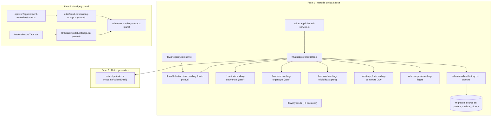

# Design: Onboarding pre-cita por WhatsApp (historia clínica básica y datos generales)

## Contexto y objetivo

Este documento fija las decisiones técnicas del change
`whatsapp-pre-appointment-onboarding` (issue
[#90](https://github.com/proyecto-polaris-ia/medica-app/issues/90)) para las tres
fases entregadas como PRs apilados: (1) historia clínica básica del paciente
nuevo, (2) completado de datos generales, y (3) nudge y visibilidad en el panel.

Los contratos normativos son las deltas de specs de este change:

| Capability | Delta | Requirements añadidos/modificados |
|---|---|---|
| `whatsapp-onboarding` (nueva) | `specs/whatsapp-onboarding/spec.md` | 7 requirements (disparador, preguntas cerradas, resumen, escritura con provenance, escalación, teléfono confiable, feature flag, continuidad/timeout) |
| `flow-engine` (modificada) | `specs/flow-engine/spec.md` | `Action Execution` + `Flow Registry` modificados; reconocimiento del flujo en el control de tema |
| `whatsapp-inbound-automation` (modificada) | `specs/whatsapp-inbound-automation/spec.md` | `Flow Engine integration` + `Eve escalation persistence` modificados |
| `clinical-record` (modificada) | `specs/clinical-record/spec.md` | contrato 1:1 modificado + provenance |
| `patient-onboarding-status` (nueva) | `specs/patient-onboarding-status/spec.md` | derivación, nudge separado, badge, Fase 2 |

Principios que gobiernan el diseño (`AGENTS.md`, `proposal.md`,
`openspec/config.yaml`):

- El LLM **interpreta** lenguaje y **redacta**, pero **no** decide el orden de las
  preguntas, **no** valida y **no** escribe. En el path de flow engine no hay LLM
  en el circuito de decisión: la clasificación y la extracción son deterministas.
- Toda disponibilidad y toda escritura salen de la BD. Las reglas duras
  (no diagnóstico, no receta, urgencia → humano) viven en backend.
- **Nunca modificar `travelhub-app`** (copiar + adaptar).
- Todo instante nuevo se persiste como `timestamptz` y se presenta en
  `America/Mexico_City`.
- Se preserva el contrato congelado de la plantilla `recordatorio_cita` y el
  contrato 1:1 de `patient_medical_history`.

Toda ruta y firma citada aquí fue verificada leyendo el código de este worktree.

---

## Alcance verificado en código

| Elemento | Estado verificado (path:line) |
|---|---|
| Union cerrado `FlowResult.action` | `src/lib/flows/types.ts:70` → `'ask' \| 'getFreeSlots' \| 'bookAppointment' \| 'resolveService' \| 'resolveProvider' \| 'complete'` |
| Union `FlowStateDefinition.action` | `src/lib/flows/types.ts:47` |
| `FlowState.metadata` / `flowName` / `pendingAction` | `src/lib/flows/types.ts:34,36,37` |
| `ExtractedEntities` admite escala­res e índice `[key: string]` | `src/lib/flows/types.ts:8-18` |
| `FlowEngine.execute` respeta `required`; `advance` **no** los revalida | `src/lib/flows/flow-engine.ts:36-77` vs `96-125` |
| Registry hoy en el archivo del flujo de reserva | `src/lib/flows/definitions/book-appointment.flow.ts:90-100` |
| Importadores de `getFlowDefinition` | `src/lib/whatsapp/orchestrator.ts:9` **y** `src/lib/web-chat/web-inbound-service.ts:2` |
| `detectTopicChange` sin noción de flowName | `src/lib/flows/flow-control.ts:76-89` |
| `flowNames` hardcodeado a booking | `src/lib/flows/flow-control.ts:147-151` |
| Switch `executeFlowAction` (booking) | `src/lib/whatsapp/orchestrator.ts:541-643` (+ `default` en `:639`) |
| Switch `executeWebFlowAction` (web) | `src/lib/web-chat/web-inbound-service.ts:282-386` (+ `default` en `:383`) |
| `FLOW_TIMEOUT_MINUTES = 30` + `isFlowExpired` | `src/lib/whatsapp/orchestrator.ts:51,154-161` |
| Persistencia de `flow_state` | `src/lib/whatsapp/inbound-service.ts:392` y `src/lib/whatsapp/store.ts:195-198` (`flowState: FlowState \| null`) |
| Gate del flow engine | `src/lib/whatsapp/inbound-service.ts:78-88` (`WHATSAPP_FLOW_ENGINE_ENABLED`) |
| Escalación en flow engine hoy | `src/lib/whatsapp/inbound-service.ts:416-435` (status `escalated`, **sin** fila en `whatsapp_escalations`) |
| Escritor de historia full-replace | `src/lib/admin/medical-history.ts:123-142` (`upsert` con `onConflict: 'patient_id'`) |
| Validación de historia (sin provenance) | `src/lib/admin/medical-history.ts:72-101` |
| Tipos de historia (sin provenance) | `src/lib/admin/types.ts:123-160` |
| `patients` (email nullable desde 0011) | `src/lib/admin/patients.ts:14,68,71`; `supabase/migrations/0011_patient_email_contact.sql` |
| Validación de email reutilizable | `src/lib/booking/patient-contact.ts` (`parseOptionalEmail`, `EMAIL_RE`) |
| Identidad verificada (Eve) | `agent/trusted-contact-context.ts:194-206`; `agent/tools/escalate-to-human.ts:24-38` |
| Escalación de Eve | `src/lib/whatsapp/eve-escalation.ts:110-210` |
| Detección determinista de urgencia existente | `src/lib/ai/whatsapp-inbound-agent.ts:129-137` |
| Recordatorios con plantilla congelada | `src/lib/citas/send-appointment-reminder.ts:23,168-185,259-300,367-436` |
| Cron de recordatorios | `app/api/cron/appointment-reminders/route.ts:62-118` |
| Badge clínico + tabs | `src/components/admin/patient-record/MedicalHistoryBadge.tsx:7-31`, `PatientRecordTabs.tsx:92-98` |
| Carga de historia en el expediente | `app/(admin)/patients/[id]/page.tsx:87-97,31-49` (constante `EMPTY_HISTORY`) |
| Migración clínica | `supabase/migrations/0013_clinical_record.sql` (tabla `patient_medical_history`) |
| Migraciones: secuenciales 0001–0022 + `down/` | `supabase/migrations/` |

Consecuencias directas verificadas:

1. `FlowState.entities` solo admite escala­res → alergias/medicamentos/condiciones
   van en `FlowState.metadata` (decisión D2).
2. `FlowStateDefinition.action` y `FlowResult.action` son dos uniones cerradas
   distintas: agregar la acción de onboarding toca **ambas** (D4).
3. `FlowEngine.advance` devuelve la acción del siguiente estado sin revalidar
   `required`; los pasos interactivos del onboarding necesitan la corrección de
   simetría (D2).
4. El path de flow engine hoy **no** crea fila en `whatsapp_escalations`; la
   guardrail exige escalación real (D7).
5. `detectTopicChange` usa el intent clasificado; con onboarding, `inquiry` es
   una **respuesta esperada**, no un cambio de tema (D6).

---

## Arquitectura general



Frontera de capas (misma que `flows/` y `citas/`): los módulos **puros**
(`onboarding-answers.ts`, `onboarding-urgency.ts`, `onboarding-eligibility.ts`,
`onboarding-status.ts`) no tocan Supabase ni red; la capa de **I/O**
(`onboarding-context.ts`, `admin/medical-history.ts`, `admin/patients.ts`,
`send-onboarding-nudge.ts`) usa `getSupabaseAdmin()` y recibe `now: Date`
inyectado donde hay límites temporales.

---

## Decisiones

### D1 — Provenance: columna `source text NOT NULL DEFAULT 'staff'`

**Decisión.** En `patient_medical_history` se agrega una columna aditiva:

```sql
ALTER TABLE public.patient_medical_history
  ADD COLUMN IF NOT EXISTS source text NOT NULL DEFAULT 'staff';

ALTER TABLE public.patient_medical_history
  DROP CONSTRAINT IF EXISTS patient_medical_history_source_check;
ALTER TABLE public.patient_medical_history
  ADD CONSTRAINT patient_medical_history_source_check
  CHECK (source IN ('patient_autoreport', 'staff'));
```

- Valores: `'patient_autoreport'` (capturado por WhatsApp, tras confirmación) y
  `'staff'` (captura/validación por staff). Default `'staff'` para las filas
  existentes y para todo escritor que no especifique procedencia.
- Tipo TypeScript nuevo en `src/lib/admin/types.ts`:
  `export type MedicalHistorySource = 'patient_autoreport' | 'staff';`
  - `MedicalHistory` agrega `source: MedicalHistorySource | null`
    (`null` = **no hay fila**, lo produce `emptyHistory`, no la BD).
  - `MedicalHistoryInput` agrega `source?: MedicalHistorySource | null`.
- `src/lib/admin/medical-history.ts`:
  - `SELECT_COLUMNS` agrega `'source'`; `mapRow` → `source: (row.source as MedicalHistorySource) ?? 'staff'`.
  - `emptyHistory` → `source: null`.
  - `validateMedicalHistoryInput` agrega
    `source: parseStatus(input.source, ['patient_autoreport', 'staff'] as const, 'source') ?? 'staff'`.
  - El payload del `upsert` **siempre** incluye `source`, de modo que un
    reemplazo por staff **regresa** la procedencia a `'staff'` (el `DEFAULT` de
    Postgres no aplica en el `UPDATE` del `ON CONFLICT`).
- **Escritura de staff sin UI nueva:** el `PUT /api/admin/patients/[id]/medical-history`
  (`app/api/admin/patients/[id]/medical-history/route.ts:22-56`) no envía
  `source`; `validateMedicalHistoryInput` lo resuelve a `'staff'`. No se toca
  `PatientHistoryTab.tsx` ni ningún formulario.
- Migración:
  - Up: `supabase/migrations/YYYYMMDDHHMMSS_patient_medical_history_source.sql`.
  - Down: `supabase/migrations/down/YYYYMMDDHHMMSS_patient_medical_history_source.down.sql`
    → `ALTER TABLE public.patient_medical_history DROP CONSTRAINT IF EXISTS patient_medical_history_source_check;`
    → `ALTER TABLE public.patient_medical_history DROP COLUMN IF EXISTS source;`.
  - `YYYYMMDDHHMMSS` es un timestamp UTC **fijo al momento de crear el archivo**
    (ver D12); no se renombra después de aplicarse.

**Alternativas consideradas.** (a) `patient_autoreported boolean`: rechazada
porque no deja espacio a procedencias futuras (migración, importación) sin otra
migración, y el `DEFAULT false` no distingue "staff" de "desconocido".
(b) `source text` nullable: rechazada porque introduciría un tercer estado
(`null`) sin semántica y obligaría a cada lector a decidir un default; la BD
nunca debería guardar provenance indefinida. (c) `NOT NULL` con `DEFAULT` es
aditivo y seguro en Postgres 11+ (sin reescritura de tabla).

**Por qué.** `source` es el nombre que fija el spec de `clinical-record` y deja
espacio a futuras procedencias; `NOT NULL DEFAULT 'staff'` garantiza que toda
fila existente conserve la semántica "capturada por staff" y que el badge y el
nudge tengan una derivación determinista.

---

### D2 — Definición del flujo de onboarding (`src/lib/flows/definitions/onboarding.flow.ts`)

**Decisión.** Nuevo `FlowDefinition` puro, nombre de flujo `'onboarding'`, con
prompts en español MX y orden fijo. Las **listas viven en
`FlowState.metadata.onboarding`**, no en `entities` (escalares).

```ts
// src/lib/flows/onboarding-answers.ts (puro)
export type OnboardingDraft = {
  context: {
    patientId: string;
    phone: string;
    patientName: string;
    sex: 'male' | 'female' | 'other' | null;
    missingEmail: boolean;
  };
  allergies: string[] | null;      // null = no preguntado; [] = "no"
  medications: string[] | null;
  conditions: string[] | null;
  pregnancyStatus: PregnancyStatus | null;
  smoking: SmokingStatus | null;
  alcohol: AlcoholStatus | null;
  email: string | null;            // Fase 2
  confirmed?: boolean;
};
```

Entidades: cada paso interactivo usa el **mismo escalar** `onboardingAnswer`
(`ExtractedEntities` admite claves arbitrarias). El determinista llena ese
escalar con el texto crudo del mensaje (trim + colapso de espacios, máx. 500
caracteres) y lo consume en la acción.

Máquina de estados (tabla 1:1 con la definición):

| Estado | `required` | `action` | Prompt (es-MX) | `transitions` |
|---|---|---|---|---|
| `ask_allergies` | `onboardingAnswer` | `evaluateOnboardingAnswer` | «Hola {patientFirstName}, soy Eva. Antes de tu cita quiero dejar listos tus datos médicos. Si algo no aplica, responde "no". ¿Tienes alguna alergia?» | `yes → ask_allergies_detail`, `no → ask_medications`, `retry → ask_allergies` |
| `ask_allergies_detail` | `onboardingAnswer` | `evaluateOnboardingAnswer` | «¿Cuáles alergias tienes? Escríbelas tal como las conoces.» | `next → ask_medications` |
| `ask_medications` | `onboardingAnswer` | `evaluateOnboardingAnswer` | «¿Tomas algún medicamento actualmente?» | `yes → ask_medications_detail`, `no → ask_conditions`, `retry → ask_medications` |
| `ask_medications_detail` | `onboardingAnswer` | `evaluateOnboardingAnswer` | «¿Cuáles medicamentos tomas?» | `next → ask_conditions` |
| `ask_conditions` | `onboardingAnswer` | `evaluateOnboardingAnswer` | «¿Tienes alguna condición médica relevante (por ejemplo, diabetes, hipertensión o del corazón)?» | `yes → ask_conditions_detail`, `no → ask_pregnancy`, `retry → ask_conditions` |
| `ask_conditions_detail` | `onboardingAnswer` | `evaluateOnboardingAnswer` | «¿Cuál o cuáles?» | `next_pregnancy → ask_pregnancy`, `next_no_pregnancy → ask_smoking` |
| `ask_pregnancy` | `onboardingAnswer` | `evaluateOnboardingAnswer` | «¿Estás embarazada actualmente?» | `next → ask_smoking`, `retry → ask_pregnancy` |
| `ask_smoking` | `onboardingAnswer` | `evaluateOnboardingAnswer` | «¿Fumas? Responde: *nunca*, *antes fumaba* o *actualmente fumo*.» | `next → ask_alcohol`, `retry → ask_smoking` |
| `ask_alcohol` | `onboardingAnswer` | `evaluateOnboardingAnswer` | «¿Consumes alcohol? Responde: *nunca*, *ocasionalmente* o *frecuentemente*.» | `next → show_summary`, `retry → ask_alcohol` |
| `show_summary` | `onboardingAnswer` | `evaluateOnboardingAnswer` | «Este es tu resumen:\n{onboardingSummary}\n\n¿Está correcto? Responde "sí" para guardarlo o "no" para corregirlo.» | `confirm → save_history`, `restart → ask_allergies` |
| `save_history` | — | `saveOnboardingHistory` | «Guardando tus datos…» | `complete → complete`, `needs_contact → ask_email` (Fase 2) |
| `ask_email` (Fase 2) | `onboardingAnswer` | `evaluateOnboardingAnswer` | «Para enviarte la confirmación, ¿me compartes tu correo electrónico?» | `next → show_contact_summary`, `retry → ask_email` |
| `show_contact_summary` (Fase 2) | `onboardingAnswer` | `evaluateOnboardingAnswer` | «Tu correo es {onboardingContactSummary}. ¿Lo guardo?» | `confirm → save_contact`, `restart → ask_email` |
| `save_contact` (Fase 2) | — | `saveOnboardingContact` | «Listo.» | `complete → complete` |
| `complete` | — | — (terminal) | «¡Listo! Ya dejé tus datos preparados para el doctor. Te esperamos en tu cita.» | — |

**Ramificación sí/no determinista.** La acción `evaluateOnboardingAnswer`
(implementada en el orquestador, evaluada por el módulo puro) lee el estado
actual (`result.nextState.name`) y el texto crudo, y devuelve la transición:

```ts
// src/lib/flows/onboarding-answers.ts (puro, testeable sin mocks)
export type OnboardingStepResult = {
  transition: string;
  draft: OnboardingDraft;
  clearAnswer?: boolean; // `retry`: re-preguntar el mismo paso
};

export function parseYesNo(raw: string): 'yes' | 'no' | null;
export function parseSmoking(raw: string): SmokingStatus | null;
export function parseAlcohol(raw: string): AlcoholStatus | null;

export function evaluateOnboardingStep(input: {
  step: string;          // nombre del estado
  rawAnswer: string;
  draft: OnboardingDraft;
}): OnboardingStepResult;
```

Mapas literales (opciones cerradas, sin interpretación clínica):

- `parseYesNo`: `sí|si|yes|claro|correcto` → `yes`; `no|nunca|ninguna|ninguno` → `no`;
  cualquier otra cosa → `null` → `retry`.
- `parseSmoking`: `nunca|no|jamás` → `never`; `antes|exfumador|antes fumaba|dejé` →
  `former`; `sí|actualmente|actualmente fumo|fumo` → `current`; desconocido → `retry`.
- `parseAlcohol`: `nunca|no` → `never`; `ocasional|ocasionalmente|a veces|socialmente`
  → `occasional`; `frecuente|frecuentemente|seguido|mucho` → `frequent`; desconocido
  → `retry`.
- Detalle (alergias/medicamentos/condiciones): se guarda el texto **literal**
  (`[rawNormalizado]`); no se normaliza clínicamente ni se parte en tokens.

**Gating de embarazo.** La transición sale del handler de
`ask_conditions_detail`: si `draft.context.sex === 'female'` → `next_pregnancy`
(va a `ask_pregnancy`); en cualquier otro caso → `next_no_pregnancy` (va directo a
`ask_smoking`) y se fija `pregnancyStatus = 'not_applicable'`. El sexo se conoce
porque el arranque del flujo guarda el contexto del paciente en
`metadata.onboarding.context` (D5); **no** se pregunta el sexo por WhatsApp.

**Corrección de simetría en `FlowEngine.advance`.** Hoy `execute` respeta
`required` (`flow-engine.ts:50-78`) pero `advance` devuelve la acción del
siguiente estado sin revalidar (`:96-125`). Con pasos interactivos que tienen
`required` + `action`, al entrar por `advance` se ejecutaría la acción sin
respuesta. Se corrige `advance` para replicar el bloque de `execute`: si al
estado destino le faltan `required`, devuelve `{ action: 'ask', missingEntity }`.
No cambia el comportamiento de booking: `check_availability`/`confirm_booking`
tienen acción pero **no** `required`, y `select_slot`/`collect_notes` tienen
`required` pero **no** acción. Esto alinea el motor con el requirement ya
existente "Deterministic Transitions / Missing required entity" del baseline
`flow-engine`.

**Resumen + confirmación.** `buildOnboardingSummary(draft)` produce el texto que
sustituye `{onboardingSummary}` (una línea por dato, fiel a lo capturado). En
`show_summary`, `no`/corrección (frase no reconocida) → `restart`: se reinicia el
draft y se vuelve a `ask_allergies` sin escribir. Es la regla determinista que
permite "volver a preguntar el dato corregido o reiniciar" del spec.

**Metadatos y respuestas.** `generateFlowResponse`
(`src/lib/whatsapp/orchestrator.ts:644-712`) suma los placeholders
`{patientFirstName}` (desde `metadata.onboarding.context.patientName`),
`{onboardingSummary}` y `{onboardingContactSummary}`. No se alteran los
placeholders de booking.

**Alternativas consideradas.** (a) Poner listas en `entities`: imposible,
`ExtractedEntities` es escalar. (b) Quitar `action` de los pasos de detalle y
persistir en un post-proceso fuera del motor: rechazada porque rompe el contrato
"la acción del onboarding se ejecuta por el mismo contrato del engine"
(`flow-engine` delta) y duplica lógica. (c) Añadir un intent `onboarding` al
clasificador: rechazada en D5/D6; no hace falta y amplía la unión de intents.

**Por qué.** Una sola acción semántica (`evaluateOnboardingAnswer`) mantiene el
orden y la ramificación en un módulo puro, testeable sin mocks, y deja el motor
como la única autoridad de transición.

---

### D3 — Refactor del registry: `src/lib/flows/registry.ts`

**Decisión.** Mover `flowRegistry` y `getFlowDefinition` de
`src/lib/flows/definitions/book-appointment.flow.ts` a un archivo neutral
`src/lib/flows/registry.ts`, y registrar ahí `bookAppointmentFlow` y
`onboardingFlow`:

```ts
// src/lib/flows/registry.ts
import { bookAppointmentFlow } from './definitions/book-appointment.flow';
import { onboardingFlow } from './definitions/onboarding.flow';
import type { FlowDefinition } from './types';

export const flowRegistry: Record<string, FlowDefinition> = {
  book_appointment: bookAppointmentFlow,
  onboarding: onboardingFlow,
};

export function getFlowDefinition(flowName: string): FlowDefinition {
  const flow = flowRegistry[flowName];
  if (!flow) throw new Error(`Flow no encontrado: ${flowName}`);
  return flow;
}
```

- `book-appointment.flow.ts` conserva **solo** `bookAppointmentFlow` (se eliminan
  `flowRegistry` y `getFlowDefinition`).
- Importadores actualizados:
  - `src/lib/whatsapp/orchestrator.ts:9`.
  - `src/lib/web-chat/web-inbound-service.ts:2`.
- No se crea re-export de compatibilidad: son dos call sites y un re-export
  perpetuaría la dependencia equivocada.

**Alternativas consideradas.** (a) Registrar el onboarding **dentro** de
`book-appointment.flow.ts`: rechazada porque invertiría la dirección de
dependencia (un archivo de flujo de reserva conociendo otro flujo) y ensucia el
archivo por dominio. (b) Un `index.ts` en `definitions/`: rechazada porque mezcla
"definiciones" con "registro" y no evita que un archivo de definición importe a
otro.

**Por qué.** El registry es el punto de composición; moverlo elimina el
acoplamiento booking↔onboarding y cumple el delta `Flow Registry` ("accesible
por nombre, instanciable por el orquestador").

---

### D4 — Acciones nuevas, handlers, atomicidad y manejo de error

**Decisión.** Se agregan **tres** valores a `FlowStateDefinition.action` y a
`FlowResult.action` (`src/lib/flows/types.ts:47,70`):

```
'evaluateOnboardingAnswer' | 'saveOnboardingHistory' | 'saveOnboardingContact'
```

Son acciones separadas (no una `commitOnboarding` combinada) por fase:
`saveOnboardingHistory` es el **único escritor clínico**; `saveOnboardingContact`
solo toca `patients`. Así cada PR de fase agrega exactamente una acción y el
rollback de Fase 2 no puede tocar la historia.

Handlers en `src/lib/whatsapp/orchestrator.ts`, dentro de `executeFlowAction`
(caso nuevo por acción; ver firma del port en D7):

```ts
case 'evaluateOnboardingAnswer': {
  const draft = readOnboardingDraft(result.nextState.metadata);
  const raw = typeof entities.onboardingAnswer === 'string' ? entities.onboardingAnswer : '';
  const evaluated = evaluateOnboardingStep({ step: result.nextState.name, rawAnswer: raw, draft });
  return {
    success: true,
    transition: evaluated.transition,
    metadata: { onboarding: evaluated.draft },
    entities: evaluated.clearAnswer ? { onboardingAnswer: undefined } : undefined,
  };
}

case 'saveOnboardingHistory': {
  const draft = readOnboardingDraft(result.nextState.metadata);
  if (draft.context.phone !== event.fromPhone) {
    return { success: false, error: 'No pude verificar tu identidad para guardar la historia.', escalate: true };
  }
  await upsertMedicalHistory(draft.context.patientId, {
    ...toMedicalHistoryInput(draft),
    source: 'patient_autoreport',
  });
  return {
    success: true,
    transition: draft.context.missingEmail ? 'needs_contact' : 'complete',
    metadata: { onboarding: { ...draft, confirmed: true } },
  };
}

case 'saveOnboardingContact': {
  const draft = readOnboardingDraft(result.nextState.metadata);
  await updatePatientEmail(draft.context.patientId, draft.email!);
  return { success: true, transition: 'complete' };
}
```

- **Atomicidad.** La historia se escribe en **un solo** `upsert` a
  `patient_medical_history` (una fila, una sentencia) ⇒ all-or-nothing de fila.
  El contacto se escribe en un `update` independiente sobre `patients` (D8), por
  diseño de fase separada; ninguno de los dos deja estado parcial de su propia
  tabla. La historia se escribe **solo** cuando el disparador garantizó que el
  paciente no tenía fila (D5), así que el full-replace no puede destruir datos de
  staff.
- **Manejo de error de escritura.** `executeFlowAction` devuelve
  `{ success: false, error, escalate: true }`. El loop de `continueFlow`
  (`orchestrator.ts:304-329`) se extiende: si `escalate`, retorna
  `{ needsHuman: true, clearFlowState: true, responseText: error }`; no reintenta
  ni re-pregunta (el paciente ya confirmó; reintentar solo reprocesaría la misma
  confirmación). La escalación humana cierra el caso. Para acciones de booking,
  el comportamiento actual se conserva (`escalate` ausente ⇒ mismo path de hoy).
- **No-escritura estructural.** El único camino a
  `saveOnboardingHistory`/`saveOnboardingContact` es la confirmación de
  `show_summary` (o `show_contact_summary`). Abandono ⇒ `flow_state` expira a los
  30 min (`FLOW_TIMEOUT_MINUTES`) sin ejecutar acción; urgencia ⇒ aborta antes de
  `save_history` (D7).

**Alternativas consideradas.** (a) `commitOnboarding` combinada: rechazada
porque acopla Fase 1 y Fase 2 en una sola acción y un PR apilado no podría
desplegarse solo. (b) Reintentar la escritura en el siguiente mensaje:
rechazada porque exige re-confirmar y el paciente ya confirmó; escalar es más
seguro y consistente con el guardrail "escala a humano". (c) Hacer la escritura
atómicamente junto con la respuesta saliente: rechazada, no hay transacción que
abarque BD + proveedor, y el guardrail pide atomicidad de la historia, no del
envío.

**Por qué.** Dos acciones de escritura mapean 1:1 a dos tablas y dos fases; el
único escritor clínico queda aislado y testeable, y el resto de las acciones de
booking no cambian.

---

### D5 — Disparador determinista y feature flag

**Decisión.** El onboarding se evalúa en `handleNewMessage`
(`orchestrator.ts:181-206`), **tras** clasificar y **antes** de enrutar:

```ts
async function handleNewMessage(context: OrchestratorContext) {
  const classification = await classifyIntent(context.event, context.conversation, ...);
  const onboarding = await maybeStartOnboarding(classification, context);
  if (onboarding) return onboarding;
  switch (classification.intent) { /* routing actual, intacto */ }
}
```

**Predicado puro** `src/lib/flows/onboarding-eligibility.ts`:

```ts
export type OnboardingEligibilityInput = {
  enabled: boolean;
  historyExists: boolean;
  missingEmail: boolean;
  hasFutureScheduledAppointment: boolean;
};
export function shouldStartOnboarding(input: OnboardingEligibilityInput): boolean;

export function resolveOnboardingStartState(input: {
  historyExists: boolean;
  missingEmail: boolean;
}): 'ask_allergies' | 'ask_email' | null;
```

Reglas: `enabled === true` y `hasFutureScheduledAppointment === true` y
(`!historyExists` **o** `missingEmail`). Si `!historyExists` → `'ask_allergies'`
(Fase 1); si `historyExists && missingEmail` → `'ask_email'` (Fase 2, solo
contacto). Si no, no arranca.

**Capa de I/O** `src/lib/whatsapp/onboarding-context.ts`:

```ts
export type OnboardingStartContext = {
  patientId: string;
  patientName: string;
  phone: string;
  sex: 'male' | 'female' | 'other' | null;
  historyExists: boolean;
  source: MedicalHistorySource | null;
  email: string | null;
  missingEmail: boolean;
  hasFutureScheduledAppointment: boolean;
};

export async function loadOnboardingStartContext(input: {
  phone: string;
  now?: Date;
}): Promise<OnboardingStartContext | null>;

export async function hasFutureScheduledAppointment(
  patientId: string,
  now: Date
): Promise<boolean>;
```

- `loadOnboardingStartContext` lee `patients` por `phone_e164 = phone` de forma
  **read-only** (`.maybeSingle()`); si no existe, devuelve `null` y el mensaje
  sigue su ruta normal. **No** crea paciente (a diferencia de `resolvePatient`).
- `historyExists`: `.from('patient_medical_history').select('patient_id').eq('patient_id', id).maybeSingle()`.
- `hasFutureScheduledAppointment`: `appointments` con
  `.eq('patient_id', id).gt('start_at', now.toISOString()).in('status', ['confirmed', 'pending']).limit(1)`.
  Estados exactos: **`confirmed` y `pending`** (el spec excluye `requested`,
  `rescheduled`, `attended`, etc.).
- `missingEmail` = `email === null`.

**Precedencia sobre el resto del routing.** El onboarding arranca solo para
intents conversacionales; no secuestra pedidos explícitos ni urgencias:

```ts
const ONBOARDING_TRIGGER_INTENTS = new Set(['inquiry', 'unknown']);
```

Si `classification.intent` es `support`/`handoff` (escalación), `book_appointment`,
`check_availability`, `cancel_request` o `reschedule_request`, el mensaje sigue
su path actual. Racional: el paciente disparador **ya tiene** una cita futura; el
onboarding se ofrece en turnos conversacionales, no secuestra una petición
explícita ni una urgencia.

**Interacción con booking y respuestas a recordatorio.** El hook de respuesta a
recordatorio (`processReminderReplyHook`, `inbound-service.ts:286-334`) corre
**antes** del branch de flow engine y gana si hay sesión de flujo activa
(`isFlowSessionActive`). Consecuencia: mientras hay onboarding activo, la sesión
de flujo gana y el mensaje continúa el onboarding; cuando no hay sesión activa,
la respuesta al recordatorio se procesa y el onboarding no la hijackea. Nada
cambia en `send-appointment-reminder.ts`.

**Feature flag** `src/lib/whatsapp/onboarding-flag.ts`
(patrón `reminder-reply-flag.ts`):

```ts
export function isOnboardingEnabled(rawValue?: string | null): boolean;      // WHATSAPP_ONBOARDING_ENABLED
export function isOnboardingNudgeEnabled(rawValue?: string | null): boolean; // WHATSAPP_ONBOARDING_NUDGE_ENABLED
```

`true | 1 | yes` (case-insensitive) encienden; ausente o cualquier otra cosa
apaga (**default off**). El onboarding requiere además
`WHATSAPP_FLOW_ENGINE_ENABLED` (gate ya existente en
`inbound-service.ts:78-88`). Con el flag apagado, `maybeStartOnboarding` retorna
`null` en la primera guarda y el comportamiento es idéntico al actual.

**Alternativas consideradas.** (a) Disparar en `processWithFlowEngine` (servicio)
en lugar del orquestador: rechazada porque parte de la decisión (intent, estado
del flujo) vive en el orquestador y habría que duplicarla. (b) Disparar en
**cualquier** intent: rechazada por secuestro de peticiones explícitas. (c)
Disparar solo en `book_appointment`: rechazada porque el paciente ya tiene cita y
el caso real es información pre-visita, no reserva. (d) Consultar la cita futura
con `listAppointments`/`listAppointmentsRange` y filtrar en memoria: rechazada
por costo y porque no existe una función "por paciente"; una query acotada por
índice (`appointments(start_at)` y FK `patient_id`) es suficiente.

**Por qué.** El disparador es una conjunción de hechos ya persistidos, verificable
con dos lecturas acotadas; el predicado puro es testeable sin BD y la guarda de
flag es la primera línea.

---

### D6 — Extensiones de `flow-control.ts`

**Decisión.**

1. `detectTopicChange` y `analyzeFlowControl` reciben un parámetro opcional
   `flowName` (`'book_appointment'` por default, retrocompatible) y usan un mapa
   de intents permitidos por flujo:

```ts
const FLOW_TOPIC_CHANGE_INTENTS: Record<string, string[]> = {
  book_appointment: ['book_appointment', 'check_availability', 'unknown'],
  onboarding: ['inquiry', 'support', 'unknown'],
};
```

   Para `onboarding`, `inquiry` (y `support`) son **respuestas esperadas**; el
   cambio de tema se dispara con `book_appointment`, `check_availability`,
   `reschedule_request`, `cancel_request` o `handoff`.
2. `generateTopicChangeConfirmation` suma a `flowNames`:
   `'onboarding': 'tu registro de datos médicos'` → «¿Quieres salir de tu
   registro de datos médicos para atender tu consulta? Responde "sí" para salir o
   "no" para continuar.»
3. La cancelación explícita reutiliza `generateCancellationConfirmation`
   (genérica); `detectCancellation` ya cubre `cancelar|salir|terminar|…` y se
   evalúa **antes** del cambio de tema (`flow-control.ts:126-134`).
4. `orchestrate` pasa `activeFlow.flowName` a `analyzeFlowControl`.

No se agrega un intent nuevo al clasificador: el onboarding no necesita
clasificación de sus respuestas (son opciones cerradas leídas por el
determinista).

**Alternativas consideradas.** (a) Añadir `'onboarding'` a
`WhatsAppInboundIntent` y clasificar cada paso: rechazada porque metería al LLM a
decidir el paso, justo lo que el spec prohíbe. (b) Extender la lista permitida
global (sin `flowName`): rechazada porque rompería booking (para booking,
`inquiry` **sí** es cambio de tema). (c) Confirmación de cancelación específica
para onboarding: rechazada por duplicación innecesaria; la genérica ya es
adecuada.

**Por qué.** El control de tema es sensible al flujo activo; pasarlo como dato
mantiene la firma retrocompatible y evita prompts de "¿quieres salir?" ante cada
respuesta del onboarding.

---

### D7 — Pausa por escalación (urgencia) y no-escritura

**Decisión.** La detección de urgencia es **backend, determinista y pura**, en un
módulo dedicado:

```ts
// src/lib/flows/onboarding-urgency.ts
export function detectOnboardingUrgency(text: string): { urgent: boolean; matched?: string };
```

Lista de patrones (subset deliberadamente acotado a las señales del spec):

```
/dolor\s+(fuerte|intenso|insoportable|severo)/
/urgenc|emergenc/
/infecci[oó]n|hinchaz[oó]n/
/sangrado\s+(abundante|activo)|no\s+para\s+de\s+sangrar/
/fiebre/
/alergia\s+a\s+(la\s+)?anestesia|anestesia.*alerg/
/no\s+puedo\s+respirar|desmay/
```

Mecanismo en `orchestrate`, cuando el flujo activo es `'onboarding'` y antes del
control de flujo:

```ts
if (activeFlow.flowName === 'onboarding' && event.body) {
  const urgency = detectOnboardingUrgency(event.body);
  if (urgency.urgent) {
    return {
      decision: { intent: 'support', summary: 'Urgencia durante onboarding', confidence: 1,
                  decision: 'needs_human', escalationReason: urgency.matched, responseText: '',
                  citedKnowledgeIds: [], citedToolCallIds: [] },
      responseText: 'Gracias por avisarme. Para cuidarte bien, una persona del consultorio te va a contactar ahora mismo.',
      needsHuman: true,
      clearFlowState: true, // pausa: se limpia flow_state
    };
  }
}
```

`OrchestratorResult` agrega `clearFlowState?: boolean`. `processWithFlowEngine`
(`inbound-service.ts:388-437`) maneja la escalación de onboarding:

1. Limpia el estado: `store.updateConversationFlowState({ conversationId, flowState: null })`
   (el store ya acepta `null`, `store.ts:195`). El onboarding no puede continuar.
2. Crea la escalación humana en la cola existente reutilizando
   `createEveWhatsAppEscalation` (`src/lib/whatsapp/eve-escalation.ts:110`), que
   persiste la fila `whatsapp_escalations`, resuelve contacto/conversación y
   envía la alerta humana. Se inyecta un port
   `createEscalation?: typeof createEveWhatsAppEscalation` en
   `WhatsAppInboundServiceOptions` (default la función real) para tests
   herméticos. El teléfono usado es `event.fromPhone` (teléfono del canal), nunca
   uno escrito en el chat.
3. Envía la respuesta al paciente, marca el mensaje como `escalated` y retorna
   `action: 'needs_human'`.

**Por qué no la detección general existente.** `buildWhatsAppClinicalEscalationDecision`
(`whatsapp-inbound-agent.ts:129-137`) tiene `/alerg/`, `/medicament/` y
`/precio|costo/`; durante el onboarding esas palabras son **respuestas legítimas**
(«soy alérgico a la penicilina», «tomo medicamento») y escalarían el 100% de los
casos. El módulo de urgencia del onboarding es un subconjunto alineado al spec
("dolor fuerte, inflamación severa, alergia a anestesia u otra señal").

**No-escritura garantizada.** `clearFlowState` + limpieza en BD eliminan el
camino a `saveOnboardingHistory`; una sesión posterior arranca de cero (el
disparador vuelve a evaluar y el paciente aún no tiene fila). Nunca hay escritura
parcial.

**Alternativas consideradas.** (a) Clasificar urgencia con el LLM: rechazada por
guardrail (debe ser backend). (b) Reutilizar
`buildWhatsAppClinicalEscalationDecision`: rechazada por la sobreexcalación
descrita. (c) Solo marcar `needsHuman` sin crear la fila de escalación (como hoy
en flow engine): rechazada porque el spec `Eve escalation persistence` exige
"persist an open escalation in the existing `whatsapp_escalations` queue".
(d) Crear la fila dentro del orquestador: rechazada para no acoplar
`createEveWhatsAppEscalation` (que toca store, contacto y envío) a un módulo de
decisión pura.

---

### D8 — Fase 2: detección y escritura del email

**Decisión.**

- **Detección.** `resolveOnboardingStartState` (D5) devuelve `'ask_email'` cuando
  `historyExists && missingEmail`; si el paciente es nuevo (`!historyExists`),
  el flujo corre la historia y, al confirmar (`save_history` con
  `missingEmail === true`), transiciona a `ask_email`. `missingEmail` sale de
  `loadOnboardingStartContext` (`patients.email === null`), no de una segunda
  query.
- **Validación determinista.** `evaluateOnboardingStep('ask_email', ...)` usa
  `parseOptionalEmail` (`src/lib/booking/patient-contact.ts`): `trim`,
  `toLowerCase`, `EMAIL_RE`. Inválido → `transition: 'retry'` (se re-pregunta);
  válido → se guarda normalizado en `metadata.onboarding.email`. El LLM no
  participa.
- **Escritura.** Nueva función en `src/lib/admin/patients.ts`:

```ts
export async function updatePatientEmail(patientId: string, email: string): Promise<Patient>;
```

  - `parseUuid(patientId)`; `parseOptionalEmail(email)`, si es `undefined` lanza
    `ValidationError('email', ...)`.
  - `update({ email })` por `id`, `.select(SELECT_COLUMNS).single()`.
  - `error.code === '23505'` → `ConflictError('Contact already registered', 'contact_conflict')`
    (el correo pertenece a otro paciente → identidad ambigua → D4 escala).
  
  Se elige una función **targeted** en vez de `updatePatient` porque
  `updatePatient` es full-replace sobre `PatientInput` y
  `normalizePatientContact` exige teléfono o email; usarlo obligaría a
  reconstruir todos los campos y podría pisar datos. `updatePatientEmail` toca
  **solo** `email`, jamás la historia clínica.
- **Patrón resumen + confirmación.** Igual que Fase 1: `show_contact_summary`
  con `{onboardingContactSummary}` y confirmación explícita; solo el `confirm`
  llega a `save_contact`.
- **Ejecución.** Es el **mismo flujo** (pasos `ask_email` →
  `show_contact_summary` → `save_contact`), agregados en el PR de Fase 2. En
  Fase 1 el flujo termina en `save_history`; el estado `'ask_email'` y la acción
  `'saveOnboardingContact'` no se declaran hasta Fase 2. No es un mini-flujo
  aparte: comparte timeout, control de tema, urgencia y flag.

**Alternativas consideradas.** (a) Mini-flujo separado `onboarding_contact`:
rechazada porque duplicaría el registro, el control de flujo, la pausa por
urgencia y el flag. (b) `updatePatient` full-replace: rechazada por riesgo de
pisar datos. (c) Validar el email con el LLM: rechazada por guardrail (backend).

**Por qué.** El email es un dato general, no clínico; su escritura vive en
`patients`, su validación es determinista y el flujo lo captura sin tocar la
historia.

---

### D9 — Fase 3: nudge de onboarding pendiente

**Decisión.**

- **Dónde se engancha.** En `app/api/cron/appointment-reminders/route.ts`, dentro
  del loop de candidatos y **después** de que `sendAppointmentReminder` devuelve
  `sent === true`; se llama `sendOnboardingNudge(...)` por candidato. El módulo
  `src/lib/citas/send-appointment-reminder.ts` **no se modifica** (contrato
  congelado). Alternativa de cron separado descartada: un cron distinto no puede
  garantizar el orden "nudge aguas abajo del recordatorio" ni compartir
  cadencia/periodo sin duplicar la selección de candidatos.
- **Módulo nuevo** `src/lib/citas/send-onboarding-nudge.ts` (server-only,
  determinista, espejo de `sendAppointmentReminder`):

```ts
export const ONBOARDING_NUDGE_TEMPLATE_NAME = 'onboarding_pendiente'; // placeholder hasta aprobación en Meta

export type SendOnboardingNudgeInput = {
  patientId: string;
  patientName: string;
  patientPhoneE164: string;
  appointmentId: string;
  startAt: string;
  dryRun: boolean;
};

export type SendOnboardingNudgeResult = {
  reminderKey: string;
  sent: boolean;
  skipped: boolean;
  dryRun?: boolean;
  providerMessageId?: string;
  error?: string;
};

export async function sendOnboardingNudge(
  input: SendOnboardingNudgeInput
): Promise<SendOnboardingNudgeResult>;
```

- **Derivación de "pendiente".** Reutiliza `deriveOnboardingStatus` (D10) con los
  hechos del paciente: `historyExists = false` ⇒ `'pendiente'` ⇒ candidato a
  nudge; `historyExists = true` ⇒ `'completo'` ⇒ `skipped`.
- **Deduplicación.** Tabla propia `onboarding_nudges` (no se reutiliza
  `appointment_reminders`, cuyo `cadence` está `CHECK (cadence IN ('h24','same_day'))`
  y cuyo `appointment_id` la ata al panel de citas). Espejo de
  `payment_reminders` (0017):
  - `id`, `patient_id` (FK), `appointment_id` (FK, `ON DELETE CASCADE`),
    `reminder_key text NOT NULL UNIQUE`, `status onboarding_nudge_status NOT NULL
    DEFAULT 'scheduled'`, `template_name text NOT NULL DEFAULT 'onboarding_pendiente'`,
    `dry_run boolean NOT NULL DEFAULT true`, `provider_message_id`, `sent_at`,
    `error`, `created_at`, `updated_at`.
  - Enum `onboarding_nudge_status ('scheduled','sent','failed')` (bloque `DO $$`
    idempotente) y trigger `set_updated_at` (patrón 0018).
  - `reminder_key = onboarding:${patientId}:${period.isoWeekKey}`, con
    `period = appointmentReminderPeriod(startAt)` (reutilizado en lectura desde
    `send-appointment-reminder.ts`). Un nudge por paciente por semana ISO; el
    `insert` con `23505` se trata como duplicado idempotente.
  - RLS patrón 0018: `ENABLE` + `FORCE`, `REVOKE ALL` de `anon`/`authenticated`,
    `GRANT` a `authenticated`, policy `onboarding_nudges_admin_all`.
  - Migración: `YYYYMMDDHHMMSS_onboarding_nudges.sql` +
    `down/YYYYMMDDHHMMSS_onboarding_nudges.down.sql` (índices → tabla → enum).
- **Opt-out.** `sendOnboardingNudge` consulta `whatsapp_contacts.opt_in_status`
  por `phone_e164` y retorna `{ sent:false, skipped:true }` si es `'opted_out'`.
  Se duplica la query mínima (4 líneas) en lugar de exportar la privada
  `isPhoneOptedOut`, para no tocar el archivo congelado.
- **Guardrail de plantilla HSM y no free-text.** El nudge **solo** puede salir
  por `sendWhatsAppTemplateMessage` (nunca `sendWhatsAppTextMessage`); el
  transporte con plantilla es el que Meta permite fuera de la ventana de 24 h.
  El módulo **no tiene** camino de texto libre, así que un fallo de la plantilla
  se persiste como `failed` con `error_message` y **nunca** degrada a texto
  libre. Si el template no está aprobado, Meta devuelve error → `failed`.
  - Flag `WHATSAPP_ONBOARDING_NUDGE_ENABLED` (default **off**) y `dryRun`
    fail-closed (patrón `APPOINTMENT_REMINDERS_DRY_RUN`).
  - **Prerrequisito operativo (no código):** registrar y aprobar en Meta la
    plantilla `onboarding_pendiente`. Es un gate de release, no de diseño.

**Por qué no anexar parámetros a `recordatorio_cita`.** Sus `bodyParameters`
están congelados contra la plantilla aprobada
(`send-appointment-reminder.ts:337-345` + `docs/plantilla-hsm-recordatorio-cita.md`);
agregar un parámetro invalidaría el contrato en Meta. El nudge es un mensaje
aparte.

---

### D10 — Badge de onboarding en el expediente

**Decisión.**

```ts
// src/lib/admin/onboarding-status.ts (puro)
import type { MedicalHistorySource } from './types';

export type OnboardingStatus = 'pendiente' | 'completo';

export function deriveOnboardingStatus(input: {
  historyExists: boolean;
  source: MedicalHistorySource | null;
}): OnboardingStatus;
```

Reglas: `!historyExists` → `'pendiente'`; `historyExists` → `'completo'`
(incluye una fila `source: 'staff'`, que es historia ya validada por el
consultorio y **no** debe recibir nudge). `source` se conserva como dato de
accesibilidad/mostrado, no como discriminante binario (ver "Riesgos abiertos").

Componente nuevo `src/components/admin/patient-record/OnboardingStatusBadge.tsx`
(hermano de `MedicalHistoryBadge.tsx`, sin estado):

```tsx
type OnboardingStatusBadgeProps = {
  hasMedicalHistory: boolean;
  source: MedicalHistorySource | null;
};
```

- Render `'pendiente'` → pill ámbar «Onboarding pendiente»; `'completo'` → pill
  verde «Onboarding completo».
- `role="status"` y `aria-label` que incluye la procedencia cuando es
  `'patient_autoreport'` («Historia de autoreporte del paciente»).
- **Sin fetch nuevo.** La página ya carga `medicalHistory` vía
  `getMedicalHistory` (`app/(admin)/patients/[id]/page.tsx:87-97`) y lo pasa a
  `PatientRecordTabs`. `hasMedicalHistory = medicalHistory.source !== null`
  (`emptyHistory` produce `source: null`; una fila real nunca es `null`).
- **Punto de inserción.** En `PatientRecordTabs.tsx:92-98`, junto a
  `MedicalHistoryBadge`:
  ```tsx
  <MedicalHistoryBadge history={medicalHistory} />
  <OnboardingStatusBadge hasMedicalHistory={medicalHistory.source !== null} source={medicalHistory.source} />
  ```
  El badge clínico y el resto de tabs no cambian (spec: superficie aditiva).
- Se actualiza la constante `EMPTY_HISTORY` de `app/(admin)/patients/[id]/page.tsx`
  con `source: null` (mismo cambio de tipo que D1).

**Alternativas consideradas.** (a) Fetch nuevo
`/api/admin/patients/[id]/onboarding-status`: rechazada porque el dato ya está
en memoria y sería una query redundante. (b) Guardar estado propio en `patients`:
rechazada; el spec pide derivación, no un campo de estado. (c) Modificar
`MedicalHistoryBadge`: rechazada; se preserva el badge de advertencia clínica.

**Por qué.** Derivación pura reutilizable por el badge y el nudge, sin migración
ni fetch adicional, y aditiva sobre el expediente.

---

### D11 — Disciplina de pruebas por fase (RED → GREEN → TRIANGULATE)

**Decisión.** Runner Vitest (`npm run test`), TDD estricto
(`openspec/config.yaml: strict_tdd: true`). Mocks por capa:

- **Puro** (`flows/`, `admin/onboarding-status.ts`): sin mocks; entradas literales.
- **Datos** (`admin/medical-history.ts`, `admin/patients.ts`): `vi.mock('@/lib/supabase/server')`
  con el `buildQuery()` encadenable de
  `src/lib/admin/__tests__/medical-history.test.ts`.
- **Orquestador** (`whatsapp/orchestrator.ts`): `vi.mock` de los módulos de datos
  (`onboarding-context`, `admin/medical-history`, `admin/patients`,
  `onboarding-flag`) siguiendo `inbound-service.test.ts`.
- **Servicio inbound**: `processWhatsAppInboundEvent(event, options)` con
  `store`/`sendText`/`createEscalation` inyectados
  (`src/lib/whatsapp/__tests__/inbound-service.test.ts`).
- **Componente**: Testing Library (patrón de `page.test.tsx`).

Mapa escenario → archivo (cada renglón arranca con un RED explícito):

| Fase | Escenario del spec | Archivo | Tipo |
|---|---|---|---|
| 1 | Disparador: nuevo+sin historia+cita futura; con historia; sin cita | `src/lib/flows/__tests__/onboarding-eligibility.test.ts` | unit puro |
| 1 | Parser sí/no, hábitos, detalle literal, resumen, gating de embarazo, `restart` | `src/lib/flows/__tests__/onboarding-answers.test.ts` | unit puro |
| 1 | Urgencia: dolor fuerte/inflamación/alergia a anestesia sí; "soy alérgico a penicilina" **no** | `src/lib/flows/__tests__/onboarding-urgency.test.ts` | unit puro |
| 1 | Definición: estados, `required`+`action`, transiciones, terminal; `advance` respeta `required` | `src/lib/flows/__tests__/onboarding-flow.test.ts` (+ extender `flow-engine.test.ts`) | unit puro |
| 1 | Registry: `getFlowDefinition('onboarding')`; nombre desconocido lanza con el nombre | `src/lib/flows/__tests__/registry.test.ts` | unit puro |
| 1 | `medical-history`: `source` en `mapRow`/`emptyHistory`/payload; default `staff`; `patient_autoreport` | `src/lib/admin/__tests__/medical-history.test.ts` (extender) | unit con mock Supabase |
| 1 | Flag default off / on | `src/lib/whatsapp/__tests__/onboarding-flag.test.ts` | unit puro |
| 1 | `loadOnboardingStartContext`: paciente por teléfono, historia, cita `confirmed/pending`, `requested` no cuenta | `src/lib/whatsapp/__tests__/onboarding-context.test.ts` | unit con mock Supabase |
| 1 | Arranque: flag off ⇒ no arranca; flag on + elegible ⇒ primer prompt; intent booking/support no arranca | `src/lib/whatsapp/__tests__/orchestrator-onboarding.test.ts` | unit con mocks |
| 1 | Continuación: ramifica sí/no, detalle, gating, resumen, confirm→write, `retry`, `restart`, abandono sin write | mismo `orchestrator-onboarding.test.ts` | unit con mocks |
| 1 | Escritura: una sola llamada `upsertMedicalHistory` con `source: 'patient_autoreport'`; fallo ⇒ `needsHuman` + `clearFlowState`, sin reintento | mismo | unit con mocks |
| 1 | Escalación por urgencia: status `escalated`, `flow_state` limpiado (null), `createEscalation` llamado, sin write | `src/lib/whatsapp/__tests__/inbound-service-onboarding.test.ts` (nuevo) | servicio con ports |
| 1 | Teléfono: `event.fromPhone` distinto del contexto ⇒ no write + escalación | `orchestrator-onboarding.test.ts` | unit con mocks |
| 1 | Control de tema: onboarding con `inquiry` continúa; con `book_appointment` pide confirmación; booking sin cambios | `src/lib/flows/__tests__/flow-control.test.ts` (extender) | unit puro |
| 2 | Email: válido persiste en `metadata`; inválido `retry`; sin tocar historia | `onboarding-answers.test.ts` + `orchestrator-onboarding.test.ts` | unit |
| 2 | `updatePatientEmail`: actualiza solo `email`; `23505` ⇒ `ConflictError` | `src/lib/admin/__tests__/patients.test.ts` (extender) | unit con mock Supabase |
| 2 | Inicio solo-contacto cuando hay historia y falta email; nunca ejecuta `saveOnboardingHistory` | `orchestrator-onboarding.test.ts` | unit con mocks |
| 3 | `deriveOnboardingStatus` pendiente/completo | `src/lib/admin/__tests__/onboarding-status.test.ts` | unit puro |
| 3 | Nudge: pendiente envía template; completo/opt-out/dedup `skipped`; fallo ⇒ `failed`, jamás free-text | `src/lib/citas/__tests__/send-onboarding-nudge.test.ts` | unit con mock Supabase/client |
| 3 | Cron: nudge solo tras `sent === true`; flag off ⇒ `skipped` | `app/api/cron/appointment-reminders/route.test.ts` (extender) | ruta |
| 3 | Badge: pendiente/completo y badge clínico intacto | `src/components/admin/patient-record/__tests__/OnboardingStatusBadge.test.tsx` | componente |

Verificación global (`openspec/config.yaml`): `npm run test`,
`npx tsc --noEmit`, `npm run lint`, `npm run build`.

**Por qué.** Cada capa se prueba donde vive: la lógica de decisión es pura y sin
mocks; las fronteras de I/O se mockean en el patrón ya establecido; la escalación
y la no-escritura se prueban a nivel servicio con ports inyectados, que es donde
se observa el efecto (fila de escalación + `flow_state` null).

---

### D12 — Riesgo de colisión de migración

**Decisión.**

- Nombre con **timestamp UTC fijo al crear el archivo**:
  `YYYYMMDDHHMMSS_<snake_case>.sql` y su `down` espejo en
  `supabase/migrations/down/`. El timestamp **no se renombra** después de
  aplicarse.
- `ADD COLUMN IF NOT EXISTS` (D1) + `DROP CONSTRAINT IF EXISTS` / `ADD CONSTRAINT`
  hacen la migración idempotente y re-ejecutable.
- **Caveat `schema_migrations`.** El runner de Supabase registra cada migración
  aplicada en `supabase_migrations.schema_migrations` por **nombre de archivo**;
  renombrar o editar un archivo ya aplicado en una rama no lo vuelve a correr y
  deja el esquema divergente. Por eso: la columna es aditiva y la migración se
  prueba en Supabase local **antes** de mergear, y el `down` es la única vía de
  reversa (no se reescribe el `up` publicado).
- Contexto verificado: las migraciones existentes son secuenciales `0001`–`0022`
  + `down/`; el proposal fija timestamp UTC como convención para las nuevas. Si
  al aplicar aparecen migraciones nuevas en el rango, el `ADD COLUMN IF NOT EXISTS`
  evita el error de columna duplicada aun si dos ramas agregan `source`.

**Alternativa considerada.** Numeración secuencial `0023_…`: rechazada porque el
proposal fija el timestamp y porque dos ramas activas colisionarían en el número
(mismo riesgo documentado en `add-patient-clinical-files`). El timestamp elimina
la colisión de nombre, no la de columna, que cubre `IF NOT EXISTS`.

---

## Plan por fases (decisión → fase)

| Fase | PR | Entregable | Decisiones | Archivos nuevos / modificados |
|---|---|---|---|---|
| **1 · Historia clínica básica** | PR 1 | Columna `source`, flujo de onboarding de historia, disparador+flag, acciones `evaluateOnboardingAnswer`/`saveOnboardingHistory`, pausa por urgencia, registry, control de tema | D1, D2, D3, D4, D5, D6, D7, D11, D12 | **Nuevos:** `flows/registry.ts`, `flows/definitions/onboarding.flow.ts`, `flows/onboarding-answers.ts`, `flows/onboarding-eligibility.ts`, `flows/onboarding-urgency.ts`, `whatsapp/onboarding-flag.ts`, `whatsapp/onboarding-context.ts`, `migration patient_medical_history_source` + down, tests. **Modificados:** `flows/types.ts`, `flows/flow-engine.ts` (`advance`), `flows/flow-control.ts`, `flows/definitions/book-appointment.flow.ts` (quitar registry), `whatsapp/orchestrator.ts`, `whatsapp/inbound-service.ts`, `web-chat/web-inbound-service.ts` (import), `admin/medical-history.ts`, `admin/types.ts`, `app/(admin)/patients/[id]/page.tsx` (`EMPTY_HISTORY.source`), tests de `medical-history`/`flow-control`/`flow-engine` |
| **2 · Datos generales** | PR 2 | Pasos `ask_email`/`show_contact_summary`/`save_contact`, acción `saveOnboardingContact`, `updatePatientEmail`, inicio solo-contacto | D4, D8, D11 | **Modificados:** `flows/definitions/onboarding.flow.ts` (+estados), `flows/types.ts` (+`saveOnboardingContact`), `whatsapp/orchestrator.ts` (+caso, +`ask_email` en `show_summary`/`save_history`), `admin/patients.ts` (+`updatePatientEmail`); tests |
| **3 · Nudge y panel** | PR 3 | Tabla `onboarding_nudges`, `send-onboarding-nudge.ts`, hook en el cron, `onboarding-status.ts`, `OnboardingStatusBadge.tsx`, inserción en tabs | D9, D10, D11, D12 | **Nuevos:** `citas/send-onboarding-nudge.ts`, `admin/onboarding-status.ts`, `components/admin/patient-record/OnboardingStatusBadge.tsx`, `migration onboarding_nudges` + down, tests. **Modificados:** `app/api/cron/appointment-reminders/route.ts`, `components/admin/patient-record/PatientRecordTabs.tsx` |

Cada fase es desplegable y revertible por separado: Fase 1 no cambia el panel ni
el cron; Fase 3 es aditiva (tabla propia + componente propio) y su rollback no
toca `recordatorio_cita`.

---

## Guardrails y seguridad

- **No diagnóstico / no interpretación.** Las respuestas se guardan literales; el
  determinista solo reconoce opciones cerradas (sí/no y hábitos) y **re-pregunta**
  cuando no reconoce. No hay normalización clínica, consejos, precios ni
  disponibilidad por WhatsApp.
- **Urgencia → humano, backend-side.** `detectOnboardingUrgency` es regex puro;
  al disparar limpia `flow_state` y crea la fila de escalación (D7). Nunca se
  escribe historia tras una urgencia.
- **Escritura solo con teléfono confiable.** El contexto del flujo captura
  `event.fromPhone` (teléfono del canal) y `saveOnboardingHistory` aborta si el
  contexto y el `fromPhone` difieren (D4). No se acepta teléfono escrito en el
  chat.
- **Provenance forzada por backend.** `source: 'patient_autoreport'` lo fija el
  orquestador, nunca el LLM ni el cliente.
- **Atomicidad.** Historia en un `upsert` único; contacto en un `update` único;
  ambos solo tras confirmación explícita.
- **Flag off = comportamiento actual.** `WHATSAPP_ONBOARDING_ENABLED` default
  off; `WHATSAPP_FLOW_ENGINE_ENABLED` sigue siendo el gate del path.
- **Contrato de recordatorios intacto.** `send-appointment-reminder.ts` no se
  modifica; el nudge es plantilla separada con tabla y flag propios, siempre por
  `sendWhatsAppTemplateMessage`.
- **RLS/servicio.** `onboarding_nudges` con RLS patrón 0018; `getSupabaseAdmin()`
  solo en módulos server. El onboarding corre en el path server-only del inbound.

---

## Riesgos abiertos

- **Aprobación de la plantilla HSM `onboarding_pendiente` en Meta.** Fuera del
  control del código; hasta aprobarse, el nudge queda `failed` (nunca free-text).
  Gate operativo de Fase 3.
- **Citas en estado `requested`.** El spec exige `confirmed`/`pending`; una cita
  recién reservada (`requested`, default de `0001`) no dispara onboarding hasta
  ser confirmada. Es fiel al spec, pero puede retrasar el arranque en la
  operación real; se documenta como decisión consciente, no como bug.
- **Filas `source = 'staff'` en la derivación.** El spec define `pendiente` = sin
  fila y `completo` = fila de autoreporte; una fila `staff` no está tipificada.
  Este diseño la trata como `'completo'` (historia ya validada por el
  consultorio) para no nudgear a pacientes con historia. Si el negocio quiere
  distinguir "completo por staff" de "completo por autoreporte", el badge puede
  agregar una tercera etiqueta sin migración (es una decisión de UI futura).
- **Escalación desde el flow engine.** Este change introduce el uso de
  `createEveWhatsAppEscalation` en el path de flow engine solo para onboarding;
  el resto de escalaciones del flow engine sigue sin crear fila (comportamiento
  actual). Unificar ese path queda fuera de alcance.
- **Timestamp de migración.** El timestamp exacto se congela al crear el archivo;
  reordenamientos manuales o renombres post-aplicación rompen
  `supabase_migrations.schema_migrations`. Mitigado con `IF NOT EXISTS` y prueba
  en Supabase local antes del merge.
- **Crecimiento futuro del flujo.** Si se agregan más preguntas, el
  `transitions` de `ask_conditions_detail` codifica el gating de embarazo; un
  cambio de sexo del paciente entre el arranque y el gating no se re-evalúa
  (el contexto se captura al arrancar). Aceptable: el flujo es corto y el sexo no
  cambia en la conversación.

---

## Decision needed before apply: No

Todas las decisiones de diseño quedaron cerradas en este documento (D1–D12),
incluidas las que el `proposal.md` dejaba abiertas: nombre/tipo/constraint de la
columna de provenance, archivo del registry, acciones nuevas, disparador exacto,
extensión del control de tema, mecanismo de pausa por urgencia, estrategia de
Fase 2, deduplicación y guardrail del nudge, y superficie del badge. El trabajo
restante son prerrequisitos **operativos** (aprobación de la plantilla HSM en
Meta) y la aplicación de las migraciones en el entorno, que no cambian el
contrato de diseño y por tanto no bloquean el inicio de `tasks`.

---

## Fuera de alcance

Historia clínica dental completa (dentición/odontograma/periodontograma),
edición clínica desde WhatsApp, diagnóstico/consejos/precios/disponibilidad,
cambios al motor de reserva o al wizard `/appointments/new`, cambios a la
plantilla `recordatorio_cita`, envíos masivos/campañas, path web-chat más allá
del cambio de import del registry, y cualquier modificación en `travelhub-app`.
