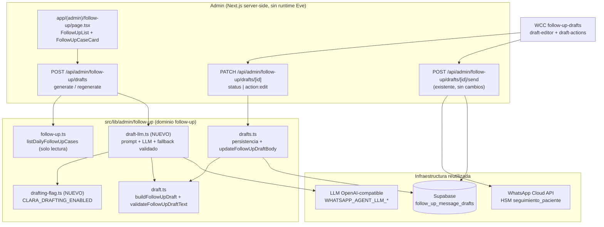
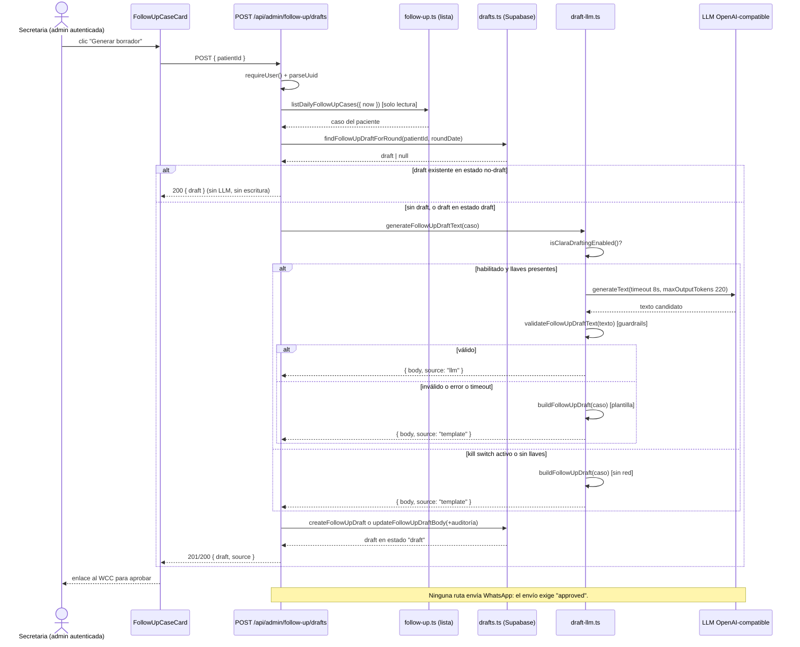
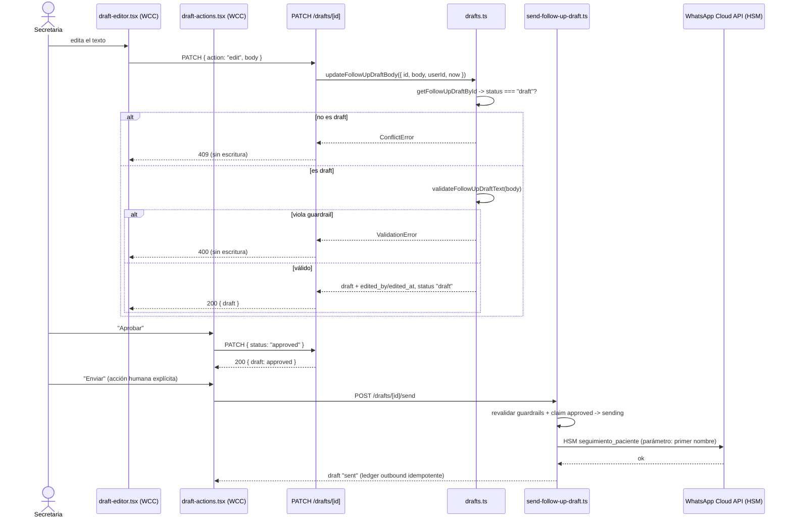

# Design: Redacción de borradores de seguimiento con aprobación humana (Clara, Fase 2)

## Contexto y objetivo

Este documento fija las decisiones técnicas del change
`clara-follow-up-draft-agent` (issue #148, Fase 2 del épico #140). La capability
nueva es `clara-drafting` y su contrato normativo está en
`specs/clara-drafting/spec.md`; el delta de redacción sobre la capability
existente está en `specs/follow-up/spec.md`. La capability `follow-up` de #89
(16 requirements / 48 escenarios) queda como base invariante: **no** se tocan
los cuatro segmentos, la deduplicación por paciente, la prioridad de motivos, el
orden canónico, la exclusión por ronda ni el envío humano.

Principios que gobiernan el diseño (`AGENTS.md`, `openspec/config.yaml`
`rules.design`, `proposal.md`):

- **El LLM redacta; el backend valida, decide y ejecuta.** El LLM nunca decide
  disponibilidad, nunca escribe en Supabase y nunca envía WhatsApp.
- **Ningún camino automático ni masivo.** La generación es bajo demanda por
  paciente; no hay cron, queue, job ni pre-generación de la lista.
- **La plantilla determinista es fallback obligatorio.** Ninguna ejecución deja
  al paciente sin borrador por causa del LLM.
- **Aprobación humana obligatoria** para cualquier envío, con el transporte HSM
  existente como único camino saliente.
- Todo instante nuevo se persiste como `timestamptz` y se presenta en
  `America/Mexico_City`.

Toda ruta, firma y línea citada aquí fue verificada leyendo el código de este
worktree.

---

## Decisión 1 — Superficie de Clara: capacidad server-side fuera del runtime Eve

**Decidido: opción (a), capacidad server-side fuera del runtime Eve**, dentro del
dominio admin existente (`src/lib/admin/follow-up/` + rutas admin).

**Por qué sí**

1. **No hay conversación que delegar.** Un subagente declarado (`agent/subagents/<id>/`)
   existe para que el agente raíz le delegue *dentro de una conversación de
   WhatsApp*, con identidad de paciente resuelta por el hook
   `agent/hooks/delegation-identity.ts` + `agent_delegation_bindings`. Clara no
   atiende conversaciones: su disparador es una petición HTTP autenticada de una
   secretaria. No hay sesión, mensaje entrante ni teléfono que resolver.
2. **El spec prohíbe la forma del subagente.** `clara-drafting` exige que Clara
   **MUST NOT** exponer canal de WhatsApp propio ni binding de agente de
   mensajería, y **MUST NOT** aceptar mensajes entrantes. Un subagente Eve vive
   dentro del runtime que sí tiene `agent/channels/whatsapp.ts`; acercarla a ese
   runtime es exactamente lo que el spec descarta.
3. **Consistencia con las decisiones previas.** #89 declaró "sin agente
   autónomo" y `architecture.md` §3.2 fija la topología vigente: "Clara y Nora
   NO son subagentes: son capacidades admin/jobs (ver specs `follow-up` y
   `dashboard-metrics`)". #148 dice "agente interno admin": se
   interpreta como capacidad admin, no como subagente conversacional.
4. **Superficie ya existente y autenticada.** La lista (`listDailyFollowUpCases`),
   los borradores (`follow_up_message_drafts`) y su aprobación ya viven en
   `app/api/admin/follow-up/` con `requireUser()`. Agregar la redacción ahí no
   crea runtime, canal, sesión ni binding nuevos.

**Por qué no las alternativas**

| Alternativa | Por qué se descarta |
|---|---|
| (b) Subagente declarado `agent/subagents/clara/` | Requiere binding de canal/identidad que el spec prohíbe; metería redacción admin en el path conversacional de Eva (non-goal explícito: "Cambios a Eva ni al path Eve conversacional"); su contrato de invocación es delegación desde una conversación, no una petición admin autenticada. |
| (c) Job / proceso programado | La decisión de producto 1 prohíbe la generación en lote o programada y el spec lo exige (`MUST NOT` generar automáticamente). Un job reintroduce la superficie cron que `follow-up` prohíbe ("ningún cron ni envío automático"). |

**Reconciliación con la topología de #140** (Eva / Mora / Clara / Nora):

| Agente | Naturaleza | Runtime | Identidad | Canal |
|---|---|---|---|---|
| Eva | Agente raíz conversacional | Eve (`agent/agent.ts`) | resuelve al paciente entrante | WhatsApp inbound |
| Mora | Subagente declarado Eve | Eve (`agent/subagents/mora/`) | `agent_delegation_bindings` | hereda el de Eva |
| **Clara** | **Capacidad admin (este change)** | **app Next.js server-side** | usuario admin (`requireUser()`) | **ninguno** |
| Nora | Capacidad admin / métricas | app Next.js server-side | usuario admin | ninguno |

Lo único que Clara comparte con Eve/Mora es la **capa de transporte del LLM**
(mismo endpoint OpenAI-compatible y mismas variables de entorno), no el runtime
ni el ciclo de vida conversacional. El provider de Eve (`agent/model.ts`) queda
**sin cambios**: la capability admin construye su propia instancia del provider
(decisión 4) para no acoplar el dominio admin al framework Eve.

---

## Alcance verificado en código

| Elemento | Estado verificado en este worktree |
|---|---|
| `src/lib/admin/follow-up/draft.ts` | `FOLLOW_UP_TEMPLATE_NAME = 'seguimiento_paciente'`, `MAX_DRAFT_LENGTH = 600`, `buildFollowUpDraft({ patientName, reason })` (puro) y `validateFollowUpDraftText(body)` (regex de precios, términos clínicos, presión, longitud; normaliza espacios y saltos). `followUpFirstName(fullName)` exportado. |
| `src/lib/admin/follow-up/drafts.ts` | `DRAFT_SELECT_COLUMNS`, `mapFollowUpDraftRow`, `getFollowUpDraftById`, `createFollowUpDraft` (upsert `ignoreDuplicates` por `dedup_key`, idempotente), `transitionFollowUpDraft` (solo desde `draft`, `ConflictError`), `claimFollowUpDraftForSend`, `markFollowUpDraftSent`, `markFollowUpDraftSentFailed`. La búsqueda por `dedup_key` **existe pero es privada** (`getFollowUpDraftByDedupKey`). |
| `src/lib/admin/follow-up/types.ts` | `FollowUpDraftStatus = draft\|approved\|rejected\|sent\|sent_failed` (el enum de BD también tiene `sending`), `FollowUpDraft`, `FollowUpCase` (`patientId`, `patientName`, `patientPhoneE164`, `reason`, `reasonLabel`, `reasonDate`, `roundDate`, `sourceAppointmentId`, `sourcePlanId`). |
| `app/api/admin/follow-up/drafts/route.ts` | `GET` (cola WCC por `?status=`) y `POST` (genera con `buildFollowUpDraft` y persiste; `201` si creó, `200` si ya existía). `POST` **no** envía nada. |
| `app/api/admin/follow-up/drafts/[id]/route.ts` | `PATCH` acepta **solo** `{ status: 'approved' \| 'rejected' }`. |
| `app/api/admin/_lib/responses.ts` | `handleAdminRequest` mapea `UnauthorizedError→401`, `ValidationError→400`, `NotFoundError→404`, `ConflictError→409`, resto `500`. `parseJsonBody` lanza `ValidationError('body')`. |
| `src/lib/admin/validate.ts` | `parseUuid`, `parseStatus`, `parseNonEmptyString(value, field)`, `ValidationError(field, message)`. |
| `src/lib/admin/follow-up/follow-up.ts` | `currentRoundDate(now)` (día calendario `America/Mexico_City`) y `listDailyFollowUpCases({ now })`. Solo lectura para esta capability. |
| `src/lib/wcc-follow-up-drafts.ts` | `getWccFollowUpDrafts({ status? })` degrada a cola vacía (`isSupabaseConfigured` / `isConfiguredButUnavailable`) y expone `body`, `status`, `errorMessage`, `approvedAt`, `sentAt`. **No** expone `edited_by`/`edited_at` (no existen aún). |
| `app/(admin)/whatsapp-command-center/follow-up-drafts/` | `page.tsx` (server component, lista `DraftCard`) + `draft-actions.tsx` (client: Aprobar / Rechazar / Enviar). **No hay edición de texto.** |
| `src/components/admin/follow-up/FollowUpCaseCard.tsx` | Botón "Generar borrador" → `onGenerateDraft(patientId)`; con `draftGenerated` muestra enlace al WCC. `FollowUpList.tsx` hace `POST /api/admin/follow-up/drafts`. |
| `src/lib/follow-up/send-follow-up-draft.ts` | Server-only; exige `approved`, revalida guardrails con `validateFollowUpDraftText`, hace claim atómico, y envía con `sendWhatsAppTemplateMessage({ templateName: draft.templateName, bodyParameters: [{ type: 'text', text: followUpFirstName(...) }] })`. |
| `agent/model.ts` | `createOpenAICompatible` + `createDynamicModel()` (Eve). La fábrica del provider es **privada** y está atada a `defineDynamic`; lee `WHATSAPP_AGENT_LLM_API_KEY/BASE_URL/MODEL` y normaliza el prefijo `proveedor/modelo`. |
| `src/lib/citas/reminder-reply-flag.ts` | Precedente exacto de kill switch: módulo puro con `TRUTHY_VALUES = {true,1,yes}`, **default off**, única lectura de la env var, con su test. |
| `supabase/migrations/` | Numeración ocupada hasta `0022_patient_files.sql`; los borradores son `0021_follow_up_message_drafts.sql` (`approved_by uuid`, `created_by uuid` **sin FK**, `timestamptz`, RLS `*_admin_all FOR ALL TO authenticated USING ((SELECT auth.uid()) IS NOT NULL)`). |
| `src/lib/admin/follow-up/__tests__/migration-0020.test.ts` | Test estructural por lectura de texto del SQL. **Ojo:** su nombre quedó desfasado; lee `0021_follow_up_message_drafts.sql`. También verifica que ninguna ruta de `app/api/cron` referencia el envío de borradores. |
| `ai@^7` (instalado) | `generateText` acepta `system`, `prompt`, `maxOutputTokens`, `maxRetries`, `temperature`, `timeout` (`{ totalMs }`) y `abortSignal`. |

### Hallazgo crítico verificado: el texto del borrador no es lo que recibe el paciente

`sendFollowUpDraft` envía el **HSM aprobado por Meta** `seguimiento_paciente`
(`src/lib/whatsapp/client.ts` → `type: 'template'`) con **un solo parámetro de
cuerpo: el primer nombre**. El `body` del borrador se revalida y se registra en
el ledger (`whatsapp_messages.body`), pero **no viaja como texto libre** al
teléfono del paciente (fuera de la ventana de 24 h Meta solo acepta plantillas
aprobadas).

Consecuencia de diseño, declarada explícitamente: el texto redactado por el LLM
y editado por la secretaria es el **contenido del borrador y el registro de lo
aprobado**, y el envío sigue siendo la plantilla aprobada con el nombre como
parámetro. Publicar texto personalizado en el teléfono exigiría una plantilla HSM
con un parámetro de cuerpo (aprobación de Meta + cambio del transporte), que
**queda fuera de alcance** y se registra como riesgo R1 para la fase tasks.

---

## Arquitectura general



Regla de dirección de dependencias: `draft-llm.ts` depende de `draft.ts` (puro),
de `drafting-flag.ts` (puro) y del provider; **nunca** al revés. `follow-up.ts`
(reglas) no depende de nada del camino LLM.

---

## Decisión 2 — Kill switch: `CLARA_DRAFTING_ENABLED`

**Variable de entorno exacta: `CLARA_DRAFTING_ENABLED`.**

**Default: apagado (`false` / ausente) → plantilla determinista, sin llamada al
LLM.** Justificación:

1. **Preserva el comportamiento actual tras el deploy.** El spec exige que con el
   kill switch activo el comportamiento "MUST equivaler al flujo previo a esta
   capacidad". Con default off, el primer deploy es inerte y la activación es una
   decisión explícita del operador.
2. **Precedente exacto del repo:** `WHATSAPP_REMINDER_REPLY_ENABLED=false`
   ("false (o unset) conserva el comportamiento actual. Usar para rollback") y su
   módulo `src/lib/citas/reminder-reply-flag.ts`. Misma convención: `true|1|yes`
   (case-insensitive) encienden; cualquier otra cosa apaga.
3. **Controla costo y latencia sin tocar datos.** Un borrador siempre existe
   (plantilla); lo único que se enciende o apaga es el camino LLM.

Semántica operativa (contrato único, sin ambigüedad):

| `CLARA_DRAFTING_ENABLED` | Kill switch | Comportamiento de la generación |
|---|---|---|
| ausente / `false` / `0` / `no` / cualquier valor no reconocido | **activo** | Texto por plantilla determinista. **No** se llama al LLM. El borrador se persiste igual en `draft`. |
| `true` / `1` / `yes` | apagado | Se intenta el LLM; ante falta de llaves, error, timeout o guardrail, cae a plantilla. |

Módulo nuevo, puro y con una sola lectura de la variable:
`src/lib/admin/follow-up/drafting-flag.ts`

```ts
export function isClaraDraftingEnabled(rawValue?: string | null): boolean;
```

Sin argumento lee `process.env.CLARA_DRAFTING_ENABLED` (lazy, en tiempo de
llamada). Consumidores llaman `isClaraDraftingEnabled()` sin argumento; los tests
inyectan el valor. `CLARA_DRAFTING_ENABLED=false` MUST agregarse a
`.env.local.example` con el comentario de rollback (patrón del flag de
recordatorios).

---

## Decisión 3 — Timeout del LLM y contrato de degradación

**Valor: `DRAFT_LLM_TIMEOUT_MS = 8000` (8 s), un solo intento
(`maxRetries: 0`).**

- Se pasa `timeout: { totalMs: DRAFT_LLM_TIMEOUT_MS }` a `generateText` (v7 del
  SDK `ai` lo soporta; también `abortSignal`).
- `maxRetries: 0`: la ruta admin `POST` responde de forma interactiva desde el
  panel; 8 s de un intento acotan la latencia total del request dentro del
  presupuesto típico de función serverless, y un reintento no aporta valor porque
  el fallback (plantilla) ya es barato y correcto.
- `maxOutputTokens: 220` (`DRAFT_LLM_MAX_OUTPUT_TOKENS`) acota el costo y hace
  improbable (no imposible) exceder `MAX_DRAFT_LENGTH`; el guardrail de longitud
  es la barrera real.
- `temperature: 0.4`: variación suficiente para que el texto no se sienta
  robótico, sin dispararse a texto largo o promocional.

**Comportamiento ante cualquier falla (mismo contrato para todos los casos):**

| Situación | Resultado |
|---|---|
| Kill switch activo (default) | Plantilla. Cero llamadas al LLM. |
| Llaves `WHATSAPP_AGENT_LLM_*` ausentes/vacías | Plantilla. Cero llamadas de red. |
| Error de red / proveedor 4xx-5xx / respuesta vacía | Plantilla. |
| Timeout de 8 s | Plantilla. |
| Salida que viola un guardrail (`validateFollowUpDraftText` lanza) | La salida **se descarta** (no se registra ni se persiste) y se usa plantilla. |
| Salida válida | Se persiste la salida del LLM. |

`generateFollowUpDraftText` **nunca lanza** por causas del LLM: siempre devuelve
`{ body, templateName, source }`, con `source: 'llm' | 'template'`. El error real
se registra una vez con `console.warn('[clara-drafting] llm fallback', { patientId, reason, error })`
sin cuerpo del mensaje ni datos clínicos. La respuesta HTTP es `201`/`200` en
ambos caminos: una falla del LLM no es un error del usuario.

---

## Decisión 4 — Módulo de redacción: `src/lib/admin/follow-up/draft-llm.ts`

**Archivo nuevo: `src/lib/admin/follow-up/draft-llm.ts`** (server-only; consume
env y red, por eso no se mezcla con el `draft.ts` puro).

Contrato:

```ts
import type { FollowUpCase } from './types';

export const DRAFT_LLM_TIMEOUT_MS = 8000;
export const DRAFT_LLM_MAX_OUTPUT_TOKENS = 220;

export type DraftTextSource = 'llm' | 'template';

export type FollowUpDraftTextResult = {
  body: string;
  templateName: string;
  source: DraftTextSource;
};

/** Firma mínima del proveedor de texto: inyectable en tests, sin red. */
export type FollowUpDraftProvider = (input: {
  system: string;
  prompt: string;
  timeoutMs: number;
  maxOutputTokens: number;
}) => Promise<string>;

/** Prompt del caso: solo datos no clínicos y no comerciales. Puro. */
export function buildFollowUpDraftPrompt(followUpCase: FollowUpCase): {
  system: string;
  prompt: string;
};

/**
 * Texto del borrador de un caso: LLM (si está habilitado y disponible) validado,
 * o plantilla determinista. Nunca lanza por causas del LLM.
 */
export async function generateFollowUpDraftText(
  followUpCase: FollowUpCase,
  deps?: {
    isEnabled?: () => boolean;
    provider?: FollowUpDraftProvider;
  }
): Promise<FollowUpDraftTextResult>;
```

Decisiones internas:

1. **Entrada: el caso ya calculado** (`FollowUpCase` completo). El módulo **no**
   consulta Supabase, **no** recalcula la lista y **no** conoce umbrales: consume
   `src/lib/admin/follow-up/` en modo solo lectura, como exige el spec.
2. **`isEnabled` y `provider` inyectables.** Default: `isClaraDraftingEnabled` y
   `createDraftProviderFromEnv()`. Los tests unitarios pasan un provider falso y
   no tocan la red (misma disciplina que el resto de la suite).
3. **Provider propio, sin acoplar a Eve.** `createDraftProviderFromEnv()` construye
   `createOpenAICompatible({ apiKey, baseURL, name: 'openai-compatible' })` con
   las **mismas** variables que `agent/model.ts`
   (`WHATSAPP_AGENT_LLM_API_KEY`, `WHATSAPP_AGENT_LLM_BASE_URL`,
   `WHATSAPP_AGENT_LLM_MODEL`, default `deepseek-v4-flash`) y la misma
   normalización del prefijo `proveedor/modelo`. Las lee **lazy en cada llamada**
   (no en el import), porque `agent/model.ts` las congela a nivel de módulo y eso
   impide testear y rotar env sin redeploy completo. `agent/model.ts` queda
   **intocado** (non-goal: no tocar el path Eve). Si la duplicación molesta
   después, se extrae una fábrica compartida en un change aparte.
4. **Falta de llaves = degradación silenciosa.** Si `apiKey` o `baseURL` están
   vacías, `generateFollowUpDraftText` ni siquiera construye el provider: devuelve
   plantilla (`source: 'template'`). Consistente con la regla
   `apply.guidelines`: "External integrations MUST degrade gracefully when keys
   are missing".
5. **Validación en el borde de la salida del LLM.** La salida cruda pasa por
   `validateFollowUpDraftText` dentro de un `try/catch`: texto vacío, > 600
   caracteres o con patrón prohibido ⇒ descarte + plantilla. El texto que sale de
   esta función **ya está validado y normalizado**.
6. **`templateName` siempre `FOLLOW_UP_TEMPLATE_NAME`** (`'seguimiento_paciente'`)
   en ambos caminos: es el nombre del HSM que el transporte usa al enviar, no una
   etiqueta de origen. El origen se expone aparte como `source` (observabilidad y
   tests), **sin** persistirlo (no se agrega columna).
7. **Sin I/O de BD y sin envío.** El módulo no persiste ni envía: devuelve texto.
   Persistir es responsabilidad de la ruta (`drafts.ts`).

---

## Decisión 5 — Prompt de redacción

**Estructura (`buildFollowUpDraftPrompt`, dos bloques separados por rol):**

`system` (invariante, independiente del caso):

- Rol: asistente de recepción de un consultorio dental que redacta **un** mensaje
  de seguimiento breve para que la secretaria lo revise y apruebe.
- Español de México, tono cálido y respetuoso, tuteo (consistente con las
  plantillas actuales: "Hola María, …").
- Longitud objetivo: 240–360 caracteres; **límite duro 600**.
- Un solo párrafo, texto plano: sin markdown, sin viñetas, sin emojis, sin firmas
  ni encabezados.
- **Prohibiciones explícitas:** no diagnosticar ni sugerir diagnósticos; no
  mencionar medicamentos, recetas, antibióticos, analgésicos, infecciones ni dolor
  intenso; no dar precios, costos, montos, descuentos ni promociones; no mencionar
  horarios concretos ni ofrecer disponibilidad; no crear presión ni urgencia
  ("última oportunidad", "oferta", "urgente"); no prometer resultados clínicos; no
  pedir datos clínicos ni datos personales sensibles.
- Invitación final suave a agendar o a resolver dudas, según el motivo.
- Salida: **únicamente** el texto del mensaje, sin explicaciones ni comentarios.

`prompt` (datos del caso, solo no clínicos):

- `Nombre: <primer nombre>` (`followUpFirstName(patientName)`).
- `Motivo: <reasonLabel>` + instrucción específica por motivo.
- `Fecha de referencia: <reasonDate formateada en es-MX>`.
- Recordatorio corto del límite de longitud y de las prohibiciones.

Instrucción por motivo (derivada de `reason`, sin datos clínicos):

| `reason` | Intención del texto |
|---|---|
| `no_show` | Retomar contacto tras una cita no atendida e invitar a agendar sin reclamo ni culpa. |
| `treatment_in_progress` | Dar seguimiento al plan de tratamiento y ofrecer agendar la siguiente visita (sin nombrar procedimientos). |
| `quote_no_response` | Ofrecer resolver dudas sobre el plan de tratamiento e invitar a una valoración, **sin** mencionar montos. |
| `inactive` | Saludar tras un tiempo sin visita e invitar a una revisión. |

**Qué NO se le pasa al LLM** (lista cerrada, verificable en test):

- Teléfono (`patientPhoneE164`), `patientId`, `roundDate`, `sourceAppointmentId`,
  `sourcePlanId`.
- Notas clínicas, expediente, diagnósticos, visitas, tratamientos concretos,
  dientes/procedimientos, planes de tratamiento, saldos o pagos.
- Precios, costos, descuentos, disponibilidad, horarios, agenda o slots.
- Historial de WhatsApp y cualquier contenido de conversaciones.

El prompt es **puro y componible**: recibe el caso y devuelve strings; no formatea
con zonas horarias dinámicas ni depende del reloj (la fecha se toma del caso).

---

## Decisión 6 — Migración de auditoría: `0023_follow_up_draft_edit_audit.sql`

**Archivo: `supabase/migrations/0023_follow_up_draft_edit_audit.sql`.**

> **Corrección de numeración (bloqueante para el apply):** el número propuesto en
> el contrato de la fase (`0022_...`) ya está ocupado en este worktree por
> `supabase/migrations/0022_patient_files.sql`. Se usa **0023** para no colisionar.
> No hay ningún otro archivo `0023_*`.

Contenido (aditivo, nullable, idempotente — estilo de los espejos 0018/0020/0021):

```sql
-- Auditoría de edición humana del borrador (columnas aditivas y nullable).
ALTER TABLE follow_up_message_drafts
  ADD COLUMN IF NOT EXISTS edited_by uuid,
  ADD COLUMN IF NOT EXISTS edited_at timestamptz;
```

Decisiones:

- **`edited_by` es `uuid` sin FK**, igual que `approved_by` y `created_by` en
  `0021_follow_up_message_drafts.sql`. Ese es el campo que el esquema usa hoy para
  actores admin; la integridad real la garantiza la API (`requireUser()`). Agregar
  una FK a `auth.users` solo en esta columna rompería la simetría del esquema y
  podría fallar en entornos donde el rol admin no vive en `auth.users`.
- **`edited_at` es `timestamptz`** (convención del repo para instantes).
- **RLS sin cambios de política.** La policy existente
  `follow_up_message_drafts_admin_all FOR ALL TO authenticated USING/ WITH CHECK (auth.uid() IS NOT NULL)`
  cubre todas las columnas; `anon` ya está revocado. No se agregan `GRANT`,
  policies, índices ni triggers: no hay filtros por estas columnas y
  `updated_at` ya tiene su trigger `follow_up_message_drafts_set_updated_at`.
- **Sin FK, sin default, sin backfill:** los borradores existentes conservan texto
  y estado, con `edited_by`/`edited_at` en `NULL` (requisito del spec).
- **Down migration nueva:** `supabase/migrations/down/0023_follow_up_draft_edit_audit.down.sql`
  con `ALTER TABLE follow_up_message_drafts DROP COLUMN IF EXISTS edited_at, DROP COLUMN IF EXISTS edited_by;`
  (orden inverso, sin tocar datos de otras columnas).
- **Rollback total:** revertir el código deja las columnas nullable sin uso; no se
  requiere down para desplegar el rollback funcional.

---

## Decisión 7 — API

Se reutilizan las dos rutas admin existentes (autenticación `requireUser()` sin
cambios) y **no** se crea ninguna ruta nueva. Ninguna ruta envía WhatsApp.

### `POST /api/admin/follow-up/drafts` — generar / regenerar (modificada)

Contrato externo: igual (`{ patientId }` → `{ draft }`, `201` si creó, `200` si
ya existía). Cambia el **origen del texto** y se agrega el caso de regeneración
explícita:

1. `requireUser()`; `parseUuid(body.patientId)`; `now = new Date()`;
   `roundDate = currentRoundDate(now)`.
2. `listDailyFollowUpCases({ now })` → buscar el caso; si no existe, `NotFoundError`
   (404). **Solo lectura de la lista.**
3. Buscar el borrador de la ronda con la nueva función exportada
   `findFollowUpDraftForRound({ patientId, roundDate })` (envuelve la búsqueda por
   `dedup_key` que hoy es privada):
   - **No existe** → `generateFollowUpDraftText(caso)` (LLM con fallback) →
     `createFollowUpDraft({ body, templateName, roundDate, userId })` → `201`
     `{ draft, source }`.
   - **Existe con `status: 'draft'`** → regenerar: `generateFollowUpDraftText(caso)`
     → `updateFollowUpDraftBody({ id, body, userId, now })` → `200`
     `{ draft, source, regenerated: true }`. La clave de deduplicación **no cambia**
     y no se crea un segundo borrador.
   - **Existe con `status` distinto de `draft`** (`approved`, `rejected`, `sent`,
     `sent_failed`) → **sin llamada al LLM y sin escritura**; `200`
     `{ draft, regenerated: false }`. Preserva la inmutabilidad exigida por el
     spec y evita gastar tokens sobre borradores ya decididos.
4. `source` (`'llm' | 'template'`) viaja en la respuesta para observabilidad y
   tests; no se persiste.

Nota: la llamada al LLM ocurre **después** de resolver el caso y solo cuando hay
algo que escribir, así que abrir el panel o pedir un borrador ya decidido nunca
gasta tokens.

### `PATCH /api/admin/follow-up/drafts/[id]` — transición o edición (extendida)

Payload discriminado; el contrato anterior sigue funcionando sin cambios:

| Payload | Efecto | Respuesta |
|---|---|---|
| `{ status: 'approved' \| 'rejected' }` | `transitionFollowUpDraft` (sin cambios: solo desde `draft`, si no `409`) | `200 { draft }` |
| `{ action: 'edit', body: string }` | `parseNonEmptyString(body, 'body')` → `updateFollowUpDraftBody({ id, body, userId, now })` | `200 { draft }` |
| Cualquier otro payload | `ValidationError` | `400 { error: 'invalid_request' }` |

Reglas de `{ action: 'edit' }`:

- Solo válido desde `draft`; otro estado ⇒ `ConflictError` ⇒ **409** y **sin
  escritura** (requisito: "la edición fuera de draft se rechaza").
- El texto pasa por `validateFollowUpDraftText` **dentro** de
  `updateFollowUpDraftBody`, antes de persistir: es el único punto de escritura de
  texto de borrador y garantiza que no exista texto sin validar en la tabla. Un
  texto con precio, término clínico, presión comercial, vacío o > 600 caracteres
  ⇒ `ValidationError` ⇒ **400** y sin escritura.
- Persiste `body` (normalizado), `edited_by = user.id`, `edited_at = now` y deja
  `status = 'draft'`.
- **No** dispara envío, **no** cambia el estado y **no** toca ningún otro registro.

**Regeneración: una sola ruta.** Se decidió concentrar la regeneración en `POST`
(un solo camino de código, un solo lugar que llama al LLM) y dejar `PATCH` como
superficie de edición humana. El WCC ofrece edición; para regenerar, el enlace al
panel de seguimiento ("Regenerar borrador").

### Sin cambios

`GET /api/admin/follow-up/drafts`, `POST .../[id]/send`,
`GET/POST /api/admin/follow-up`, `POST /api/admin/follow-up/contacts`,
`src/lib/follow-up/send-follow-up-draft.ts` y `src/lib/whatsapp/client.ts` quedan
intactos (invariante del proposal).

---

## Decisión 8 — UI

| Archivo | Cambio |
|---|---|
| `src/components/admin/follow-up/FollowUpCaseCard.tsx` | El botón dice "Generar borrador" y, cuando `draftGenerated` es verdadero, "Regenerar borrador" (mismo `onGenerateDraft`); se conserva el enlace al WCC para aprobar. Sin cambios de layout ni de otras acciones. |
| `src/components/admin/follow-up/FollowUpList.tsx` | Sin cambios estructurales: `POST` ya existe. Solo se ajusta el texto del botón si vive aquí. |
| `app/(admin)/whatsapp-command-center/follow-up-drafts/draft-editor.tsx` | **Nuevo** client component: `<textarea>` con el `body` del borrador + "Guardar cambios" (`PATCH { action: 'edit' }`), estado `busy`, error visible y `router.refresh()`. Solo se renderiza cuando `status === 'draft'`. Muestra el aviso "El envío requiere aprobación; guardar no envía nada." |
| `app/(admin)/whatsapp-command-center/follow-up-drafts/page.tsx` | Renderiza `<DraftEditor draft={...} />` en `DraftCard` cuando `status === 'draft'`, y muestra "Editado {fecha relativa}" cuando `editedAt` no es `null` (reutiliza `formatRelativeTime`). El copy de la página deja de decir "generados por plantilla" y pasa a "redactados por Clara y revisados por una persona". |
| `app/(admin)/whatsapp-command-center/follow-up-drafts/draft-actions.tsx` | Sin cambios funcionales (Aprobar / Rechazar / Enviar). Se mantiene separado del editor para conservar el diff pequeño. |
| `src/lib/wcc-follow-up-drafts.ts` | `WccFollowUpDraftRow` y `mapDraft` agregan `editedBy` / `editedAt`, y el `select` agrega `edited_by, edited_at`. Sigue degradando a cola vacía. |

**Texto asesor (priorización).** El diseño **no** introduce texto asesor en esta
entrega: el spec lo permite (`MAY`) pero no lo exige, y agregarlo requeriría otra
llamada LLM o persistencia adicional. El orden, los motivos y la composición de
la lista se renderizan exactamente como hoy desde `FOLLOW_UP_REASON_PRIORITY`.
Queda como follow-up opcional documentado, no como deuda oculta.

---

## Secuencia

### A — La secretaria genera el borrador bajo demanda



### B — Edición → aprobación → envío



---

## Seguridad y guardrails

- **El LLM no decide nada.** Disponibilidad, segmentos, deduplicación, prioridad y
  orden son deterministas y no leen salida del LLM. `follow-up.ts` y `rules.ts` no
  se modifican.
- **El LLM no escribe ni envía.** `draft-llm.ts` es puro respecto a la BD y a la
  red saliente: devuelve texto. Persistir es `drafts.ts`; enviar es
  `send-follow-up-draft.ts` y exige `approved`.
- **Doble barrera de guardrails.** `validateFollowUpDraftText` corre (1) sobre la
  salida del LLM antes de proponerla, (2) en `updateFollowUpDraftBody` antes de
  persistir cualquier texto y (3) otra vez en el envío (ya existente).
- **Sin canal, sin binding, sin cron.** Clara no agrega entradas en `agent/`, ni
  `agent_delegation_bindings`, ni rutas en `app/api/cron`. El test estructural
  actual que prohíbe referencias de cron a borradores sigue vigente.
- **Autorización.** Toda ruta usa `requireUser()`; `edited_by` y `approved_by`
  salen del usuario autenticado, nunca del payload.
- **RLS sin relajación.** Las columnas nuevas heredan la policy existente; `anon`
  sigue revocado.
- **Privacidad en logs.** El log de fallback incluye `patientId`, `reason` y el
  mensaje de error; nunca el cuerpo del borrador ni datos clínicos.

---

## Plan TDD por capa

Política: test-first (RED → GREEN → TRIANGULATE → REFACTOR) con `npm run test`
para unit/integración y `npm run test:local` contra Supabase local para la capa de
datos y la migración.

| # | Capa | Archivo de test | Casos (RED primero) |
|---|---|---|---|
| 1 | Flag (puro) | `src/lib/admin/follow-up/__tests__/drafting-flag.test.ts` (nuevo, espejo de `src/lib/citas/__tests__/reminder-reply-flag.test.ts`) | ausente/`null`/`''`/`false`/`0`/`no`/`on` ⇒ `false`; `true`/`1`/`yes` (con espacios y mayúsculas) ⇒ `true`; sin argumento lee la env var (**default off**). |
| 2 | Prompt (puro) | `src/lib/admin/follow-up/__tests__/draft-llm.test.ts` | el prompt incluye el primer nombre y el `reasonLabel`; **no** contiene teléfono, `patientId`, `roundDate`, `sourceAppointmentId`, `sourcePlanId`; **no** contiene precios, disponibilidad ni términos clínicos; instrucción distinta por cada uno de los 4 motivos; menciona el límite de 600. |
| 3 | Capacidad (LLM mockeado) | `src/lib/admin/follow-up/__tests__/draft-llm.test.ts` | kill switch activo ⇒ no se llama al provider y `source === 'template'` y el body es el de `buildFollowUpDraft`; sin llaves ⇒ no hay llamada de red; provider que lanza ⇒ template; provider con timeout (`DRAFT_LLM_TIMEOUT_MS`) ⇒ template; provider devuelve `''`, texto de 601 caracteres, texto con `$100`, `diagnóstico` o `promoción` ⇒ descarte + template (y el texto inválido no aparece en el resultado); provider devuelve texto válido ⇒ `source === 'llm'` y body normalizado por `validateFollowUpDraftText`. |
| 4 | Migración (estructural) | `src/lib/admin/follow-up/__tests__/migration-0023.test.ts` (nuevo, estilo de `migration-0020.test.ts`) | el SQL de `0023_follow_up_draft_edit_audit.sql` contiene `ADD COLUMN IF NOT EXISTS edited_by uuid` y `edited_at timestamptz` (nullable, sin `NOT NULL`, sin `DEFAULT`); no contiene `CREATE POLICY`, `GRANT`, `REVOKE`, `DROP` ni `NOT NULL`; el down `down/0023_*.down.sql` elimina `edited_at` y luego `edited_by`. |
| 5 | Capa de datos (Supabase local) | `src/lib/admin/follow-up/__tests__/drafts.test.ts` (extender) | `findFollowUpDraftForRound` encuentra por `dedup_key` y devuelve `null` si no existe; `updateFollowUpDraftBody` en `draft` persiste body + `edited_by` + `edited_at` y conserva `status`; en `approved`/`sent`/`sent_failed`/`rejected` lanza `ConflictError` y **no** escribe; id desconocido ⇒ `NotFoundError`; texto inválido ⇒ `ValidationError` y **no** escribe; `DRAFT_SELECT_COLUMNS`/`mapFollowUpDraftRow` exponen `editedBy`/`editedAt`. |
| 6 | Ruta POST | `app/api/admin/follow-up/drafts/route.test.ts` (extender, con `draft-llm` mockeado) | `201` al crear con texto LLM; `200` al regenerar un `draft` (llamando al generador y a `updateFollowUpDraftBody`); `200` **sin** llamar al generador ni escribir cuando el borrador existente está en `approved`/`sent`/`rejected`; `401` sin sesión; `400` con `patientId` inválido; `404` con paciente fuera de la lista; el body del borrador cumple los guardrails en todos los caminos. |
| 7 | Ruta PATCH | `app/api/admin/follow-up/drafts/[id]/route.test.ts` (extender) | `{ action: 'edit' }` válido ⇒ `200` y persiste texto + auditoría dejando `draft`; guardrail violado ⇒ `400` y sin escritura; estado no-`draft` ⇒ `409`; payload sin `status` ni `action` ⇒ `400`; `{ status }` (aprobar/rechazar) sigue funcionando igual. |
| 8 | UI WCC | `app/(admin)/whatsapp-command-center/follow-up-drafts/page.test.tsx` (extender) | en `draft` se renderiza el `<textarea>` con el body; guardar hace `fetch` a `/api/admin/follow-up/drafts/<id>` con `method: 'PATCH'` y `{ action: 'edit', body }`; en `approved`/`sent` no hay editor; se muestra "Editado …" cuando `editedAt` existe; el aviso de que guardar no envía está presente. |
| 9 | UI lista admin | `src/components/admin/follow-up/__tests__/FollowUpList.test.tsx` (extender) | el botón dice "Regenerar borrador" cuando `draftGenerated` es `true` y sigue haciendo `POST` al endpoint de borradores; "Agendar cita" sigue siendo un `Link`. |

**Cómo corre la suite de datos contra Supabase local** (equivalente a
`architecture.md` §9): `supabase start` → `supabase db reset` (aplica 0023) →
`npm run test:local` (`SUPABASE_LOCAL=1 vitest run`), con aislamiento por
`truncateAllTables` + advisory lock de `src/test-utils/local-db.ts`. La migración
se prueba en dos niveles: estructural (test 4, sin BD) y funcional (test 5, columnas
reales y `edited_by`/`edited_at` persistidos).

**Cierre de fase:** `npm run test`, `npx tsc --noEmit`, `npm run lint`,
`npm run build` y `npm run test:local` en verde.

---

## Notas para la fase tasks (forecast y gate de decisión)

- **Estrategia de entrega confirmada por el usuario:** 3 PRs encadenados (skill
  `chained-pr`), uno por slice del forecast.
- **Gate: "Decision needed before apply: No"** para la capacidad de redacción: la
  superficie (decisión 1), el kill switch (2), el timeout (3), el módulo (4), el
  prompt (5), la migración (6), las rutas (7) y la UI (8) quedan cerrados aquí. La
  única decisión abierta es de **alcance de entrega**, no de implementación (R1).
- **Archivos del apply** (lista exacta):
  - Nuevos: `src/lib/admin/follow-up/drafting-flag.ts`,
    `src/lib/admin/follow-up/draft-llm.ts`,
    `supabase/migrations/0023_follow_up_draft_edit_audit.sql`,
    `supabase/migrations/down/0023_follow_up_draft_edit_audit.down.sql`,
    `app/(admin)/whatsapp-command-center/follow-up-drafts/draft-editor.tsx`.
  - Modificados: `src/lib/admin/follow-up/types.ts`, `src/lib/admin/follow-up/drafts.ts`,
    `app/api/admin/follow-up/drafts/route.ts`, `app/api/admin/follow-up/drafts/[id]/route.ts`,
    `src/lib/wcc-follow-up-drafts.ts`,
    `app/(admin)/whatsapp-command-center/follow-up-drafts/page.tsx`,
    `src/components/admin/follow-up/FollowUpCaseCard.tsx` (+ `FollowUpList.tsx` si el
    copy del botón vive ahí), `.env.local.example` (agregar
    `CLARA_DRAFTING_ENABLED=false` con comentario de rollback), y los tests de la
    tabla anterior.
  - No se modifica: `agent/**`, `src/lib/follow-up/send-follow-up-draft.ts`,
    `src/lib/whatsapp/client.ts`, `src/lib/admin/follow-up/{rules,follow-up,config}.ts`,
    `vercel.json`, `travelhub-app`. `architecture.md` §3.2 ya describe esta
    topología; una línea opcional en el claim admin es documentación, no requisito.
- **Trampas de numeración y nombres:** usar **0023** (0022 ya es `patient_files`) y
  no repetir el desfase del test existente `migration-0020.test.ts` (que lee
  `0021_*.sql`): el nuevo test se llama `migration-0023.test.ts` y lee
  `0023_*.sql`.
- **Forecast de tamaño (slices de PR encadenados, skill `chained-pr`):**
  1. Flag + capacidad de redacción + prompt + unit tests (≈320 líneas con tests).
  2. Migración 0023 + capa de datos + rutas + tests de datos y de ruta (≈420 líneas).
  3. UI (editor WCC, botón regenerar, data layer WCC) + tests de UI + `.env.local.example`
     (≈260 líneas).
  Cada slice es verificable por sí solo; el slice 2 no depende del 3.
- **Activación operativa (post-merge):** poner `CLARA_DRAFTING_ENABLED=true` en
  Vercel para encender la redacción por LLM; quitarla o ponerla en `false` es el
  rollback inmediato.

---

## Riesgos

**R1 — El texto redactado no llega como texto libre al paciente (alcance de
entrega).** El transporte envía el HSM `seguimiento_paciente` con el primer nombre
como único parámetro; el cuerpo del borrador vive en la tabla y en
`whatsapp_messages.body`. Mitigación: el diseño lo hace explícito y el valor
entregado (redacción asistida + edición + auditoría + guardrails) es real y
verificable; publicar texto personalizado requiere una plantilla HSM con parámetro
de cuerpo (aprobación de Meta + cambio de transporte), fuera de alcance. **Acción
para la fase tasks: confirmar con el usuario si se acepta este alcance o si se abre
un change aparte para la plantilla.** **Resolución (fase tasks):** el usuario
aceptó el alcance interno-only; el texto redactado/editado queda como contenido
del borrador y registro de lo aprobado, el transporte HSM permanece sin cambios, y
una plantilla HSM con parámetro de cuerpo se cubrirá en un change/issue aparte.

**R2 — Costo/latencia del LLM.** Acotado: solo bajo demanda, un intento, 8 s de
timeout, 220 tokens de salida y cero llamadas si el borrador ya está decidido o el
kill switch está activo. Sin cron ni lote.

**R3 — Regeneración sobre escritura humana.** `POST` regenera un `draft` y
sobrescribe el texto editado. Mitigación: es una acción explícita ("Regenerar
borrador"), queda registrada en `edited_by`/`edited_at` y el envío sigue exigiendo
aprobación. No hay historial de versiones de texto (fuera de alcance).

**R4 — Salida del LLM que pasa las regex pero no es apropiada** (p. ej. tono frío
o datos irrelevantes). Los guardrails son deterministas y no cubren semántica.
Mitigación real: la edición humana y la aprobación obligatoria antes de cualquier
envío; el prompt prohíbe explícitamente lo no permitido. No se promete validación
semántica automática.

**R5 — Duplicación del provider frente a `agent/model.ts`.** Si cambian el modelo
o la convención de env en Eve, hay que replicarlo. Mitigación: mismas variables y
misma normalización, con test que verifica la lectura lazy de env; extraer una
fábrica compartida queda como follow-up (este change no toca `agent/`).

**R6 — `edited_by` sin FK.** Es consistente con `approved_by`/`created_by`, pero
un borrado de usuario dejaría un uuid huérfano. Aceptado: el esquema actual no
modela actores admin con FK.

---

## Fuera de alcance

- WhatsApp directo a Clara, canal propio, binding de agente y mensajes entrantes.
- Envío automático, programado, en lote o masivo (cron/queue/job).
- Generación en lote de la lista del día; pre-generación o cache de borradores.
- Cambios a la segmentación, deduplicación, prioridades, umbrales u orden.
- Texto asesor de priorización en la UI (permitido por el spec, no entregado aquí).
- Diagnóstico, consejo clínico, precios o disponibilidad en el texto.
- Nueva plantilla HSM con parámetro de cuerpo, cambios al transporte o al ledger.
- Historial de versiones del texto del borrador.
- Cambios a `agent/**` (Eva/Mora), al wizard `/appointments/new` o al motor de reserva.
- Cualquier modificación dentro de `travelhub-app`.

---

## Decisiones y trade-offs (resumen)

| Decisión | Elegido | Alternativa descartada | Razón corta |
|---|---|---|---|
| D1 Superficie | Capacidad server-side en el dominio admin | Subagente Eve / job | No hay conversación que delegar; el spec prohíbe canal y binding; un job contradice "sin generación programada". |
| D2 Kill switch | `CLARA_DRAFTING_ENABLED`, default **off** | Default on | Preserva el comportamiento actual hasta activación explícita; precedente `WHATSAPP_REMINDER_REPLY_ENABLED`. |
| D3 Timeout | 8 s, `maxRetries: 0`, 220 tokens, `temperature 0.4` | Sin límite / con reintentos | Latencia acotada para una acción interactiva; el fallback es barato y suficiente. |
| D4 Módulo | `src/lib/admin/follow-up/draft-llm.ts` con provider inyectable | Importar `agent/model.ts` / meter el LLM en `draft.ts` | Mantiene `draft.ts` puro y no acopla el admin a Eve; provider lazy y testeable. |
| D5 Prompt | System invariante + datos no clínicos del caso | Pasar el expediente o el historial | Minimiza datos personales/clínicos expuestos al proveedor y el riesgo de fuga. |
| D6 Migración | `0023_follow_up_draft_edit_audit.sql`, columnas nullable sin FK, RLS intacta | FK a `auth.users`, policy nueva | 0022 ya está ocupado; simetría con `approved_by`/`created_by`; la policy existente ya cubre UPDATE. |
| D7 API | `POST` genera/regenera; `PATCH [id]` con `{status}` o `{action:'edit'}` | Rutas nuevas (`/regenerate`, `/edit`) | Cambio aditivo y retrocompatible, sin superficie nueva que autenticar. |
| D8 UI | Editor en `draft-editor.tsx` + botón generar/regenerar | Editor dentro de `draft-actions.tsx` | Diffs pequeños y revisables; se conserva el componente de acciones intacto. |
| D9 Regeneración | Solo en `POST`; `PATCH` solo edita | Regenerar en ambos | Un solo lugar llama al LLM y un solo camino que probar. |
