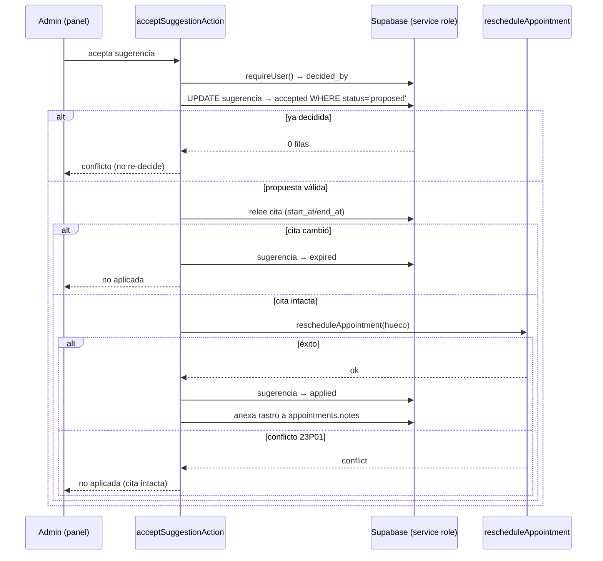

# Diseño: Nora — agenda productiva (indicadores y sugerencias de reacomodo)

## Contexto y objetivo

Este diseño implementa la capacidad nueva `nora-agent` descrita en `proposal.md`
y especificada en `specs/nora-agent/spec.md` (8 requisitos / 41 escenarios), y
resuelve el issue [#149](https://github.com/proyecto-polaris-ia/medica-app/issues/149)
dentro del épico [#140](https://github.com/proyecto-polaris-ia/medica-app/issues/140)
(Fase 3). La pregunta de negocio es operativa: **¿dónde quedaron huecos
improductivos y qué citas se podrían reacomodar para aprovecharlos, sin mover
nada sin que un humano lo apruebe?**

Nora se entrega en **dos fases con PRs apilados**:

- **Fase 1 — indicadores:** reutiliza el motor puro de métricas de #88 y agrega
  detección determinista de huecos, más una sección en el dashboard.
- **Fase 2 — sugerencias:** genera propuestas de reacomodo deterministas, las
  persiste y exige confirmación humana explícita en el panel antes de aplicar la
  única mutación sancionada.

Este documento fija la decisión central (**qué forma tiene Nora**), el modelo de
datos, el algoritmo determinista, el flujo de confirmación, el plan de migración,
el plan de pruebas y los archivos exactos. Toda ruta y firma citada aquí fue
verificada leyendo el código de este worktree.

---

## Decisión central: Nora es una capacidad determinista con UI, no un agente LLM

**Decisión.** Nora es una **capacidad determinista**: una librería pura + un
loader + una sección de panel. No hay prompt, no hay tool de modelo, no hay
subagente de Eve, no hay canal conversacional. La UI es la superficie de lectura y
de confirmación humana; toda la lógica de huecos y sugerencias es aritmética pura
en memoria sobre datos de la base de datos.

**Justificación.**

1. **Precedente de Clara (#89).** La otra capacidad de la Fase 2/#140 se resolvió
   como determinista, no como agente: las capacidades proactivas de negocio de
   este producto nacen deterministas y solo después, si acaso, ganan una capa
   conversacional. Ver `openspec/specs/follow-up/spec.md` ("El LLM no participa:
   las reglas de segmentación son puras, sin I/O ni relojes implícitos").
2. **Precedente de Mora.** Mora sí es un subagente declarado de Eve
   (`agent/subagents/mora/`), pero sus herramientas de negocio son deterministas
   y sus montos salen de la base ("MUST NOT compute or infer an amount from
   conversation content", `openspec/specs/mora-agent/spec.md`). Lo conversacional
   es la presentación; el cálculo siempre es determinista. Nora, al no requerir
   lenguaje natural, no necesita la capa conversacional.
3. **Principio arquitectónico del proyecto.** `architecture.md` §3.2 y
   `openspec/config.yaml` son explícitos: "El LLM interpreta y redacta; las tools
   ejecutan contra Supabase. El LLM no escribe en BD ni envía mensajes por sí
   mismo." Un agente que "proponga" reacomodos estaría decidiendo disponibilidad.
4. **"Toda disponibilidad sale de la BD".** Un generador no determinista podría
   proponer un horario que no existe. Eso viola una regla dura del dominio. La
   detección de huecos y la generación de sugerencias deben ser reproducibles y
   auditables: el mismo estado de agenda produce la misma lista.
5. **La evolución futura es una capa, no un reemplazo.** Si más adelante se
   quiere una Nora conversacional ("muéstrame los huecos de la próxima semana por
   WhatsApp"), esa capa sería una **presentación** sobre este núcleo
   determinista; nunca lo sustituiría ni decidiría disponibilidad por su cuenta.

**Alternativas consideradas y descartadas.**

| Alternativa | Por qué se descarta |
|---|---|
| **Agente LLM que propone slots.** Un subagente (o tool de Eve) que reciba la agenda y "sugiera" reacomodos en lenguaje natural. | El modelo decidiría disponibilidad, violando "toda disponibilidad sale de la BD" y el principio "el LLM no decide disponibilidad". Las propuestas no serían reproducibles ni auditables, y el riesgo de sugerir una hora ocupada es inaceptable. |
| **Enfoque solo-SQL (función o procedimiento almacenado) que replique la aritmética de huecos.** | Duplicaría en SQL las funciones puras ya probadas de #88 (`computeOccupancy`, `capacityMinutesForProvider`, `overlapsRange`) y la semántica de `booking_free_slots` (`0004_agenda_functions.sql`). Dos implementaciones de la misma verdad divergen; además el generador de razones y el orden determinista serían incómodos de probar en SQL. Se reutilizan las funciones puras y solo se persiste el resultado. |
| **Reutilizar `booking_free_slots` tal cual para los huecos de Nora.** | `booking_free_slots` está atado a un proveedor, **una** duración y **un** día, y devuelve slots discretizados por duración; no expone huecos crudos por proveedor/día con conteo y minutos. Se reutiliza su **semántica** ("libre" = citas con `status NOT IN ('cancelled','rescheduled')`), no su firma. |

---

## Base reutilizada (verificada en este worktree)

- `src/lib/admin/metrics/aggregate.ts:78` — `computeMetrics`: ocupación, no-show,
  totales y desglose por proveedor. **Sin cambios.**
- `src/lib/admin/metrics/occupancy.ts:26` — `overlapsRange` (solape semiabierto
  `[start, end)`).
- `src/lib/admin/metrics/occupancy.ts:61` — `capacityMinutesForProvider`
  (minutos de `business_hours` por día clínico del rango).
- `src/lib/admin/metrics/no-show.ts:18` — `computeNoShow`.
- `src/lib/admin/metrics/types.ts` — `ClinicRange`, `MetricAppointment`,
  `MetricBusinessHour`, `OCCUPANCY_STATUSES`.
- `src/lib/admin/metrics/range.ts:80` — `resolveRange` (presets `week` / `month` /
  `custom` con límites a medianoche local).
- `src/lib/admin/metrics/loader.ts:135` — `getDashboardMetrics`: contrato
  `isSupabaseConfigured` / `isConfiguredButUnavailable` y `Promise.all`.
- `src/lib/admin/timezone.ts:1,77,83` — `CLINIC_TZ` (`America/Mexico_City`),
  `clinicDayKey`, `clinicTimeLabel`.
- `src/lib/booking/reschedule.ts:33` — `rescheduleAppointment`: **única** ruta de
  mutación de agenda; rechaza `cancelled / attended / no_show`; devuelve
  conflicto `23P01` cuando la constraint de exclusión por proveedor se activa.
- `supabase/migrations/0004_agenda_functions.sql` — `booking_free_slots`: define
  "libre" como `business_hours` menos citas con `status NOT IN ('cancelled','rescheduled')`.
- `supabase/migrations/0018_appointment_reminders.sql` — patrón idempotente de
  tabla nueva: `IF NOT EXISTS`, trigger `set_updated_at`, RLS `ENABLE`/`FORCE`,
  `REVOKE anon`, `GRANT authenticated`, policy `admin_all`.
- `app/(admin)/dashboard/page.tsx` — server component con
  `export const dynamic = 'force-dynamic'` y `searchParams` (`preset`/`from`/`to`).
- `app/(admin)/dashboard/components/MetricsSection.tsx:165` y
  `MetricsRangeSelector.tsx:28` — sección presentacional y selector de rango.
- `src/components/admin/EmptyState.tsx:1` — estado vacío reutilizable.
- `app/(admin)/whatsapp-command-center/knowledge/actions.ts` — patrón de server
  actions `'use server'` con `requireUser()`.
- `src/lib/supabase/auth.ts:53` — `requireUser()` devuelve el usuario o lanza
  `UnauthorizedError`.

---

## Decisiones

### 1. Fase 1 — reuso del motor de #88 + detección de huecos

No se toca `src/lib/admin/metrics/`. Nora importa `computeMetrics` (para
ocupación/no-show), `overlapsRange` y `capacityMinutesForProvider`, y aporta
únicamente el delta: **huecos**. Esto satisface el requisito "Reuso del motor de
métricas" del spec.
Módulo puro nuevo `src/lib/admin/nora/gaps.ts`:

```ts
// Tipos reutilizados de src/lib/admin/metrics/types.ts
export const NORA_MIN_GAP_MINUTES = 30;

export type NoraGap = {
  providerId: string;
  dayKey: string;   // YYYY-MM-DD en America/Mexico_City
  startAt: string;  // ISO UTC
  endAt: string;    // ISO UTC
  minutes: number;
};

export function computeGaps(input: {
  businessHours: MetricBusinessHour[];
  appointments: MetricAppointment[];
  range: ClinicRange;
  minGapMinutes?: number; // default NORA_MIN_GAP_MINUTES
}): NoraGap[];
```

Reglas del cálculo (deterministas, sin `Date.now()` ni I/O):

1. **Días clínicos del rango.** Se itera el rango con pasos de 24 h desde
   `range.start` (medianoche local; MX no observa horario de verano, UTC−6 fijo),
   igual que `capacityMinutesForProvider`. El `dayKey` sale de `clinicDayKey`.
2. **Ventanas concretas.** Cada `business_hours` del proveedor cuyo `dayOfWeek`
   coincide con el día se convierte a instantes UTC: medianoche local + `startTime`
   y + `endTime`.
3. **Unión de ventanas.** Se ordenan por `startAt` y se fusionan las que se
   solapan o tocan (`next.start <= current.end`). Evita huecos duplicados por
   datos sucios (`business_hours` con traslapes).
4. **Citas activas.** Una cita ocupa salvo que su `status` sea `cancelled` o
   `rescheduled` — exactamente la semántica de `booking_free_slots`. Las citas se
   recortan a la ventana unida antes de restar.
5. **Resta.** De cada ventana unida se restan los intervalos ocupados ordenados,
   produciendo intervalos libres.
6. **Filtro.** Solo se devuelven los libres con `minutes >= minGapMinutes`.
7. **Orden.** Salida ordenada por `(providerId, startAt)` para ser reproducible.

Los huecos **no** se persisten: se calculan en memoria a partir de la agenda real
cada vez que se lee el panel.

### 2. Fase 2 — generador determinista de sugerencias

Módulo puro nuevo `src/lib/admin/nora/suggestions.ts`:

```ts
export const NORA_MAX_SUGGESTIONS = 20;

export type NoraSuggestionReason = 'gap_before' | 'gap_after' | 'gap_between';

export type NoraMovableAppointment = {
  id: string;
  providerId: string;
  startAt: string;
  endAt: string;
  status: 'requested' | 'pending' | 'confirmed';
  serviceDurationMinutes: number;
};

export type NoraSuggestion = {
  appointmentId: string;
  providerId: string;
  suggestedStartAt: string;
  suggestedEndAt: string; // suggestedStartAt + serviceDurationMinutes
  reasonCode: NoraSuggestionReason;
};

export function computeSuggestions(input: {
  gaps: NoraGap[];
  movableAppointments: NoraMovableAppointment[];
  activeAppointments: MetricAppointment[]; // para detectar huecos "entre" citas
  maxSuggestions?: number;                 // default NORA_MAX_SUGGESTIONS
}): NoraSuggestion[];
```

Reglas:

- **Movible** = `status IN ('requested','pending','confirmed')`. Los terminales
  (`cancelled`, `rescheduled`, `no_show`, `attended`) nunca entran.
- **Candidato** = hueco del **mismo proveedor** con `minutes >= serviceDurationMinutes`.
  El destino es `gap.startAt`. Si `gap.startAt === appointment.startAt`, la cita
  ya está en ese hueco: no es un movimiento, se descarta.
- **Código de razón** (determinista, sobre las citas activas del mismo proveedor):
  - `gap_between` si existe una cita activa que **termina** exactamente en
    `gap.startAt` y otra que **empieza** exactamente en `gap.endAt`.
  - en otro caso, `gap_before` si `gap.startAt < appointment.startAt`.
  - en otro caso, `gap_after`.
- **Mejor candidato por cita:** el hueco con menor `startAt` (empate por
  `endAt`); determinista e independiente del orden de la base.
- **Acotado y ordenado:** se ordena por `(providerId, suggestedStartAt, appointmentId)`
  y se recorta a `maxSuggestions`.
- **Nada se aplica aquí.** `computeSuggestions` es puro y no escribe en la base.

### 3. Modelo de datos — tabla nueva `nora_reschedule_suggestions`

**Migración nueva aditiva.** El patrón de tabla nueva (`IF NOT EXISTS`, trigger
`set_updated_at`, RLS forzado, `REVOKE anon`/`GRANT authenticated`, policy
`admin_all`) espeja `0018_appointment_reminders.sql` (el patrón "0012-style" de
tabla aditiva). **Nomenclatura:** por `architecture.md` §4, la convención vigente
es timestamp
`supabase/migrations/<timestamp>_nora_reschedule_suggestions.sql` (el timestamp
UTC se toma al crear el archivo), con su reversión en
`supabase/migrations/down/<timestamp>_nora_reschedule_suggestions.down.sql`.

```sql
CREATE TABLE IF NOT EXISTS public.nora_reschedule_suggestions (
  id uuid PRIMARY KEY DEFAULT gen_random_uuid(),
  appointment_id uuid NOT NULL REFERENCES public.appointments(id) ON DELETE CASCADE,
  provider_id uuid NOT NULL REFERENCES public.providers(id),
  suggested_start_at timestamptz NOT NULL,
  suggested_end_at timestamptz NOT NULL,
  status text NOT NULL DEFAULT 'proposed'
    CHECK (status IN ('proposed', 'accepted', 'rejected', 'expired', 'applied')),
  reason_code text NOT NULL
    CHECK (reason_code IN ('gap_before', 'gap_after', 'gap_between')),
  created_at timestamptz NOT NULL DEFAULT now(),
  updated_at timestamptz NOT NULL DEFAULT now(),
  decided_by uuid,
  decided_at timestamptz,
  CHECK (suggested_end_at > suggested_start_at)
);

CREATE INDEX IF NOT EXISTS idx_nora_suggestions_status_created
  ON public.nora_reschedule_suggestions (status, created_at DESC);
CREATE INDEX IF NOT EXISTS idx_nora_suggestions_appointment
  ON public.nora_reschedule_suggestions (appointment_id, created_at DESC);
```

Decisiones del modelo:

| Decisión | Valor | Razón |
|---|---|---|
| Tipo de `status` | `text` + `CHECK` | Tabla nueva y aditiva; evita crear un tipo Postgres nuevo que mantener/migrar. `appointment_status` queda intacto. |
| `appointment_status` | **No se modifica** | Invariante del dominio; la sugerencia tiene su propio ciclo de vida. |
| `reason_code` | `gap_before | gap_after | gap_between` | Taxonomía acotada de por qué el reacomodo aprovecha un hueco. |
| `decided_by` / `decided_at` | Nullable | Se llenan al aceptar/rechazar con `auth.uid()` y el instante. |
| `updated_at` | Trigger `set_updated_at` | Mismo patrón idempotente de 0018. |
| RLS | `ENABLE` + `FORCE`, solo `authenticated`, policy `admin_all` | Nora es administrativa; nada de `anon`. El service role (BYPASSRLS) usa el admin client. |
| `down` | `DROP TABLE` | Reversión limpia; no hay datos preexistentes que preservar. |

### 4. Carga y vista (`src/lib/admin/nora/loader.ts`)

Adaptador delgado, con el mismo contrato de degradación que
`getDashboardMetrics`:

```ts
export type NoraView = {
  isSupabaseConfigured: boolean;
  isConfiguredButUnavailable: boolean;
  generatedAt: string;
  preset: MetricsPreset;
  rangeLabel: string;
  range: { startAt: string; endAt: string };
  metrics: MetricsResult | null;   // reuso de #88; null = estado vacío
  gaps: NoraGap[];                 // vacío = sin huecos
  suggestions: NoraSuggestionRecord[]; // sugerencias persistidas no decididas
};

export async function getNoraView(
  params: { preset?: string; from?: string; to?: string },
  now?: Date
): Promise<NoraView>;
```

- Reutiliza `resolveRange` y `computeMetrics` (no reimplementa ocupación/no-show).
- Lecturas: citas del rango, `business_hours`, `providers`, `services`
  (duración) y `nora_reschedule_suggestions` en estado `proposed`. Mismo patrón de
  `Promise.all` + join manual por lote que `loader.ts` de métricas.
- Genera huecos con `computeGaps` y sugerencias con `computeSuggestions`; las
  sugerencias nuevas se persisten (Fase 2) de forma idempotente **solo** como
  `proposed` (nunca se aplican).
- Nunca lanza: si falta `isSupabaseConfigured` o la lectura falla, devuelve la
  vista degradada con `metrics: null`, `gaps: []`, `suggestions: []`.

> Nota de idempotencia de persistencia: el loader MUST NOT duplicar una sugerencia
> `proposed` ya existente para la misma `(appointment_id, suggested_start_at)`.
> La inserción se hace con una verificación previa por esa clave; una restricción
> `UNIQUE` parcial opcional puede reforzarla a nivel de BD (decisión de apply si
> los tests de datos muestran duplicados bajo concurrencia).

### 5. Flujo de confirmación humana y aplicación

**Server actions** en `app/(admin)/dashboard/nora-actions.ts` (`'use server'`),
siguiendo el patrón de `knowledge/actions.ts`:

```ts
'use server';
export async function acceptSuggestionAction(suggestionId: string): Promise<void>;
export async function rejectSuggestionAction(suggestionId: string): Promise<void>;
```

- Ambas llaman `await requireUser()` → `decided_by = user.id`. Sin usuario,
  `requireUser` lanza y la mutación no ocurre (requisito "administrador
  autenticado").
- Tras decidir, invalidan el cache de la ruta del dashboard para reflejar el
  nuevo estado. **La API exacta de revalidación MUST verificarse contra la guía
  de Next.js indicada por `AGENTS.md`** (la versión de Next.js de este repo
  puede diferir de lo esperado) antes de escribir la action.

**Ruta de aplicación** `src/lib/admin/nora/apply.ts` (I/O, admin client):

```ts
export type ApplyResult =
  | { ok: true; appointmentId: string }
  | { ok: false; reason: 'not_found' | 'already_decided' | 'expired' | 'conflict' | 'invalid_status' };

export async function applyAcceptedSuggestion(input: {
  suggestionId: string;
  decidedBy: string;
  occurredAt: Date;
}): Promise<ApplyResult>;
```

Secuencia de `acceptSuggestionAction`:

1. **Guarda optimista de la sugerencia.** `UPDATE nora_reschedule_suggestions
   SET status='accepted', decided_by=?, decided_at=? WHERE id=? AND status='proposed'`.
   Si afecta 0 filas → `already_decided` (idempotente; doble click no re-decide).
2. **Releer la cita.** Si `start_at`/`end_at` ya no coinciden con el estado
   original con el que se generó la propuesta → marcar `expired` y no aplicar.
3. **Aplicar por la única ruta sancionada.** Llamar
   `rescheduleAppointment({ appointmentId, patientId, serviceId, providerId,
   currentStartAt, currentEndAt, newStartAt, newEndAt, notes })`.
   - Éxito → marcar `applied` y anexar el rastro a `appointments.notes`.
   - `conflict` (`23P01`) → **no** marcar `applied`; la cita que ocupa el horario
     queda intacta; la sugerencia permanece `accepted` para revisión humana.
   - `invalid_status`/`not_found` → reportar sin marcar `applied`.
4. **Rastro auditable.** Anexar a `appointments.notes` (nunca sobrescribir), con
   marca de tiempo `America/Mexico_City` (`clinicTimeLabel`), siguiendo el formato
   normativo de `confirm-appointment-from-reminder`:

```
[2026-10-07 12:30 America/Mexico_City] Reacomodo aplicado (sugerencia <id>): <inicio anterior> → <inicio nuevo>
```

`rejectSuggestionAction` solo hace el `UPDATE ... WHERE status='proposed'` a
`rejected` con `decided_by`/`decided_at`; **no** toca la cita.

Un diagrama de secuencia del flujo de aceptación:



### 6. Panel — sección Nora

- `app/(admin)/dashboard/page.tsx` (modificado) resuelve
  `getNoraView(params)` en paralelo con `getDashboardMetrics(params)` usando los
  mismos `searchParams`, y renderiza `<NoraSection view={noraView} />` debajo de
  `MetricsSection`. El selector de rango existente
  (`MetricsRangeSelector`) se reutiliza sin cambios: el rango ya viaja por la URL.
- `app/(admin)/dashboard/components/NoraSection.tsx` (nuevo, server component):
  tarjetas de huecos y minutos improductivos, tabla por proveedor y día, lista de
  sugerencias con su razón, y `EmptyState` cuando no hay datos.
- `app/(admin)/dashboard/components/NoraSuggestionActions.tsx` (nuevo, cliente):
  botones **Aceptar** / **Rechazar** por sugerencia que invocan las server actions
  y muestran el resultado de la aplicación (aplicada, expirada o conflicto).
- Degradación: el mismo banner ámbar que `MetricsSection` cuando
  `isConfiguredButUnavailable`; estado vacío ante `metrics === null`, `gaps` vacío
  o `suggestions` vacío. Nunca valores `null`/`undefined`/negativos.

### 7. Contrato de degradación y estados vacíos

Idéntico al de `dashboard-metrics`: `isSupabaseConfigured` decide si se intenta la
lectura; `isConfiguredButUnavailable` refleja un fallo de lectura capturado; el
loader **nunca** lanza hacia el server component. `metrics === null` (sin citas ni
`business_hours`) produce estado vacío, no ceros engañosos.

### 8. Zona horaria

Todo día clínico y todo hueco se calcula con `CLINIC_TZ` y `clinicDayKey`; los
límites de `business_hours` se interpretan como horas locales `America/Mexico_City`
(UTC−6 fijo). El rastro de auditoría usa `clinicTimeLabel`. Nunca se usa la fecha
UTC del servidor para asignar un hueco a un día.

---

## Fuera de alcance

- Reprogramación automática o diferida; WhatsApp de sugerencias; Nora
  conversacional (LLM/subagente/tool).
- Cambios a `src/lib/admin/metrics/`, al contrato de `dashboard-metrics` o a la
  lógica de tendencia de #88.
- Cambios al enum `appointment_status` o a las transiciones de #87.
- Creación, edición o borrado de `business_hours` (disponibilidad publicada).
- Precios, diagnóstico o consejo clínico por cualquier canal.

---

## Plan de migración

1. Crear `supabase/migrations/<timestamp>_nora_reschedule_suggestions.sql`
   (timestamp UTC al momento de crearla) con la tabla, índices, trigger, RLS y
   policy descritos en §3, siguiendo el patrón idempotente de 0018.
2. Crear `supabase/migrations/down/<timestamp>_nora_reschedule_suggestions.down.sql`
   con `DROP TABLE IF EXISTS public.nora_reschedule_suggestions;`.
3. `supabase start` + `supabase db reset` para aplicar todas las migraciones desde
   cero contra la base local.
4. `npm run test:local` para las suites de datos (loader y ruta de aplicación).
5. La migración es **aditiva** y sin backfill; aplicar en producción deja la tabla
   vacía y sin efecto hasta que Fase 2 la use.

---

## Plan de pruebas

TDD activo (`openspec/config.yaml` → `apply.tdd: true`). RED primero por
comportamiento, luego GREEN, luego triangulación de bordes.

**Fase 1 — unitarias puras (Vitest, sin Supabase):**

| Escenario del spec | Archivo | Tipo |
|---|---|---|
| Hueco entre dos citas; día lleno sin huecos; cita cancelada no ocupa; ventanas solapadas se unen; tramo bajo el mínimo; cita que cruza el borde | `src/lib/admin/nora/__tests__/gaps.test.ts` | unit puro |
| Días clínicos y límites de ventana en `America/Mexico_City`; borde de medianoche | `src/lib/admin/nora/__tests__/gaps.test.ts` | unit puro |
| Reuso de `computeMetrics`: la ocupación/no-show de Nora es igual a la del motor | `src/lib/admin/nora/__tests__/loader.test.ts` (unit con mocks) | unit |

**Fase 2 — unitarias puras + datos locales:**

| Escenario del spec | Archivo | Tipo |
|---|---|---|
| Sugerencia hacia hueco real; sin hueco suficiente; no se inventan horas; códigos de razón; lista acotada y orden determinista; cita terminal no movible | `src/lib/admin/nora/__tests__/suggestions.test.ts` | unit puro |
| Carga de vista, persistencia idempotente de `proposed`, degradación sin Supabase y con fallo | `src/lib/admin/nora/__tests__/loader.local.test.ts` | datos locales (`npm run test:local`) |
| Aceptar aplica y marca `applied`; conflicto `23P01` no aplica; cita movida → `expired`; rastro en `notes` con hora clínica; `status` de cita intacto | `src/lib/admin/nora/__tests__/apply.local.test.ts` | datos locales |
| Server actions: requieren usuario; solo `proposed` se decide; rechazar no mueve la cita | `app/(admin)/dashboard/__tests__/nora-actions.test.ts` (con `requireUser` y clientes mockeados) | unit |
| Sección Nora: render de huecos/sugerencias, estado vacío y degradación; `page.tsx` sigue mostrando métricas y la rejilla | `app/(admin)/dashboard/page.test.tsx` (modificado) | unit con mocks |

Verificación global del change: `supabase start` + `supabase db reset` +
`npm run test:local`, luego `npx tsc --noEmit` y `npm run build`.

---

## Archivos (nuevos y modificados)

**Fase 1**

| Archivo | Estado | Rol |
|---|---|---|
| `src/lib/admin/nora/types.ts` | Nuevo | Tipos y constantes de Nora. |
| `src/lib/admin/nora/gaps.ts` | Nuevo | `computeGaps` puro. |
| `src/lib/admin/nora/loader.ts` | Nuevo | `getNoraView`, degradación y reuso de métricas (parte de indicadores; Fase 2 agrega sugerencias). |
| `src/lib/admin/nora/__tests__/gaps.test.ts` | Nuevo | Unit puro de huecos y TZ. |
| `src/lib/admin/nora/__tests__/loader.test.ts` | Nuevo | Unit con mocks (degradación y reuso de métricas). |
| `app/(admin)/dashboard/components/NoraSection.tsx` | Nuevo | Sección presentacional. |
| `app/(admin)/dashboard/page.tsx` | Modificado | Resuelve `getNoraView` y monta `NoraSection`. |
| `app/(admin)/dashboard/page.test.tsx` | Modificado | Cubre la sección Nora sin romper lo existente. |

**Fase 2**

| Archivo | Estado | Rol |
|---|---|---|
| `src/lib/admin/nora/suggestions.ts` | Nuevo | `computeSuggestions` puro. |
| `src/lib/admin/nora/apply.ts` | Nuevo | `applyAcceptedSuggestion` sobre `rescheduleAppointment`. |
| `src/lib/admin/nora/__tests__/suggestions.test.ts` | Nuevo | Unit puro del generador. |
| `src/lib/admin/nora/__tests__/loader.local.test.ts` | Nuevo | Datos locales del loader. |
| `src/lib/admin/nora/__tests__/apply.local.test.ts` | Nuevo | Datos locales de aplicación/lifecycle/rastro. |
| `app/(admin)/dashboard/nora-actions.ts` | Nuevo | Server actions aceptar/rechazar. |
| `app/(admin)/dashboard/components/NoraSuggestionActions.tsx` | Nuevo | Cliente con botones de decisión. |
| `app/(admin)/dashboard/__tests__/nora-actions.test.ts` | Nuevo | Unit de actions. |
| `supabase/migrations/<timestamp>_nora_reschedule_suggestions.sql` | Nuevo | Tabla aditiva + índices + RLS. |
| `supabase/migrations/down/<timestamp>_nora_reschedule_suggestions.down.sql` | Nuevo | Reversión. |

---

## Riesgos

- **Sugerencia obsoleta.** La cita o el hueco pueden cambiar entre generación y
  aceptación. Mitigación: releer la cita y comparar `start_at`/`end_at` + guarda
  optimista + constraint de exclusión (`23P01`).
- **Doble decisión concurrente.** Mitigación: `UPDATE ... WHERE status='proposed'`;
  solo la primera gana.
- **Datos sucios de `business_hours`.** Mitigación: unir ventanas antes de restar
  y mínimo de duración.
- **Carga del panel.** Mitigación: lecturas agregadas y aritmética en memoria;
  `getDashboardMetrics` y `getNoraView` corren en paralelo.
- **API de revalidación de Next.js.** La versión instalada puede diferir de la
  esperada. Mitigación: leer la guía vigente de Next.js que exige `AGENTS.md`
  antes de escribir las server actions.
