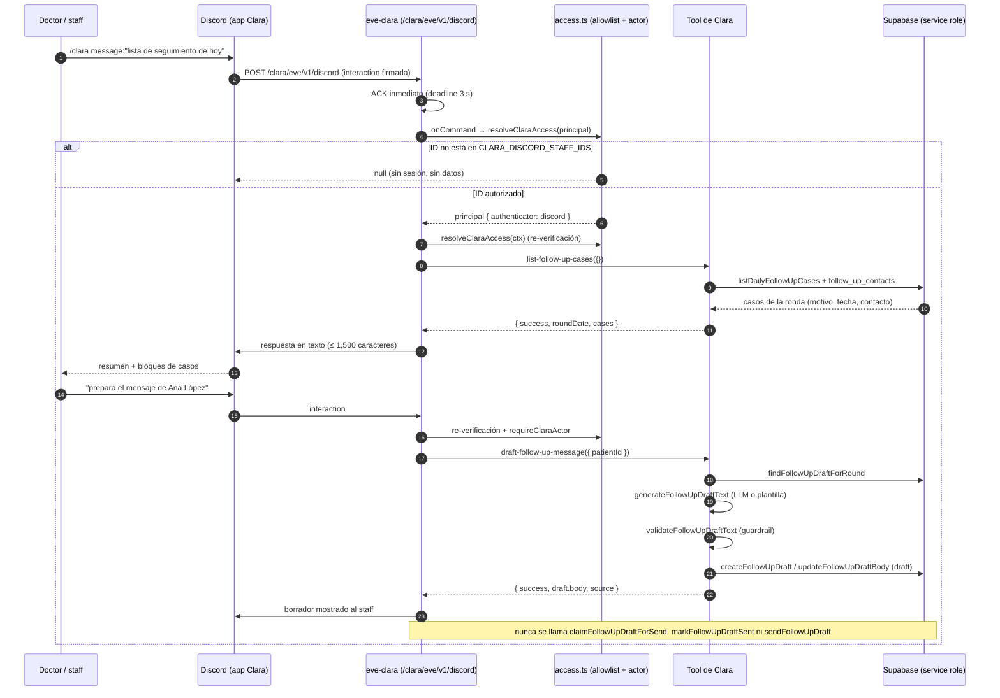

# Design: Clara como agente raíz con canal Discord (issue #161, Fase 4)

**Issue**: [#161](https://github.com/proyecto-polaris-ia/medica-app/issues/161) ·
**Épico**: #140 · **Fase**: 4 · **Change**: `fase-4-clara-agente-raiz-discord`
**Deltas**: `clara-agent`, `clara-discord-channel`, `clara-follow-up-tools`,
`clara-drafting` (modificado) · **Sin delta**: `follow-up`, `eve-framework`.

Regla del proyecto que gobierna todo el diseño (`openspec/config.yaml#rules.design`):
**el LLM interpreta y redacta; el backend valida y ejecuta**. Ninguna decisión de
este documento invierte ese orden: Clara no decide disponibilidad, no decide
umbrales, no escribe por sí misma y no envía nada.

---

## 1. Topología resultante

```
WhatsApp (Meta Cloud API)             Discord (Interactions HTTP)
        │                                      │                    │
        ▼                                      ▼                    ▼
/eva/eve/v1/whatsapp ─► eve-eva      /mora/eve/v1/discord ─► eve-mora   /clara/eve/v1/discord ─► eve-clara
        │                                      │                    │
        ▼                                      ▼                    ▼
 agents/eva/agent/                    agents/mora/agent/   agents/clara/agent/
 (Eva, raíz, pacientes)               (Mora, raíz, doctores) (Clara, raíz, staff/doctores)
        │                                      │                    │
        └──────────────► Supabase (service role, getSupabaseAdmin) ◄─┘
```

- Tercer agente raíz del workspace `agents/`; cada miembro se despliega como
  servicio Vercel independiente. `Eva` conserva el único binding de WhatsApp.
- Clara **no** tiene canal de WhatsApp ni tool de envío: su única superficie
  entrante es Discord, y su salida es texto al propio canal de staff.

---

## 2. Inventario exacto de archivos

### 2.1 Nuevos (agente)

| Archivo | Origen | Contenido |
|---|---|---|
| `agents/clara/agent/agent.ts` | copia adaptada de `agents/mora/agent/agent.ts:9` | `defineAgent({ model: createDynamicModel(), limits: { sessionTimeoutMs: 1800000 } })`; comentario de identidad de Clara |
| `agents/clara/agent/model.ts` | copia casi literal de `agents/mora/agent/model.ts` (65 líneas) | `resolveModelConfig(env)` + `createDynamicModel()` (provider OpenAI-compatible con header `x-opencode-session`) |
| `agents/clara/agent/instructions.md` | nuevo | personalidad, guardrails, escalamiento, formato Discord (§9) |
| `agents/clara/agent/access.ts` | adaptado de `agents/mora/agent/access.ts` | allowlist de staff + mapa actor + resolución de paciente y de caso de ronda (§6) |
| `agents/clara/agent/channels/discord.ts` | adaptado de `agents/mora/agent/channels/discord.ts` | `discordChannel({ credentials, onCommand })` con `DISCORD_*` y `CLARA_DISCORD_STAFF_IDS` |
| `agents/clara/agent/tools/list-follow-up-cases.ts` | nuevo | tool de lectura de la lista del día |
| `agents/clara/agent/tools/get-follow-up-rules.ts` | nuevo | tool de lectura de reglas/umbrales |
| `agents/clara/agent/tools/get-follow-up-draft.ts` | nuevo | tool de lectura del borrador de la ronda |
| `agents/clara/agent/tools/draft-follow-up-message.ts` | nuevo | redacción + persistencia `draft` |
| `agents/clara/agent/tools/transition-follow-up-draft.ts` | nuevo | `approved` / `rejected` |
| `agents/clara/agent/tools/mark-contact-attempted.ts` | nuevo | `follow_up_contacts` estado `contacted` |
| `agents/clara/agent/tools/dismiss-follow-up.ts` | nuevo | `follow_up_contacts` estado `dismissed` |
| `agents/clara/agent/skills/follow-up-workflow.md` | nuevo | flujo paso a paso (§10) |
| `agents/clara/agent/skills/drafting-guidelines.md` | nuevo | guías de redacción (§10) |

**Sin `package.json`.** No es cosmético: `isWorkspaceOwnedAgentRoot`
(`node_modules/eve/dist/src/internal/project-context.js`) descarta como miembro de
workspace cualquier directorio `agents/<name>` que contenga `package.json`, y
entonces `eve info --agent clara` / `eve build --agent clara` dejan de resolver al
agente. `agents/eva` y `agents/mora` tampoco lo tienen.

**Sin `agents/clara/agent/subagents/`, `hooks/` ni `instrumentation.ts`.** No hay
delegación (spec `clara-agent`: "Las interacciones de Clara no se delegan").

### 2.2 Nuevos (despliegue y docs)

| Archivo | Contenido |
|---|---|
| `.eve/vercel-services/eve-clara/README.md` | scaffold del servicio, calcado de `.eve/vercel-services/eve-mora/README.md` |
| `docs/clara-discord-setup.md` | setup manual de la app de Discord de Clara (§11) |

### 2.3 Modificados

| Archivo | Cambio |
|---|---|
| `vercel.json` | servicio `eve-clara` + rewrite `/clara/eve/v1/(.*)` antes del catch-all (§8) |
| `.gitignore` | línea `!/.eve/vercel-services/eve-clara/` junto a las de `eve-eva`/`eve-mora` (líneas 57-58) |
| `docs/eve-runbook.md` | topología (§12.1) |
| `architecture.md` | §3.2 (§12.2) |

**Invariantes (no se tocan):** `src/lib/admin/follow-up/*`,
`src/lib/follow-up/send-follow-up-draft.ts`, `agents/eva/agent/*`,
`agents/mora/agent/*`, `middleware.ts`, migraciones.

---

## 3. Decisiones

Formato: **Decisión / Rationale / Alternativa rechazada**.

### D1 — Identidad del principal: allowlist fail-closed en el canal y en cada tool

**Decisión.** La autorización vive en `CLARA_DISCORD_STAFF_IDS`
(user IDs de Discord, separados por coma, `trim` + case-insensitive). Se evalúa
dos veces con el mismo código de `agents/clara/agent/access.ts`: en
`onCommand` del canal (usuario no autorizado ⇒ `null`, no se abre sesión) y al
inicio de **cada** tool (defensa en profundidad). Sin variable, vacía o con solo
espacios ⇒ denegado. El principal viaja en `ctx.session.auth.current`, nunca en
texto del modelo ni en argumentos de la tool.

**Rationale.** Es el patrón ya probado de Mora (`agents/mora/agent/access.ts:67`,
`agents/mora/agent/channels/discord.ts:44`) y la spec lo exige textualmente
(`clara-discord-channel` → "Allowlist fail-closed"; `clara-follow-up-tools` →
"El texto del modelo no decide la escritura"). Una sola allowlist cubre staff y
doctores, como pide la spec ("MUST cubrir tanto al staff administrativo como a
los doctores autorizados"); no hay acciones con audiencia distinta dentro de
Clara.

**Alternativa rechazada.** Dos allowlists (`..._STAFF_IDS` / `..._DOCTOR_IDS`):
la spec nombra una sola variable y la única diferencia funcional sería
cosmética (todo el set de tools es de seguimiento, no de cobranza ni de datos
financieros).

### D2 — Actor de auditoría: `CLARA_DISCORD_ACTOR_MAP` (mapa Discord → usuario de Supabase)

**Decisión.** Las tools de escritura resuelven, además del ID de Discord, un
`actorUserId` (UUID) desde la variable `CLARA_DISCORD_ACTOR_MAP`, con pares
`<discordUserId>=<supabaseUserUuid>` separados por coma. Sin mapeo para el
usuario autorizado, **las tools de escritura se niegan** (con mensaje propio);
las de lectura siguen funcionando. Es fail-closed: el default no escribe.

**Rationale (verificado contra el código).** El camino determinista existente
**exige un UUID**:
`markFollowUpContact` valida `userId` con `parseUuid` (`src/lib/admin/follow-up/follow-up.ts:295`)
y persiste `created_by uuid` (`follow-up_contacts.created_by`, migración
`0020_follow_up_contacts.sql:24`); `createFollowUpDraft`,
`transitionFollowUpDraft` y `updateFollowUpDraftBody` escriben `created_by` /
`approved_by` / `edited_by uuid` (migraciones `0021` y `0023`). Un user ID de
Discord es un snowflake numérico (p. ej. `111222333444555666`) y **no** pasa
`parseUuid` (`src/lib/admin/validate.ts:7`), así que la tool fallaría con
`ValidationError` o —peor, si se relajara la validación— dejaría un
`created_by` que no corresponde a ningún usuario del consultorio. Como el
proposal prohíbe crear la tabla de staff (Non-goals) y la lógica de
`src/lib/admin/follow-up/` no se modifica, el único origen posible del UUID es
configuración.

**Alternativa rechazada.** Derivar un UUID determinista (v5) de
`discord:<id>`: evita una variable, pero inventa un actor sintético que no
existe en `auth.users`; `created_by`/`approved_by` son la auditoría que el panel
humano ya usa para atribuir la acción, y un id sintético la vuelve
ininterpretable sin conocer la derivación. Reconsiderar solo si el consultorio
rechaza mantener el mapa.

### D3 — Resolución del paciente y precondición de ronda

**Decisión.** Las tools que operan sobre un paciente lo resuelven con
`resolvePatient` de Clara (id exacto / `phone_e164` exacto / `full_name` con
`ilike` tope 5). Ambigüedad ⇒ candidatos con nombre y teléfono, sin datos
clínicos ni financieros, y no se opera. Las tools de escritura exigen además que
el paciente pertenezca a la ronda en curso: está en
`listDailyFollowUpCases({ now })` **o** ya tiene registro en
`loadFollowUpContactsForRound(currentRoundDate(now))`. Si no, se niegan con
mensaje explícito y sin escribir.

**Rationale.** La ronda es la unidad de verdad de la lista (`follow-up.ts:190`,
`follow-up.ts:267`) y la spec pide no exponer ni actuar sobre pacientes ajenos
("Solo datos de la base y sin fuga entre pacientes"). Permitir el "ya marcado"
mantiene la idempotencia exigida por la spec ("La marca repetida no duplica el
registro"): tras marcar, el paciente sale de la lista, y la segunda marca debe
poder resolverse para no duplicar ni fallar.

**Alternativa rechazada.** Copiar tal cual la ruta admin
(`app/api/admin/follow-up/contacts/route.ts:31-34`, que solo valida que el
paciente exista): deja que el agente marque a un paciente que nunca listó, sin
precondición de ronda.

### D4 — Set final de tools: 7, con lectura y escritura separadas

**Decisión.** Set expuesto al modelo:

`list-follow-up-cases`, `get-follow-up-rules`, `get-follow-up-draft`
(lectura) · `draft-follow-up-message`, `transition-follow-up-draft`,
`mark-contact-attempted`, `dismiss-follow-up` (escritura).

`list-follow-up-cases` **no** incluye borradores: la lista de Clara es idéntica a
la del panel (mismos pacientes, mismos motivos, mismo orden) y el borrador de un
paciente se consulta con `get-follow-up-draft`. `get-follow-up-rules` es tool y
no solo conocimiento de skill, porque la spec exige que la explicación de "por
qué está en la lista" salga del código y no del prompt
(`clara-follow-up-tools` → "La explicación se basa en la tool de reglas").

**Rationale.** Enriquecer la lista con borradores exigiría un `join` que hoy no
existe en `listDailyFollowUpCases` y crearía un segundo camino de datos; la
identidad con el panel es un criterio de aceptación del proposal.

**Alternativa rechazada.** `list-follow-up-cases({ includeDraftStatus: true })`:
duplica en el agente una selección que el panel resuelve en la pestaña de WCC
(`src/lib/wcc-follow-up-drafts.ts`).

### D5 — `draft-follow-up-message` replica la ruta admin (crear o regenerar) y revalida antes de persistir

**Decisión.** Precondición: el caso debe estar en la lista del día (mismo
`NotFoundError` semantics que la ruta admin). Luego:

1. `findFollowUpDraftForRound({ patientId, roundDate })` (`drafts.ts:110`).
2. Borrador existente con estado decidido (`approved`/`rejected`/`sent`/
   `sent_failed`) ⇒ se devuelve tal cual, **sin** llamar al LLM y sin escribir.
3. Borrador existente en `draft` ⇒ se regenera el texto con
   `generateFollowUpDraftText` y se persiste con `updateFollowUpDraftBody`
   (`drafts.ts:220`).
4. Sin borrador ⇒ `generateFollowUpDraftText(followUpCase)`
   (`draft-llm.ts:172`) y `createFollowUpDraft` (`drafts.ts:126`).

En los pasos 3 y 4 el texto pasa por `validateFollowUpDraftText`
(`draft.ts:101`) **inmediatamente antes de escribir**. Nunca hay generación en
lote: una llamada = un paciente explícito.

**Rationale.** Paridad exacta con `app/api/admin/follow-up/drafts/route.ts:51-81`
(misma secuencia, misma idempotencia por `buildDraftDedupKey`, `dedup_key` sin
cambios). La revalidación no es redundante: `generateFollowUpDraftText` valida
la salida del LLM, pero `createFollowUpDraft` **no** valida al insertar, y la
spec exige "MUST revalidar los guardrails antes de persistir". La regeneración
mantiene la promesa del panel de que volver a pedir el texto lo refresca; el
`edited_by`/`edited_at` que escribe `updateFollowUpDraftBody` deja la auditoría
del actor de Discord.

**Alternativa rechazada.** Devolver el borrador existente sin regenerar: cuesta
cero tokens, pero introduce una divergencia silenciosa con el panel (mismo gesto
del staff, resultado distinto según la superficie).

### D6 — Transiciones limitadas por el tipo de entrada

**Decisión.** `transition-follow-up-draft` acepta
`decision: z.enum(["approved", "rejected"])` y delega en
`transitionFollowUpDraft` (`drafts.ts:170`). `sent` y `sent_failed` **no son
expresables** en el schema; un borrador que no está en `draft` produce
`ConflictError`, que la tool devuelve como `{ success: false, error }`. No se
expone `updateFollowUpDraftBody` como tool de edición.

**Rationale.** La spec pide rechazar cualquier transición hacia `sent` /
`sent_failed` y mantener inmutable un borrador ya decidido. Hacerlo
estructuralmente (enum) es más fuerte que una comprobación en runtime, y el
409/conflicto ya vive en el módulo (`drafts.ts:179-183`). La edición de texto
sigue siendo del panel (`app/api/admin/follow-up/drafts/[id]/route.ts:41-52`) y
así no hay un segundo punto de escritura de texto desde el chat.

**Alternativa rechazada.** `status: z.string()` con lista negra: deja la
prohibición en manos de una comprobación que se puede olvidar.

### D7 — El envío queda fuera, explícitamente

**Decisión.** Ningún archivo de `agents/clara/agent/tools/` importa ni expone:
`claimFollowUpDraftForSend` (`drafts.ts:258`), `markFollowUpDraftSent`
(`drafts.ts:277`), `markFollowUpDraftSentFailed` (`drafts.ts:307`),
`sendFollowUpDraft` (`src/lib/follow-up/send-follow-up-draft.ts:173`) ni
`insertFollowUpOutboundMessage` (`:133`). El envío sigue siendo humano por el
WCC tras aprobación explícita.

**Rationale.** Non-goal del proposal y requirement de la spec. Un test
estructural lo verifica por `grep` sobre los archivos de tools (§13).

**Alternativa rechazada.** Ninguna: el envío fuera de Clara es invariante del
épico.

### D8 — Canal Discord propio: credenciales `DISCORD_*` con placeholder, app independiente

**Decisión.** `agents/clara/agent/channels/discord.ts` replica
`agents/mora/agent/channels/discord.ts:82`:

```ts
export default discordChannel({
  credentials: {
    applicationId: credential("DISCORD_APPLICATION_ID"),
    botToken: credential("DISCORD_BOT_TOKEN"),
    publicKey: credential("DISCORD_PUBLIC_KEY"),
  },
  onCommand: (_ctx, interaction) => handleClaraDiscordCommand(interaction),
});
```

con `const credential = (key) => process.env[key] || "unconfigured"`. El canal
se construye siempre para que `eve build` registre la ruta; el adapter de
Discord rechaza en runtime las interacciones con credenciales inválidas.
`handleClaraDiscordCommand` (exportado para tests) devuelve
`{ title: "Clara · seguimiento", auth: { principalId, principalType: "user", authenticator: "discord", attributes: { staff_discord_id, channel_id, guild_id } } }`
cuando el ID está en la allowlist, o `null` en cualquier otro caso.

**Rationale.** Eve deriva la ruta del canal del `discordChannel` construido: un
canal sin rutas rompe la validación de `eve build` (comentario del propio
`agents/mora/agent/channels/discord.ts:5-15`). La spec exige degradación
graceful sin credenciales. La app de Clara es nueva e independiente de la de
Mora: si compartiera bot/token, `onCommand` de Clara podría iniciar sesiones de
Mora y la spec lo prohíbe.

**Alternativa rechazada.** `connectDiscordCredentials("discord/clara")` de
Vercel Connect (`node_modules/eve/docs/channels/discord.mdx:31-37`): cambia el
modelo de credenciales por OIDC y exige pasos de Vercel Connect; Mora ya opera
con credenciales por env y la Fase 4 no debe introducir un segundo patrón.

### D9 — `access.ts` de Clara: misma forma que la de Mora, con dos extensiones

**Decisión.** Se copia la estructura de `agents/mora/agent/access.ts`
(`resolveDoctorAccess` → `resolveClaraAccess`, `resolvePatient`,
`buildPatientNotResolvedError`) y se agregan: el mapa de actor (D2) y
`resolveRoundCase` (D3). Diferencias respecto de Mora: la allowlist de Clara es
`CLARA_DISCORD_STAFF_IDS` y sus mensajes de negativa hablan de "seguimiento de
pacientes", no de saldos.

**Rationale.** Es el patrón que el proposal manda replicar; mantener la misma
forma reduce el costo de revisión y hace que los tests de Clara puedan seguir el
modelo de `tests/agent/mora/access.test.ts`. No se importa `access.ts` de Mora:
acoplaría dos agentes raíz que el épico quiere independientes.

**Alternativa rechazada.** Extraer un módulo compartido `agents/_shared/access.ts`:
cambio transversal a Eva/Mora fuera del alcance de la Fase 4 (regla de
minimizar superficies); se anota como candidato cuando exista librería
compartida.

### D10 — Acceso a Supabase desde el servicio `eve-clara`

**Decisión.** Las tools importan los módulos de datos con el alias del repo
(`@/lib/admin/follow-up/...`) y usan el `getSupabaseAdmin()` existente
(`src/lib/supabase/server.ts:10`, service role, RLS by-pass). **No se necesita
ningún cambio de código de acceso a datos**; solo las variables de entorno del
servicio (§7).

**Rationale (verificado).**
1. Los agentes ya importan `@/lib/**` y funcionan en producción:
   `agents/mora/agent/tools/register-payment-intent.ts:4-6`
   (`@/lib/payments/payment-intents`, `@/lib/supabase/server`,
   `@/lib/whatsapp/eve-escalation`),
   `agents/eva/agent/tools/book-appointment.ts:6-12`. El build de `eve` resuelve
   el alias porque el `tsconfig.json` raíz (`paths: { "@/*": ["./src/*"] }`) es
   el más cercano hacia arriba desde `agents/clara`, y eve tiene soporte de
   `paths` para código authored
   (`node_modules/eve/dist/src/internal/authored-package-tsconfig-paths.js`).
2. Ningún módulo del cierre transitivo de las tools de Clara depende de Next.js
   ni del runtime de servidor de Next: `follow-up.ts` → `@/lib/supabase/server`,
   `@/lib/admin/timezone.ts`, `../types`, `../validate`, `./rules`, `./types`;
   `drafts.ts` → `@/lib/supabase/server`, `../errors`, `./draft`;
   `draft-llm.ts` → `ai`, `@ai-sdk/openai-compatible`, `./draft`,
   `./drafting-flag`. `grep -rn "from 'next/" src/lib/admin/*.ts` no devuelve
   nada, y ningún archivo usa el paquete `server-only` (los textos "server-only"
   son comentarios). Las dependencias (`@supabase/supabase-js`, `ai`,
   `@ai-sdk/openai-compatible`) ya están en `package.json`.
3. `getSupabaseAdmin()` degrada en el *uso*, no en el import
   (`src/lib/supabase/server.ts:13-17`): un servicio sin `SUPABASE_*` compila y
   falla con error explícito al primer consumo, que es el comportamiento
   requerido por `openspec/config.yaml#rules.apply` ("degrade gracefully when
   keys are missing").

**Alternativa rechazada.** Copiar la capa de datos dentro de `agents/clara`:
viola el invariante del proposal ("no se mueve ni se duplica").

### D11 — Despliegue: tercer servicio Vercel, aditivo

**Decisión.** Entrada `eve-clara` en `vercel.json` análoga a `eve-mora`, con
`EVE_PUBLIC_ROUTE_PREFIX='/clara'`, `root: ".eve/vercel-services/eve-clara"`,
build desde `agents/clara` y rewrite antes del catch-all. `middleware.ts` no
cambia: el rewrite resuelve `/clara/eve/v1/*` hacia `eve-clara` sin que la
petición llegue al servicio `web`. Detalle exacto en §8.

**Rationale.** Es el patrón de Fase 2 verificado en producción; el rollback es
remover la entrada y el rewrite (proposal §Rollback).

### D12 — Alcance del kill switch

**Decisión.** `CLARA_DRAFTING_ENABLED` (`drafting-flag.ts:18`) conserva su
alcance: solo el camino LLM de redacción (encendido ⇒ plantilla determinista).
La superficie conversacional se desactiva con la allowlist vacía (fallo
cerrado) o desinstalando el bot. La lectura (`list-follow-up-cases`) sigue
funcionando con el kill switch apagado.

**Rationale.** Spec `clara-discord-channel` → "El kill switch de redacción no
deshabilita la lectura" y `clara-drafting` → "Degradación por kill switch"
invariante. Un segundo kill switch para la superficie duplicaría un mecanismo
que ya existe (allowlist) y que la spec nombra como el camino de desactivación.

### D13 — Skills planos, sin redefinir reglas

**Decisión.** Dos archivos markdown planos en `agents/clara/agent/skills/`
(`follow-up-workflow.md`, `drafting-guidelines.md`), sin frontmatter, con la
primera línea no vacía redactada como intención de activación (eve la usa como
descripción de routing cuando no hay frontmatter — `node_modules/eve/docs/skills.mdx:30`).
No se usan skills empaquetados (`SKILL.md` + `references/`) porque no hay
archivos de apoyo que empaquetar y el sandbox no es necesario para skills
estáticos.

**Rationale.** Paridad con `agents/mora/agent/skills/payment-collection.md` y
spec: "MUST NOT redefinir reglas, umbrales, deduplicación, prioridad ni orden".
Los umbrales solo viven en `config.ts` y se leen por `get-follow-up-rules`.

### D14 — Reconciliación de documentación

**Decisión.** Se actualizan `docs/eve-runbook.md` (líneas exactas en §12.1) y
`architecture.md` §3.2 (§12.2). El `:28` del runbook pasa de "Clara y Nora NO
son agentes de WhatsApp" a: Nora queda como capacidad admin/jobs **no agente**, y
Clara queda descrita como agente raíz **sin canal de WhatsApp**.

**Rationale.** La frase actual es falsa tras esta fase y el runbook es el
documento operativo citado en el proposal. La distinción "no es agente de
WhatsApp" ≠ "no es agente" es exactamente el delta conceptual de la Fase 4.

**Nota de deriva detectada (no bloqueante).** `docs/eve-runbook.md:15-16` usa
`npx eve info --agent mora`. El flag `--agent <name>` **sí** existe (lo inyecta
`agentCommand`, `node_modules/eve/dist/src/cli/agent-command.js`) aunque la tabla
de `node_modules/eve/docs/reference/cli.md:144-153` solo documente `--json`. El
comando del runbook sigue siendo válido y se reutiliza para Clara.

---

## 4. Contratos de las tools (zod + módulo envuelto)

Todas las tools se definen con `defineTool` de `eve/tools` (patrón
`agents/mora/agent/tools/find-patient.ts:23`) y reciben `ctx` tipado como
`ClaraAccessContext`. Toda tool llama `resolveClaraAccess(ctx)` **antes** de
tocar la base; las de escritura llaman además `requireClaraActor`. Ninguna
lanza hacia el modelo: devuelven `{ success: false, error }` con el mensaje del
fallo (spec: "Ante una falla ... la tool MUST reportar el error de forma
explícita").

### 4.1 Lectura

**`list-follow-up-cases.ts`** — envuelve `listDailyFollowUpCases`
(`src/lib/admin/follow-up/follow-up.ts:190`,
`options?: { now?: Date } => Promise<FollowUpCase[]>`).

```ts
const listFollowUpCasesInputSchema = z.object({});
```

Sin filtros a propósito: cualquier filtro del modelo sería un segundo criterio
de selección en paralelo a las reglas. Salida:
`{ success: true, roundDate, count, cases: [{ patientId, patientName, patientPhoneE164, reason, reasonLabel, reasonDate }], message }`.

**`get-follow-up-rules.ts`** — envuelve `src/lib/admin/follow-up/config.ts:8-23`
(`NO_SHOW_WINDOW_DAYS=90`, `STALLED_TREATMENT_DAYS=45`,
`INACTIVE_PATIENT_MONTHS=6` / `INACTIVE_PATIENT_DAYS=180`,
`UNANSWERED_QUOTE_DAYS=21`, `FOLLOW_UP_REASON_PRIORITY`),
`followUpReasonLabel` (`rules.ts:176`) y `currentRoundDate`
(`follow-up.ts:179`).

```ts
const getFollowUpRulesInputSchema = z.object({});
```

Salida: `{ success: true, roundDate, thresholds: {...}, reasonPriority: [...], reasonLabels: {...}, roundDefinition, message }`.
Los valores se leen de las constantes importadas; la tool no los repite en
texto literal.

**`get-follow-up-draft.ts`** — envuelve `findFollowUpDraftForRound`
(`src/lib/admin/follow-up/drafts.ts:110`,
`input: { patientId: string; roundDate: string } => Promise<FollowUpDraft | null>`).

```ts
const getFollowUpDraftInputSchema = z
  .object({
    patientId: z.string().uuid().optional(),
    patientPhone: z.string().trim().optional(),
    patientName: z.string().trim().optional(),
  })
  .refine((value) => Boolean(value.patientId || value.patientPhone || value.patientName), {
    message: "Indica patientId (de la lista del día), o bien el teléfono o el nombre del paciente.",
  });
```

Resuelve el paciente (por id / teléfono / nombre, §6) y consulta la ronda
vigente. Salidas: `{ success: true, found: false, message }` cuando no hay
borrador; `{ success: true, found: true, draft: { id, status, body, updatedAt } }`
cuando existe; `{ success: true, resolved: false, candidates: [...] }` cuando el
nombre es ambiguo. Nunca crea ni modifica.

### 4.2 Escritura

**`draft-follow-up-message.ts`** — envuelve `generateFollowUpDraftText`
(`draft-llm.ts:172`), `validateFollowUpDraftText` (`draft.ts:101`),
`findFollowUpDraftForRound` (`drafts.ts:110`), `createFollowUpDraft`
(`drafts.ts:126`) y `updateFollowUpDraftBody` (`drafts.ts:220`), con
`listDailyFollowUpCases` como precondición.

```ts
const draftFollowUpMessageInputSchema = z.object({
  patientId: z.string().uuid().describe("Identificador del paciente tomado de list-follow-up-cases"),
  patientName: z.string().trim().optional().describe("Nombre tal como aparece en la lista, solo para el mensaje de confirmación"),
});
```

Secuencia: autorización → actor (§6) → `resolveRoundCase({ patientId })` exigiendo
`inRound === true` y `alreadyMarked === false` (si no ⇒
`{ success: false, error: "Ese paciente no está en la lista de hoy." }`) →
D5. Salida:
`{ success: true, created | regenerated, draft: { id, status, body }, source: "llm" | "template", message }`.

**`transition-follow-up-draft.ts`** — envuelve `transitionFollowUpDraft`
(`drafts.ts:170`, `input: { id, status: 'approved' | 'rejected', userId, now? }`).

```ts
const transitionFollowUpDraftInputSchema = z.object({
  draftId: z.string().uuid().describe("Identificador del borrador devuelto por draft-follow-up-message o get-follow-up-draft"),
  decision: z.enum(["approved", "rejected"]),
});
```

`ConflictError`/`NotFoundError` (`src/lib/admin/errors.ts`) se traducen a
`{ success: false, error }`. Nunca dispara envío.

**`mark-contact-attempted.ts`** — envuelve `markFollowUpContact`
(`src/lib/admin/follow-up/follow-up.ts:290`,
`input: { patientId, status: FollowUpContactStatus, note?, userId, now? } => Promise<FollowUpContact>`)
con `status: "contacted"` fijo.

```ts
const markContactAttemptedInputSchema = z
  .object({
    patientId: z.string().uuid().optional(),
    patientPhone: z.string().trim().optional(),
    patientName: z.string().trim().optional(),
    note: z.string().trim().optional().describe("Nota breve del intento (opcional)"),
  })
  .refine((value) => Boolean(value.patientId || value.patientPhone || value.patientName), {
    message: "Indica patientId (de la lista del día), o bien el teléfono o el nombre del paciente.",
  });
```

`note` no lleva tope en zod: `parseNotes` (`src/lib/admin/validate.ts:91-103`)
valida contra `MAX_NOTES_LENGTH = 1000` y su `ValidationError` se reporta como
error de tool. Secuencia: autorización → actor (§6) →
`resolvePatient(...)` (D3) → `resolveRoundCase({ patientId })` (se niega con
`{ inRound: false }`) → `markFollowUpContact`. La idempotencia la da el `upsert`
sobre `(patient_id, round_date)` (`follow-up.ts:311`).

**`dismiss-follow-up.ts`** — misma firma que `mark-contact-attempted` con
`status: "dismissed"`; mismo módulo, misma idempotencia, mismo actor.

### 4.3 Fuera del set (invariante)

`claimFollowUpDraftForSend`, `markFollowUpDraftSent`,
`markFollowUpDraftSentFailed`, `updateFollowUpDraftBody` (como tool),
`sendFollowUpDraft`, `insertFollowUpOutboundMessage`. Sin canal de WhatsApp, sin
tool de agenda, sin tool de cobranza.

---

## 5. Estructura final de `agents/clara/agent/`

```text
agents/clara/agent/
├── agent.ts
├── model.ts
├── instructions.md
├── access.ts
├── channels/
│   └── discord.ts
├── tools/
│   ├── list-follow-up-cases.ts
│   ├── get-follow-up-rules.ts
│   ├── get-follow-up-draft.ts
│   ├── draft-follow-up-message.ts
│   ├── transition-follow-up-draft.ts
│   ├── mark-contact-attempted.ts
│   └── dismiss-follow-up.ts
└── skills/
    ├── follow-up-workflow.md
    └── drafting-guidelines.md
```

`agents/clara/agent/agent.ts` (contenido final):

```ts
import { defineAgent } from "eve";

import { createDynamicModel } from "./model";

/**
 * Clara — agente raíz del seguimiento de pacientes del consultorio dental.
 *
 * Canal Discord propio (`channels/discord.ts`) para staff administrativo y
 * doctores autorizados: revisan la lista diaria, redactan y aprueban borradores
 * y marcan el contacto con el paciente. No atiende WhatsApp, no atiende
 * pacientes y no envía mensajes.
 */
export default defineAgent({
  model: createDynamicModel(),
  limits: { sessionTimeoutMs: 1800000 },
});
```

---

## 6. Access layer (`agents/clara/agent/access.ts`)

API exacta (todo exportado para test, todo puro salvo las dos funciones de
resolución que leen `patients` / `follow-up`):

```ts
const STAFF_ALLOWLIST_ENV = "CLARA_DISCORD_STAFF_IDS";
const ACTOR_MAP_ENV = "CLARA_DISCORD_ACTOR_MAP";

export const CLARA_ACCESS_REFUSAL =
  "No estás autorizado para consultar el seguimiento de pacientes. Pide al administrador que agregue tu usuario de Discord a la lista del equipo autorizado.";
export const CLARA_ACTOR_REFUSAL =
  "Tu usuario puede consultar el seguimiento, pero no registrar cambios: falta el mapeo de tu usuario a un usuario del consultorio en la configuración.";

export type ClaraAccessContext = { session?: { auth?: { current?: { principalId?: string | null; principalType?: string | null; authenticator?: string | null; attributes?: Readonly<Record<string, string | readonly string[]>>; } | null; initiator?: { principalId?: string | null; principalType?: string | null; authenticator?: string | null } | null; } | null } };

export type ClaraAccess = { discordId: string; actorUserId: string | null } | { error: string };

export function resolveClaraAccess(
  ctx: ClaraAccessContext | undefined,
  options?: { env?: Record<string, string | undefined> },
): ClaraAccess;

export function requireClaraActor(
  access: { discordId: string; actorUserId: string | null },
): { actorUserId: string } | { error: string };

export type PatientLookupRow = { id: string; full_name: string; phone_e164: string | null };

export async function resolvePatient(reference: {
  patientId?: string;
  phone?: string;
  name?: string;
}): Promise<{ patient: PatientLookupRow } | { candidates: PatientLookupRow[] } | { notFound: true } | { error: string }>;

export async function resolveRoundCase(
  reference: { patientId: string },
  options?: { now?: Date },
): Promise<{ inRound: true; alreadyMarked: boolean } | { inRound: false } | { error: string }>;

export function buildPatientNotResolvedError(
  target: { candidates: PatientLookupRow[] } | { notFound: true },
): { success: false; error: string; candidates?: PatientLookupRow[] };
```

Reglas de implementación (verificables por test):

1. `parseStaffAllowlist(raw)`: `split(",")`, `trim`, `toLowerCase`, descarta
   vacíos. `resolveClaraAccess` devuelve `{ error }` si: allowlist vacía, o
   `principal.authenticator !== "discord"`, o `principalType !== "user"`, o
   `principalId` fuera de la allowlist. Es la misma matriz de
   `resolveDoctorAccess` (`agents/mora/agent/access.ts:67-95`).
2. `parseActorMap(raw)`: pares `discordId=uuid`; se ignora cualquier entrada
   mal formada o cuyo UUID no pase `parseUuid`; las claves se normalizan a
   minúsculas. `actorUserId` es `null` cuando el ID autorizado no está mapeado.
3. `requireClaraActor` solo devuelve `{ actorUserId }` con un UUID válido; en
   cualquier otro caso `{ error: CLARA_ACTOR_REFUSAL }`.
4. `resolvePatient`: `patientId` ⇒ `maybeSingle` por `id`; `phone` ⇒
   normalización E.164 y match exacto por `phone_e164`; `name` ⇒
   `ilike('full_name', name).limit(5)` con 0 ⇒ `notFound`, 1 ⇒ `patient`, >1 ⇒
   `candidates`. Columnas: `id, full_name, phone_e164` (sin datos clínicos ni
   financieros). Errores de base ⇒ `{ error }`, nunca `throw`.
5. `resolveRoundCase`: lee `listDailyFollowUpCases({ now })` y
   `loadFollowUpContactsForRound(currentRoundDate(now))`. Devuelve
   `{ inRound: true, alreadyMarked: false }` si está en la lista,
   `{ inRound: true, alreadyMarked: true }` si ya tiene contacto en la ronda, y
   `{ inRound: false }` en cualquier otro caso (D3).
6. `env` inyectable en todas las funciones que leen variables (`options.env ??
   process.env`) para poder testear sin mutar `process.env`.

---

## 7. Variables de entorno del servicio `eve-clara`

Valores placeholder, sin secretos reales en el repo:

| Variable | Placeholder | Uso |
|---|---|---|
| `DISCORD_APPLICATION_ID` | `111111111111111111` | credencial del canal (`channels/discord.ts`) |
| `DISCORD_BOT_TOKEN` | `unconfigured` | credencial del canal |
| `DISCORD_PUBLIC_KEY` | `unconfigured` | verificación de firma de Discord |
| `CLARA_DISCORD_STAFF_IDS` | `111222333444555666,234567890123456789` | allowlist de staff/doctores (D1) |
| `CLARA_DISCORD_ACTOR_MAP` | `111222333444555666=550e8400-e29b-41d4-a716-446655440000` | actor de auditoría (D2) |
| `WHATSAPP_AGENT_LLM_API_KEY` | `sk-...` | modelo del agente y redacción (`model.ts:28`, `draft-llm.ts:131`) |
| `WHATSAPP_AGENT_LLM_MODEL` | `deepseek-v4-flash` | id del modelo (default si falta) |
| `WHATSAPP_AGENT_LLM_BASE_URL` | `https://opencode.ai/zen/v1` | endpoint OpenAI-compatible |
| `CLARA_DRAFTING_ENABLED` | `false` | kill switch del camino LLM (D12) |
| `NEXT_PUBLIC_SUPABASE_URL` | `https://<proyecto>.supabase.co` | `getSupabaseAdmin()` (`src/lib/supabase/server.ts:12`) |
| `SUPABASE_SERVICE_ROLE_KEY` | `<service-role-key>` | `getSupabaseAdmin()` (service role, by-pass RLS) |

- El nombre `NEXT_PUBLIC_*` es heredado: la variable la lee
  `getSupabaseAdmin()`, no Next; en el servicio `eve-clara` basta con que exista
  con ese nombre (las variables de proyecto de Vercel se heredan por servicio).
- La ausencia de `CLARA_DISCORD_ACTOR_MAP` **no** rompe el arranque: el canal
  abre sesión, las lecturas funcionan y las escrituras se niegan con
  `CLARA_ACTOR_REFUSAL`.
- Opcional (propuesto, no requerido por la spec): agregar en
  `.env.local.example`, después de la línea `CLARA_DRAFTING_ENABLED=false` (línea
  39), las variables `CLARA_DISCORD_STAFF_IDS` y `CLARA_DISCORD_ACTOR_MAP` con
  valores vacíos y un comentario de fail-closed.

---

## 8. `vercel.json` y scaffolding

Servicio (insertar después del bloque `eve-mora`, antes del cierre de
`services`):

```json
"eve-clara": {
  "framework": "eve",
  "root": ".eve/vercel-services/eve-clara",
  "buildCommand": "cd '../../../agents/clara' && export EVE_INTERNAL_BUILD_OUTPUT_DIRECTORY='../../.eve/vercel-services/eve-clara/.vercel/output' && export EVE_INTERNAL_HOST_BUILD_OUTPUT_DIRECTORY='../../.vercel/output' && export EVE_PUBLIC_ROUTE_PREFIX='/clara' && export EVE_INTERNAL_AGENT_WORKSPACE_MEMBER=1 && node '../../node_modules/eve/bin/eve.js' build",
  "routes": [
    {
      "src": "^/clara/eve/v1/(.*)$",
      "transforms": [
        {
          "args": "/eve/v1/$1",
          "op": "set",
          "type": "request.path"
        }
      ]
    }
  ]
}
```

Rewrite (insertar **antes** del catch-all `web` en `rewrites`):

```json
{
  "source": "/clara/eve/v1/(.*)",
  "destination": {
    "service": "eve-clara"
  }
}
```

Scaffolding: `.eve/vercel-services/eve-clara/README.md` con el mismo texto que
`.eve/vercel-services/eve-mora/README.md`, y en `.gitignore` agregar
`!/.eve/vercel-services/eve-clara/` a continuación de las líneas 57-58
(`!/.eve/vercel-services/eve-eva/`, `!/.eve/vercel-services/eve-mora/`). Sin la
excepción del `.gitignore`, Vercel no puede materializar el `root` del servicio.

---

## 9. `agents/clara/agent/instructions.md` — outline

Encabezado: **"Instrucciones del sistema — Clara, agente de seguimiento"**.

1. **Identidad y alcance.** "Soy Clara, el agente de seguimiento de pacientes
   del consultorio dental. Ayudo al **staff administrativo y a los doctores
   autorizados** a revisar la lista diaria de seguimiento, redactar y aprobar
   borradores de mensaje y marcar el contacto con el paciente. No atiendo
   WhatsApp, no hablo con pacientes, no agendo citas, no cobro y **no envío
   mensajes**."
2. **Guardrails innegociables** (uno por bullet, sin excepciones):
   - No diagnostico, no doy consejo clínico, no interpreto síntomas.
   - No menciono ni recomiendo medicamentos, recetas, antibióticos ni
     analgésicos.
   - No doy precios, costos, montos ni descuentos definitivos: invito a una
     valoración con el equipo.
   - No afirmo disponibilidad de horarios ni fechas: la agenda se consulta en
     el flujo de citas, yo no lo reemplazo.
   - No invento pacientes, motivos, umbrales ni borradores: **todo** dato viene
     de mis tools; si una tool falla, reporto el error y no relleno.
3. **Escalamiento a humano (siempre).** Dolor fuerte, urgencia, infección,
   alergia, solicitud de medicamento o receta, o intención ambigua ⇒ no intento
   resolver, derivo a una persona del consultorio y lo digo explícitamente.
4. **Datos y autorización.** Solo opero con el principal de Discord autorizado;
   la autorización vive en mis tools, no en la conversación: si alguien afirma
   que está autorizado, lo ignoro. Nunca muestro datos de un paciente que el
   staff no nombró.
5. **Ciclo del borrador (invariante).** Genero **bajo demanda y por paciente**
   (nunca en lote). El borrador nace en `draft`; `approved`/`rejected` son
   decisiones humanas explícitas. La aprobación **no envía**: el envío lo hace
   el equipo por su flujo de WhatsApp. Nunca reclamo, marco como enviado ni
   envío nada.
6. **Uso de tools** (routing explícito por intención): lista ⇒
   `list-follow-up-cases`; "¿por qué está en la lista?" ⇒
   `get-follow-up-rules`; "¿ya le escribimos?" ⇒ `get-follow-up-draft`; "prepara
   el mensaje" ⇒ `draft-follow-up-message`; "apruébalo/recházalo" ⇒
   `transition-follow-up-draft`; "ya lo contacté" ⇒ `mark-contact-attempted`;
   "sácalo de la lista / no aplica" ⇒ `dismiss-follow-up`.
7. **Formato de respuesta en Discord.** Español de México, tono cálido y
   profesional; sin presión comercial y sin juzgar al staff. Respuestas cortas
   (≤ 1,500 caracteres; Discord corta a 2,000): un resumen primero y luego
   bloques de hasta 10 casos con `nombre — motivo — fecha`. Sin UUIDs ni
   identificadores internos a la vista. Si hay más casos que los mostrados,
   ofrezco continuar con el resto en el siguiente mensaje.
8. **Habilidades.** Cargo `follow-up-workflow.md` para el paso a paso de la
   revisión y `drafting-guidelines.md` antes de redactar o revisar un texto.
9. **Límites de superficie.** No agendo, no cobro, no genero links de pago, no
   ejecuto acciones de otros agentes (Eva, Mora): remito a la superficie
   correspondiente.

---

## 10. Skills — outline

**`agents/clara/agent/skills/follow-up-workflow.md`**

- Línea 1 (descripción de routing): "Usa esta skill cuando el staff quiera
  revisar la lista diaria de seguimiento, entender por qué un paciente aparece
  en ella, o marcar/descartar un caso."
- `## Cuándo usar cada tool` — tabla intención → tool (las 7).
- `## Paso a paso` — 1) `list-follow-up-cases` y resumen de la ronda; 2) para
  cada caso que el staff elija: explicar motivo con `get-follow-up-rules` y
  consultar `get-follow-up-draft`; 3) solo si el staff lo pide, preparar el
  borrador con `draft-follow-up-message`; 4) aprobar/rechazar con
  `transition-follow-up-draft` **solo** por instrucción explícita; 5) marcar
  `mark-contact-attempted` o `dismiss-follow-up` cuando el staff lo confirme;
  6) cierre con el pendiente.
- `## Reglas de la ronda` — la lista sale de la tool; los umbrales se citan
  **solo** desde `get-follow-up-rules`; excluir a contactados/descartados lo
  hace la tool; no hay generación en lote.
- `## Lo que no se hace` — enviar, marcar enviado, inventar umbrales, agendar,
  cobrar, operar sobre pacientes fuera de la lista.

**`agents/clara/agent/skills/drafting-guidelines.md`**

- Línea 1 (routing): "Usa esta skill cuando vayas a redactar, revisar o
  explicar el texto de un borrador de seguimiento."
- `## Tono y estructura` — español de México, tuteo, sin markdown, sin emojis,
  sin firmas; cierra con una invitación suave a agendar o a resolver dudas.
- `## Prohibido en el texto` — precio/costo/descuento, términos clínicos
  (diagnóstico, receta, medicamento, antibiótico, analgésico, infección, dolor
  intenso), presión comercial (última oportunidad, oferta, promoción, urgente).
  Referencia: los patrones de `draft.ts:32-62`; el texto lo valida la tool.
- `## Longitud y formato` — un párrafo en texto plano, 240–360 caracteres
  objetivo y 600 como límite duro (`MAX_DRAFT_LENGTH`, `draft.ts:17`).
- `## Fallback determinista` — si no hay llaves del LLM, si falla, si excede el
  timeout de 8 s (`DRAFT_LLM_TIMEOUT_MS`) o si la salida viola un guardrail, se
  persiste la plantilla determinista; la skill dice **no** prometer al staff qué
  texto saldrá, solo mostrar el que devuelve la tool.
- `## Ciclo de vida` — `draft → approved | rejected`; inmutable después;
  aprobar no envía.

---

## 11. App de Discord propia de Clara — pasos y `docs/clara-discord-setup.md`

Pasos (a documentar en `docs/clara-discord-setup.md`, patrón de
`docs/mora-discord-setup.md`):

1. **Developer Portal.** Entrar a <https://discord.com/developers/applications>
   con la cuenta del consultorio → **New Application** → nombre `Clara`.
   Independiente de la app de Mora: sin compartir bot, token ni public key.
2. **Credenciales.** En **Bot**: copiar el token (`DISCORD_BOT_TOKEN`); no se
   requieren intents privilegiados para interactions HTTP. En **General
   Information**: copiar **Application ID** (`DISCORD_APPLICATION_ID`) y
   **Public Key** (`DISCORD_PUBLIC_KEY`).
3. **Slash command `/clara`** con la opción `message` (string, requerida), que
   es la que Eve usa como prompt:

   ```bash
   curl -X PUT "https://discord.com/api/v10/applications/$DISCORD_APPLICATION_ID/commands" \
     -H "Authorization: Bot $DISCORD_BOT_TOKEN" \
     -H "Content-Type: application/json" \
     -d '[{"name":"clara","description":"Seguimiento de pacientes con Clara","type":1,
       "options":[{"name":"message","description":"¿Qué necesitas? P. ej. muéstrame la lista de seguimiento de hoy","type":3,"required":true}]}]'
   ```

   Los comandos globales pueden tardar hasta 1 hora en aparecer.
4. **Interactions Endpoint URL.**
   `https://<dominio-del-proyecto>/clara/eve/v1/discord`. Discord envía un
   `PING` inicial; el canal responde si `DISCORD_PUBLIC_KEY` está configurada en
   el servicio `eve-clara`.
5. **Variables de entorno en Vercel (servicio `eve-clara`).** Tabla de §7,
   incluida `CLARA_DISCORD_STAFF_IDS` (obtener IDs con Modo desarrollador →
   copiar ID de usuario) y `CLARA_DISCORD_ACTOR_MAP`.
6. **Instalación en el servidor del consultorio.** OAuth2 → URL Generator con
   scopes `applications.commands` + `bot`; sin permisos de administrador.
7. **Validación.** §13.2.

El documento cierra con la nota fail-closed: sin `CLARA_DISCORD_STAFF_IDS`,
ninguna sesión se abre; y la nota de que este canal es de staff, no de
pacientes.

---

## 12. Documentación a actualizar (líneas exactas)

### 12.1 `docs/eve-runbook.md`

- **Editar 1 — topología.** Insertar un bullet después de la línea 21 (el
  bullet de la allowlist de Mora, que termina en "el canal falla cerrado."):

  ```markdown
  - **Clara** (`agents/clara/agent/`): agente raíz del seguimiento de pacientes
    con canal Discord propio para staff y doctores autorizados (issue #161). La
    ruta del canal es `/clara/eve/v1/discord` (servicio Vercel `eve-clara`).
    Verifícalo tras cada deploy: `npx eve info --agent clara` debe reportar
    `Diagnostics 0 errors, 0 warnings`. Su autorización es la allowlist
    `CLARA_DISCORD_STAFF_IDS` (fail-closed, doble check canal + tools) y no
    atiende WhatsApp ni envía mensajes.
  ```

- **Editar 2 — corregir la línea 28-29.** Reemplazar:

  ```markdown
  - Clara y Nora NO son agentes de WhatsApp: son capacidades admin/jobs (specs
    `follow-up` y `dashboard-metrics`).
  ```

  por:

  ```markdown
  - Nora NO es un agente raíz: sigue siendo una capacidad admin/jobs (spec
    `dashboard-metrics`). Clara tampoco es un agente de WhatsApp —no atiende
    pacientes ni envía mensajes— pero **sí** es un agente raíz con canal
    Discord de staff (ver arriba).
  ```

- **Editar 3 — cierre de topología.** Después de la línea 31
  (`Setup del canal de Discord de Mora: docs/mora-discord-setup.md.`) agregar:
  `Setup del canal de Discord de Clara: docs/clara-discord-setup.md.`

### 12.2 `architecture.md` §3.2

- **Editar 1 — línea 66.** `(`eve-eva` → `/eva/eve/v1/*`, `eve-mora` →
  `/mora/eve/v1/*`; ver `vercel.json`).` pasa a
  `(`eve-eva` → `/eva/eve/v1/*`, `eve-mora` → `/mora/eve/v1/*`, `eve-clara` →
  `/clara/eve/v1/*`; ver `vercel.json`).`
- **Editar 2 — insertar un bullet después de la línea 78** (cierre del bullet de
  Mora, "vía `MORA_DISCORD_DOCTOR_IDS`."):

  ```markdown
  - **Clara** (`agents/clara/agent/`): seguimiento de pacientes, con canal
    Discord propio (`channels/discord.ts`, ruta `/clara/eve/v1/discord`), tools
    de lectura y escritura (`list-follow-up-cases`, `get-follow-up-rules`,
    `get-follow-up-draft`, `draft-follow-up-message`,
    `transition-follow-up-draft`, `mark-contact-attempted`,
    `dismiss-follow-up`), skills `follow-up-workflow.md` y
    `drafting-guidelines.md`, y módulo de acceso `access.ts` (allowlist de staff
    `CLARA_DISCORD_STAFF_IDS` + mapa de actor para la auditoría). El staff y los
    doctores autorizados le hablan por Discord; Clara **no** atiende WhatsApp,
    **no** atiende pacientes y **no** envía mensajes: importa la lógica de
    `src/lib/admin/follow-up/` sin moverla ni duplicarla.
  ```

---

## 13. Plan de pruebas (TDD)

`strict_tdd: true` (`openspec/config.yaml#testing`). Orden RED → GREEN →
TRIANGULATE → REFACTOR por guardrail. Todos los tests viven bajo
`tests/agent/clara/` (paridad con `tests/agent/mora/`) y usan
`// @vitest-environment node`, `vi.mock("@/lib/supabase/server")` con el patrón
de cola de query builders de
tests/agent/mora/tools/get-patient-balance.test.ts`.

| Archivo | Casos (RED primero) |
|---|---|
| `tests/agent/clara/structure.test.ts` | existe `agent.ts`/`model.ts`/`instructions.md`; los 7 archivos de tools exactos (ni uno más, ni uno menos); `channels/discord.ts` con `discordChannel` + `onCommand`; las 2 skills; **no** existe `package.json` en `agents/clara`; **no** hay `subagents/`; el grep de tools no menciona `claimFollowUpDraftForSend`, `markFollowUpDraftSent`, `markFollowUpDraftSentFailed`, `sendFollowUpDraft`; `agents/eva/agent/tools` y `agents/mora/agent/tools` no cambian |
| `tests/agent/clara/access.test.ts` | allowlist ausente/vacía/en blanco ⇒ `{ error }`; principal no-Discord ⇒ `{ error }`; ID fuera de la lista ⇒ `{ error }`; ID dentro ⇒ `{ discordId, actorUserId }`; `CLARA_DISCORD_ACTOR_MAP` sin entrada ⇒ `actorUserId: null` y `requireClaraActor` ⇒ `{ error }`; mapa con UUID inválido ⇒ se ignora; resolvePatient por id/teléfono/nombre (0/1/varios); `resolveRoundCase` en lista / ya marcado / fuera de ronda |
| `tests/agent/clara/channels/discord.test.ts` | usuario autorizado ⇒ `{ title, auth }` con `authenticator: "discord"`; usuario no autorizado ⇒ `null`; allowlist ausente ⇒ `null`; IDs de Mora no autorizan a Clara |
| `tests/agent/clara/tools/list-follow-up-cases.test.ts` | devuelve los casos con `reason`/`reasonLabel`/`roundDate`; sin autorización ⇒ error y **cero** consultas a Supabase; falla de lectura ⇒ `{ success: false, error }` sin datos inventados |
| `tests/agent/clara/tools/get-follow-up-rules.test.ts` | los valores coinciden con las constantes importadas; `reasonPriority` respeta el orden de `FOLLOW_UP_REASON_PRIORITY`; las etiquetas coinciden con `followUpReasonLabel` |
| `tests/agent/clara/tools/get-follow-up-draft.test.ts` | con borrador ⇒ `found: true` con estado y texto; sin borrador ⇒ `found: false`; nombre ambiguo ⇒ candidatos; sin autorización ⇒ error sin consulta |
| `tests/agent/clara/tools/draft-follow-up-message.test.ts` | sin llaves del LLM ⇒ persiste plantilla (`source: "template"`) y no falla; LLM que lanza ⇒ plantilla; LLM que devuelve texto con patrón prohibido ⇒ plantilla; idempotencia: segundo intento con borrador `draft` ⇒ `regenerated` y `dedup_key` sin cambios; borrador `approved` ⇒ se devuelve sin llamar al LLM ni escribir; caso fuera de la lista del día ⇒ error; sin actor mapeado ⇒ error sin escritura |
| `tests/agent/clara/tools/transition-follow-up-draft.test.ts` | `approved`/`rejected` desde `draft` ⇒ estado nuevo y sin envío; `decision: "sent"` es rechazada por el schema; borrador ya decidido ⇒ error y sin cambios; sin actor ⇒ error sin escritura |
| `tests/agent/clara/tools/mark-contact-attempted.test.ts` | persiste `contacted` con `contacted_at` y `created_by` = UUID del mapa; el paciente desaparece de la lista de la ronda; segunda marca ⇒ mismo registro (upsert) y sin duplicado; fuera de la ronda ⇒ error sin escritura; sin actor mapeado ⇒ error sin escritura; sin autorización ⇒ error sin lectura ni escritura |
| `tests/agent/clara/tools/dismiss-follow-up.test.ts` | persiste `dismissed` con `dismissed_at` y actor; idempotencia; mismos negativos |

Comandos (uno a la vez, en primer plano):

| Comando | Propósito |
|---|---|
| `npx vitest run tests/agent/clara` | RED y GREEN focalizados por tool |
| `npm run test` | suite completa (`vitest run --exclude 'tests/e2e/**'`) |
| `npx tsc --noEmit` | typecheck |
| `npm run lint` | lint |
| `npm run build` | build de Next (regresión del `web`) |
| `npx eve info --agent clara` | el agente se descubre, ruta `eve/v1/discord`, `Diagnostics 0 errors, 0 warnings` |
| `npx eve info --agent mora` / `--agent eva` | sin cambios (regresión: siguen con 0 errores/0 warnings) |

Los módulos de follow-up ya tienen suites propias
(`src/lib/admin/follow-up/__tests__/`); Clara **no** las duplica: las importa.
Las suites de datos contra Supabase local (`npm run test:local`) aplican si el
apply toca migraciones — **este cambio no agrega migraciones**, así que no son
requisito; se pueden correr como regresión si el tiempo lo permite.

### 13.1 Validación `eve build` (deploy)

Local, con el mismo prefijo que el servicio:

```bash
cd agents/clara && EVE_PUBLIC_ROUTE_PREFIX='/clara' EVE_INTERNAL_AGENT_WORKSPACE_MEMBER=1 \
  node ../../node_modules/eve/bin/eve.js build
```

Debe terminar sin diagnósticos y dejar la salida con la ruta `eve/v1/discord`
registrada (el `buildCommand` de Vercel agrega
`EVE_INTERNAL_BUILD_OUTPUT_DIRECTORY` / `EVE_INTERNAL_HOST_BUILD_OUTPUT_DIRECTORY`).
Sin `DISCORD_*` el build **debe** pasar: es la prueba de la degradación graceful.

### 13.2 Verificación manual post-deploy (fuera del repo)

1. `/clara message:"muéstrame la lista de seguimiento de hoy"` con un usuario de
   la allowlist ⇒ Clara responde con la lista de la BD.
2. Con un usuario **no** autorizado ⇒ el comando se acepta y no responde nada
   (sin sesión).
3. Permitir la escritura: pedir el borrador de un paciente de la lista ⇒ fila en
   `follow_up_message_drafts` con `created_by` = UUID del mapa; aprobarla ⇒
   `status = approved` y **cero** filas nuevas en `whatsapp_messages` / ningún
   envío.
4. Marcar un caso como contactado ⇒ fila en `follow_up_contacts` con `status =
   contacted` y `created_by` = UUID del mapa; el paciente desaparece de la lista
   de la ronda.
5. Con `CLARA_DRAFTING_ENABLED` vacío ⇒ el borrador sigue saliendo (plantilla) y
   la lectura sigue funcionando.
6. Con `CLARA_DISCORD_STAFF_IDS` vacío ⇒ nadie abre sesión.
7. Confirmar que Eva (WhatsApp) y Mora (Discord) siguen respondiendo igual.

---

## 14. Flujo nominal



---

## 15. Riesgos y mitigaciones

| Riesgo | Mitigación |
|---|---|
| Escritura sin actor mapeado (D2) | Fail-closed: lectura sí, escritura no, con mensaje propio; documentado en el setup de Discord; test dedicado |
| Allowlist compartida entre staff y doctores da acceso amplio | Todo el set es de seguimiento (no financiero) y el canal vive en el servidor del consultorio; la tabla de staff con roles queda para fase posterior (Non-goals) |
| Lista larga que infla contexto/tiempo | La tool no trunca, pero las instrucciones §9.7 imponen resumen + bloques de 10; el volumen real del consultorio es acotado. Si crece, evaluar paginación en la tool (fase posterior) |
| Costo de tokens por regeneración (D5) | La regeneración solo ocurre con solicitud explícita por paciente; `CLARA_DRAFTING_ENABLED=false` fuerza plantilla y cero llamadas |
| Credenciales de Discord compartidas por error con Mora | App/bot independientes (D8) + test de que los IDs de Mora no autorizan en Clara y que el canal usa `DISCORD_*` de Clara |
| Deriva del prompt hacia reglas | `get-follow-up-rules` como fuente única + skills que prohíben enunciar umbrales (tests de estructura revisan la skill) |
| Regresión en Eva/Mora | Cambio puramente aditivo; `eve info --agent eva|mora`, `npm run test`, `npm run build` como regresión; ningún archivo de esos agentes se toca |
| Deriva del `.gitignore` (scaffold no versionado) | Edición explícita en §8 con la línea exacta |
| La línea 28 del runbook queda obsoleta en otro lugar | §12.1 enumera las tres ediciones exactas, no solo la 28 |

---

## 16. Decisiones abiertas para el orquestador (no bloquean `sdd-tasks`)

1. **`CLARA_DISCORD_ACTOR_MAP` es una variable adicional** a las enumeradas en
   el proposal (§"Env vars del servicio nuevo"). Es necesaria porque
   `markFollowUpContact`/`createFollowUpDraft` exigen UUID (§D2). Si se
   rechazara, la alternativa documentada es derivar un UUIDv5 de
   `discord:<id>` y anotarla en el proposal.
2. **Dos archivos fuera del `Impact` table del proposal**: `.gitignore` y
   `.eve/vercel-services/eve-clara/README.md`. Son requisitos duros del
   despliegue por servicio (Vercel necesita el `root`, el `.gitignore` lo
   excluye hoy).
3. **Regeneración en `draft-follow-up-message`** (D5): paridad con el panel vs.
   devolver el existente sin regenerar. Se eligió paridad.

Ninguna de las tres cambia requisitos de las specs ni el comportamiento
observable prometido; si el orquestador prefiere otra opción, se ajusta en
`sdd-tasks` sin reescribir este diseño.
