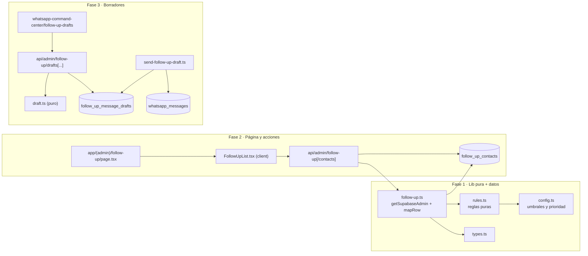

# Design: Lista diaria de pacientes a contactar (Clara ligera)

## Contexto y objetivo

Este documento fija las decisiones técnicas del change
`clara-daily-contact-list` (issue #89) para las tres fases: segmentación
determinista, página con acciones manuales y borradores de mensaje con
aprobación humana. La capability nueva es `follow-up` y su contrato normativo es
`specs/follow-up/spec.md` (16 requirements, 48 escenarios). El diseño es
**aditivo**: no altera tablas, rutas ni contratos existentes.

Principios que gobiernan el diseño (AGENTS.md + `proposal.md`):

- El LLM **no** participa en esta entrega. La segmentación es por reglas puras y
  los borradores son deterministas por plantilla.
- **Nunca envío automático**: ningún cron, queue ni job envía un borrador.
- El backend decide y ejecuta; el transporte saliente se reutiliza server-only.
- Todo instante nuevo se persiste como `timestamptz` y se presenta en
  `America/Mexico_City` (`src/lib/admin/clinic-time.ts`).

Toda ruta y firma citada aquí fue verificada leyendo el código de este worktree.

---

## Alcance verificado en código

| Elemento | Estado verificado |
|---|---|
| `src/lib/admin/clinic-time.ts` | `clinicDayRange(now)` y `trailingDaysRange(now, days)` ya existen y operan en `America/Mexico_City`. **No** existe un helper de "clave de día" (`YYYY-MM-DD`). |
| `src/lib/admin/treatment-plans.ts` | Patrón `SELECT_COLUMNS` + `mapRow` snake→camel + errores `NotFoundError`/`ValidationError`. `treatment_plans.status` usa el enum `treatment_plan_status` y `updated_at` existe. |
| `src/lib/admin/clinical-visits.ts` | `clinical_visits.created_at` existe; `SELECT_COLUMNS` y `mapRow` siguen el mismo patrón. |
| `src/lib/admin/patients.ts` | `listPatients`, `searchPatients`, `createPatient`, `updatePatient`, `deletePatient`. **No** existe `getPatient(id)`. Columnas: `full_name`, `phone_e164` (nullable desde 0011). |
| `src/lib/admin/accounts-receivable.ts` | Precedente de **lectura masiva + agrupación en memoria** (`groupByPatient`, `fetchPatients(ids)`) en vez de N+1. |
| `app/api/admin/_lib/` | `requireUser`, `handleAdminRequest`, `parseJsonBody`, `UnauthorizedError`. Mapeo de errores a 401/400/404/409/500. |
| `app/api/admin/appointments/route.ts` | Patrón de `GET`/`POST` de colección; `route.test.ts` con Supabase/auth mockeados. |
| `supabase/migrations/0018_appointment_reminders.sql` | Patrón RLS: `ENABLE` + `FORCE`, `REVOKE ALL` de `anon`/`authenticated`, `GRANT` a `authenticated`, policy `*_admin_all FOR ALL TO authenticated USING ((SELECT auth.uid()) IS NOT NULL)`. |
| `supabase/migrations/down/0018_*.down.sql` | Down en orden índices → tabla → enum. |
| `src/lib/whatsapp/client.ts` | `sendWhatsAppTemplateMessage` (HSM Meta, `es_MX`, degrada a `{ ok:false, skipped:true }` sin credenciales). |
| `src/lib/payments/send-payment-reminder.ts` | Precedente de envío HSM server-only idempotente por clave (`reminder_key`). |
| `src/lib/whatsapp/store.ts` | `insertWhatsAppOutboundMessage` usa `whatsapp_messages.whatsapp_message_id` UNIQUE + `ignoreDuplicates`; `whatsapp_messages` exige `conversation_id` y `contact_id` NOT NULL. |
| `app/(admin)/appointments/new/page.tsx` | Server component de 18 líneas que renderiza `<BookingWizard mode="internal" />`. **No** lee `searchParams`. |
| `src/components/booking/BookingWizard.tsx` | Firma `{ mode, siteKey? }`. **No** acepta paciente inicial. `ConfirmStep` sí sabe preseleccionar vía `PatientSearch` → `handleSelectPatient`. |
| `app/(admin)/whatsapp-command-center/` | Rutas `contacts`, `conversations`, `escalations`, `payments`, `appointments`, `knowledge`. No hay superficie de seguimiento. |
| `app/(admin)/whatsapp-command-center/page.tsx` | Dashboard WCC con `sections` enlazadas; `src/lib/wcc-*.ts` es el patrón de data layer del WCC. |
| `app/(admin)/layout.tsx` | Nav admin con `navItems`; la página `follow-up` requiere entrada nueva. |

---

## Arquitectura general



Frontera de capas (misma que `treatment-plans.ts`): **puro** (`config.ts`,
`rules.ts`, `draft.ts`) no toca Supabase ni lee el reloj; **I/O** (`follow-up.ts`,
`send-follow-up-draft.ts`) usa `getSupabaseAdmin()` y recibe `now: Date`
inyectado para poder testear límites de umbral.

---

## Fase 1 — Módulo `src/lib/admin/follow-up/`

### 1.1 `src/lib/admin/follow-up/config.ts` (puro, sin I/O)

Constantes explícitas y prioridad de motivos como única fuente de verdad:

```ts
export const NO_SHOW_WINDOW_DAYS = 90;
export const STALLED_TREATMENT_DAYS = 45;
export const INACTIVE_PATIENT_MONTHS = 6;
export const INACTIVE_PATIENT_DAYS = INACTIVE_PATIENT_MONTHS * 30; // 180
export const UNANSWERED_QUOTE_DAYS = 21;

export const FOLLOW_UP_REASON_PRIORITY = [
  'no_show',
  'treatment_in_progress',
  'quote_no_response',
  'inactive',
] as const;

export const MS_PER_DAY = 24 * 60 * 60 * 1000;
```

`INACTIVE_PATIENT_MONTHS` es la constante semántica; `INACTIVE_PATIENT_DAYS`
(180) es la derivada que usan las reglas para mantener el cálculo puramente en
días (ver Decisions §D3).

### 1.2 `src/lib/admin/follow-up/rules.ts` (puro, sin Supabase, `now` inyectado)

Tipos de entrada ya extraídos (instantes ISO o `Date`), nunca filas crudas:

```ts
export type FollowUpReason =
  | 'no_show'
  | 'treatment_in_progress'
  | 'quote_no_response'
  | 'inactive';

export type FollowUpAppointment = {
  id: string;
  patientId: string;
  startAt: string;
  status: 'requested' | 'confirmed' | 'pending' | 'cancelled'
        | 'rescheduled' | 'no_show' | 'attended';
};

export type FollowUpPlan = {
  id: string;
  patientId: string;
  name: string;
  status: 'in_progress' | 'presented';
  createdAt: string;
  updatedAt: string;
};

export type FollowUpRulesInput = {
  now: Date;
  appointments: FollowUpAppointment[];
  plans: FollowUpPlan[];
  /** Última visita por paciente: created_at máximo de clinical_visits. */
  lastVisitByPatient: Map<string, string>;
};

export type FollowUpCandidate = {
  patientId: string;
  reason: FollowUpReason;
  reasonDate: string;
  reasonLabel: string;
  sourceAppointmentId: string | null;
  sourcePlanId: string | null;
};
```

Firmas de las reglas (todas puras y exportadas para test):

```ts
export function daysBetween(instantIso: string, now: Date): number;

export function isRecoverableNoShow(
  appointment: FollowUpAppointment,
  patientAppointments: FollowUpAppointment[],
  now: Date
): boolean;

export function isStalledTreatmentPlan(
  plan: FollowUpPlan,
  lastVisitCreatedAt: string | null,
  now: Date
): boolean;

export function isUnansweredQuote(plan: FollowUpPlan, now: Date): boolean;

export function isInactivePatient(
  patientId: string,
  patientAppointments: FollowUpAppointment[],
  now: Date
): boolean;

export function pickReasonForPatient(
  patientId: string,
  patientAppointments: FollowUpAppointment[],
  patientPlans: FollowUpPlan[],
  lastVisitCreatedAt: string | null,
  now: Date
): FollowUpCandidate | null;

export function buildFollowUpList(input: FollowUpRulesInput): FollowUpCandidate[];
```

Reglas exactas (mapeo 1:1 con el spec):

| Segmento | Condición | `reasonDate` |
|---|---|---|
| `no_show` | `status === 'no_show'` y `0 <= daysBetween(startAt) <= NO_SHOW_WINDOW_DAYS` y **no** existe otra cita del paciente con `startAt > noShow.startAt` y `status !== 'cancelled'` | `startAt` del no-show |
| `treatment_in_progress` | `status === 'in_progress'` y `daysBetween(lastVisitCreatedAt ?? plan.createdAt) > STALLED_TREATMENT_DAYS` | `lastVisitCreatedAt ?? plan.createdAt` |
| `quote_no_response` | `status === 'presented'` y `daysBetween(plan.updatedAt) > UNANSWERED_QUOTE_DAYS` | `plan.updatedAt` |
| `inactive` | existe al menos una cita histórica (`attended` o `startAt` en el pasado) y el máximo `startAt` entre citas **no canceladas** tiene `daysBetween > INACTIVE_PATIENT_DAYS` | `startAt` de esa cita más reciente |

Notas de borde exigidas por el spec:

- **Límite exacto 90 días incluido**: `daysBetween <= 90` (no `<`).
- **Cancelada no excluye**: una cita posterior `cancelled` no cuenta como
  "cita posterior"; `rescheduled` sí, porque su estado es `!== 'cancelled'`.
- **Plan sin visitas**: fallback a `plan.createdAt` (nunca se descarta en
  silencio).
- **Presupuesto**: `updated_at`, documentado como último cambio y **nunca**
  presentado como fecha de presentación al paciente.
- **Paciente con cita futura**: si la cita no cancelada más reciente está en el
  futuro, `daysBetween` es negativo y no califica como inactivo.
- **Deduplicación**: `buildFollowUpList` evalúa `FOLLOW_UP_REASON_PRIORITY` de
  mayor a menor por paciente y emite **una sola** entrada
  (`pickReasonForPatient`).
- **Determinismo**: orden estable por (índice de prioridad, `reasonDate` asc,
  `patientId` asc) para que la misma entrada produzca la misma lista y el mismo
  orden.

### 1.3 `src/lib/admin/follow-up/types.ts`

Tipos de dominio de la capa de datos: `FollowUpCase`, `FollowUpContact`,
`FollowUpContactStatus`, `FollowUpDraft`, `FollowUpDraftStatus`. Errores y
validación se **reutilizan** de `../errors` (`NotFoundError`, `ConflictError`) y
`../validate` (`parseUuid`, `ValidationError`); no se crea una jerarquía
paralela.

### 1.4 `src/lib/admin/follow-up/follow-up.ts` (capa I/O)

Sigue el patrón de `treatment-plans.ts`: `SELECT_COLUMNS` explícitos (nunca
`select('*')`), `mapRow` snake→camel y `getSupabaseAdmin()`.

```ts
const APPOINTMENT_COLUMNS = 'id, patient_id, start_at, status';
const PLAN_COLUMNS = 'id, patient_id, name, status, created_at, updated_at';
const VISIT_COLUMNS = 'patient_id, created_at';
const PATIENT_COLUMNS = 'id, full_name, phone_e164';
const CONTACT_COLUMNS =
  'id, patient_id, round_date, status, contacted_at, dismissed_at, note, created_by, created_at, updated_at';

export type FollowUpCase = {
  patientId: string;
  patientName: string;
  patientPhoneE164: string | null;
  reason: FollowUpReason;
  reasonLabel: string;
  reasonDate: string;
  roundDate: string;
  sourceAppointmentId: string | null;
  sourcePlanId: string | null;
};

export async function listDailyFollowUpCases(options?: { now?: Date }): Promise<FollowUpCase[]>;
export async function loadFollowUpContactsForRound(roundDate: string): Promise<FollowUpContact[]>;
export async function markFollowUpContact(input: {
  patientId: string;
  status: FollowUpContactStatus;
  note?: string | null;
  userId: string;
  now?: Date;
}): Promise<FollowUpContact>;
export function currentRoundDate(now: Date): string; // clinicDayKey
```

**Decisión de acceso a datos: lectura masiva + agrupación en memoria (no N+1).**

`listDailyFollowUpCases` ejecuta un número constante de queries, sin importar el
número de pacientes, replicando `accounts-receivable.ts`:

1. `appointments`: `id, patient_id, start_at, status` (proyección mínima) →
   agrupación en memoria con `groupByPatient`.
2. `treatment_plans` con `.in('status', ['in_progress', 'presented'])`.
3. `clinical_visits`: `patient_id, created_at` restringido a los pacientes con
   plan `in_progress` (`.in('patient_id', ids)`), reducido a
   `lastVisitByPatient: Map<string,string>`.
4. `patients` con `.in('id', candidateIds)` para nombre y teléfono.
5. `follow_up_contacts` de la ronda actual (`.eq('round_date', roundDate)`).

Luego se llama a `buildFollowUpList` (puro) y se filtran los pacientes con
estado `contacted`/`dismissed` en la ronda. `markFollowUpContact` hace
`upsert` con `onConflict: 'patient_id,round_date'` (idempotente dentro de la
ronda). El instante de contacto/descarte se calcula con `now` inyectado.

**Helper nuevo de tiempo:** se añade `export function clinicDayKey(now: Date):
string` a `src/lib/admin/clinic-time.ts` (`Intl.DateTimeFormat('en-CA', {
timeZone: 'America/Mexico_City' })` → `YYYY-MM-DD`). Es la única extensión al
archivo existente y la consumen persistencia y UI.

---

## Fase 2 — Persistencia, API y página

### 2.1 Migración `supabase/migrations/0019_follow_up_contacts.sql`

Enum idempotente con bloque `DO $$` (patrón 0001/0018) y tabla:

```sql
DO $$
BEGIN
  IF NOT EXISTS (SELECT 1 FROM pg_type WHERE typname = 'follow_up_contact_status') THEN
    CREATE TYPE follow_up_contact_status AS ENUM ('contacted', 'dismissed');
  END IF;
END
$$;

CREATE TABLE IF NOT EXISTS follow_up_contacts (
  id uuid PRIMARY KEY DEFAULT gen_random_uuid(),
  patient_id uuid NOT NULL REFERENCES patients(id) ON DELETE CASCADE,
  round_date date NOT NULL,
  status follow_up_contact_status NOT NULL,
  contacted_at timestamptz,
  dismissed_at timestamptz,
  note text,
  created_by uuid,
  created_at timestamptz NOT NULL DEFAULT now(),
  updated_at timestamptz NOT NULL DEFAULT now(),
  CONSTRAINT follow_up_contacts_unique_round UNIQUE (patient_id, round_date)
);

CREATE INDEX IF NOT EXISTS idx_follow_up_contacts_round
  ON follow_up_contacts (round_date, status);
```

- `created_by` es el `user.id` de `requireUser()` (sin FK: `auth.users` no es
  referenciable desde el schema público con service role; mismo criterio que
  `treatment_plans.created_by`).
- Trigger `follow_up_contacts_set_updated_at` con `set_updated_at()` (patrón
  0018) dentro de guarda `IF NOT EXISTS (SELECT 1 FROM pg_trigger ...)`.
- RLS **patrón 0018 exacto**: `ENABLE` + `FORCE ROW LEVEL SECURITY`,
  `REVOKE ALL ON follow_up_contacts FROM anon` y `FROM authenticated`,
  `GRANT SELECT, INSERT, UPDATE, DELETE ... TO authenticated`, y
  `CREATE POLICY "follow_up_contacts_admin_all" ON follow_up_contacts FOR ALL TO
  authenticated USING ((SELECT auth.uid()) IS NOT NULL) WITH CHECK ((SELECT
  auth.uid()) IS NOT NULL);`
- `round_date` se calcula siempre en la app con `clinicDayKey(now)`; **no** es
  columna generada porque `timezone(...)` en Postgres no es `IMMUTABLE`.

Down: `supabase/migrations/down/0019_follow_up_contacts.down.sql` →
`DROP INDEX IF EXISTS idx_follow_up_contacts_round;` → `DROP TABLE IF EXISTS
follow_up_contacts;` → `DROP TYPE IF EXISTS follow_up_contact_status;`.

### 2.2 API admin de contacto

Corte de rutas siguiendo el patrón de colecciones (`appointments/route.ts`):

| Ruta | Método | Cuerpo / respuesta |
|---|---|---|
| `app/api/admin/follow-up/route.ts` | `GET` | Lista del día `{ cases, roundDate }`; calcula `now` en el servidor. `export const dynamic = 'force-dynamic'`. |
| `app/api/admin/follow-up/contacts/route.ts` | `POST` | `{ patientId, status: 'contacted'\|'dismissed', note? }` → `201 { contact }`. |

Ambas envuelven el handler en `handleAdminRequest` y llaman `requireUser()`.
Validación nueva en `src/lib/admin/validate.ts`:
`parseFollowUpContactStatus(value)` (enum cerrado, `ValidationError` si no
coincide). Tests `route.test.ts` con mocks de auth y de
`@/lib/admin/follow-up/follow-up`.

### 2.3 Página y componentes

- `app/(admin)/follow-up/page.tsx`: server component delgado (patrón
  `appointments/new/page.tsx`) que renderiza el client component. La data se
  carga por `fetch('/api/admin/follow-up')` para conservar el patrón client-fetch
  de `accounts-receivable/page.tsx`.
- `src/components/admin/follow-up/FollowUpList.tsx` (client): agrupa por motivo,
  muestra nombre, teléfono y `reasonLabel` + `reasonDate` (formateada en
  `America/Mexico_City`), y ofrece las cuatro acciones.
- `src/components/admin/follow-up/FollowUpCaseCard.tsx` (client): una tarjeta por
  caso con botones "Marcar contactado", "Descartar" y link
  `/appointments/new?patientId=<id>`, más "Generar borrador" (Fase 3).
- `src/components/admin/follow-up/__tests__/FollowUpList.test.tsx`.

Acciones "Marcar contactado" y "Descartar" hacen `POST` a
`/api/admin/follow-up/contacts` y recargan la lista; "Agendar cita" es un
`<Link>` que **solo navega** (no crea cita ni cambia estado, como exige el spec).

### 2.4 Preselección del paciente en el wizard (cambio mínimo)

Verificado: `appointments/new/page.tsx` **no** lee `searchParams` y
`BookingWizard` **no** acepta paciente inicial. Cambio mínimo y aditivo:

1. `app/(admin)/appointments/new/page.tsx` recibe
   `searchParams: Promise<{ patientId?: string }>`, valida con `parseUuid` y, si
   hay `patientId`, obtiene el paciente server-side.
2. `src/lib/admin/patients.ts` añade
   `export async function getPatient(id: string): Promise<Patient | null>` con
   `.maybeSingle()` (reutiliza `SELECT_COLUMNS` y `mapRow` existentes).
3. `BookingWizard` acepta un prop opcional
   `initialPatient?: { id: string; fullName: string; phoneE164: string | null; email: string | null }`
   y lo pasa a `ConfirmStep`.
4. `ConfirmStep` acepta `initialPatient?` y siembra `patientId`, `phone`,
   `email` y `fullName` en el `useState` inicial, reutilizando exactamente el
   mismo estado que hoy llena `PatientSearch`.
5. `app/(admin)/layout.tsx` suma `{ href: '/follow-up', label: 'Seguimiento' }`
   a `navItems`.

Sin `initialPatient` el wizard se comporta igual que hoy (prop opcional,
cero regresión).

---

## Fase 3 — Borradores con aprobación humana

### 3.1 Migración `supabase/migrations/0020_follow_up_message_drafts.sql`

```sql
DO $$
BEGIN
  IF NOT EXISTS (SELECT 1 FROM pg_type WHERE typname = 'follow_up_draft_status') THEN
    CREATE TYPE follow_up_draft_status AS ENUM
      ('draft', 'approved', 'rejected', 'sent', 'sent_failed');
  END IF;
END
$$;

CREATE TABLE IF NOT EXISTS follow_up_message_drafts (
  id uuid PRIMARY KEY DEFAULT gen_random_uuid(),
  patient_id uuid NOT NULL REFERENCES patients(id) ON DELETE CASCADE,
  body text NOT NULL,
  template_name text NOT NULL DEFAULT 'seguimiento_paciente',
  status follow_up_draft_status NOT NULL DEFAULT 'draft',
  dedup_key text NOT NULL UNIQUE,
  provider_message_id text,
  error_message text,
  approved_by uuid,
  approved_at timestamptz,
  sent_at timestamptz,
  created_by uuid,
  created_at timestamptz NOT NULL DEFAULT now(),
  updated_at timestamptz NOT NULL DEFAULT now()
);

CREATE INDEX IF NOT EXISTS idx_follow_up_drafts_status
  ON follow_up_message_drafts (status, created_at DESC);
CREATE INDEX IF NOT EXISTS idx_follow_up_drafts_patient
  ON follow_up_message_drafts (patient_id, created_at DESC);
```

Mismo trigger `set_updated_at` y **RLS patrón 0018** con policy
`follow_up_message_drafts_admin_all`. Down:
`supabase/migrations/down/0020_follow_up_message_drafts.down.sql` (índices →
tabla → enum).

`dedup_key` = `follow-up-draft:<patientId>:<roundDate>`: garantiza un borrador
por paciente y ronda. El `UPSERT` con `onConflict: 'dedup_key'` +
`ignoreDuplicates: true` hace idempotente la generación.

### 3.2 Generación determinista: `src/lib/admin/follow-up/draft.ts` (puro)

```ts
export const FOLLOW_UP_TEMPLATE_NAME = 'seguimiento_paciente';
export const MAX_DRAFT_LENGTH = 600;

export function buildFollowUpDraft(input: {
  patientName: string;
  reason: FollowUpReason;
}): { body: string; templateName: string };

export function validateFollowUpDraftText(body: string): string; // normaliza o lanza ValidationError
```

Plantillas es-MX amables por motivo (sin diagnósticos, sin precios, sin
disponibilidad ni presión comercial):

| Motivo | Texto base |
|---|---|
| `no_show` | «Hola {nombre}, notamos que no pudimos atenderte en tu cita anterior. ¿Te gustaría agendar un nuevo espacio? Con gusto te ayudamos.» |
| `treatment_in_progress` | «Hola {nombre}, queremos dar seguimiento a tu tratamiento para que puedas continuar con tu plan. ¿Te gustaría agendar tu siguiente visita?» |
| `quote_no_response` | «Hola {nombre}, seguimos a tus órdenes para resolver cualquier duda sobre tu plan de tratamiento. Cuando quieras podemos agendar una valoración.» |
| `inactive` | «Hola {nombre}, hace tiempo que no te vemos en el consultorio. ¿Te gustaría agendar una revisión?» |

Guardrails de texto (se ejecutan **al generar y otra vez antes de enviar**):

- `trim()`, colapso de saltos de línea/espacios múltiples.
- Largo máximo 600 caracteres → `ValidationError('body', ...)`.
- Lista negra de patrones que nunca deben aparecer:
  - precios/moneda: `/\$\s?\d/`, `/\b(precio|costo|cuánto cuesta|descuento)\b/i`;
  - clínicos: `/\b(diagnóstico|receta|medicamento|antibiótico|analgésico|infección|dolor intenso)\b/i`;
  - presión comercial: `/\b(última oportunidad|oferta|promoción|urgente|ahora o nunca)\b/i`.
- Si un guardrail falla, la ruta responde `400 invalid_request` vía
  `handleAdminRequest` y **no** persiste ni envía nada.

### 3.3 Ciclo de vida y quién aprueba

```
draft ──approve──▶ approved ──send──▶ sent
  │                   │
  └──reject──▶ rejected└──send falla──▶ sent_failed
```

- **Aprueba un usuario admin autenticado** (`requireUser()`), nunca un proceso
  automático ni el LLM. `approved_by = user.id`, `approved_at = now`.
- Transiciones válidas y guardadas: `approve`/`reject` solo desde `draft`;
  `send` solo desde `approved`. Cualquier otra transición → `ConflictError`
  (409). Una fila `sent` reenviada → no-op idempotente.
- **Superficie de aprobación: el WhatsApp Command Center.** El spec exige que el
  borrador "se muestra en el WhatsApp Command Center"; se crea
  `app/(admin)/whatsapp-command-center/follow-up-drafts/page.tsx` (server
  component) + `follow-up-drafts/draft-actions.tsx` (client con botones
  Aprobar / Rechazar / Enviar) y una tarjeta de acceso en
  `app/(admin)/whatsapp-command-center/page.tsx` (array `sections`). La página
  `follow-up` ofrece "Generar borrador" (única acción de Fase 3 fuera del WCC) y
  un enlace al WCC.

### 3.4 Envío server-only: `src/lib/follow-up/send-follow-up-draft.ts`

No existe hoy una función para insertar un outbound con `conversation_id` y
`contact_id` obtenidos desde un paciente (no desde un evento inbound). Se añade:

1. `sendFollowUpDraft({ draftId, userId })`:
   - lee el borrador; exige `status === 'approved'`; re-valida el `body` con
     `validateFollowUpDraftText`.
   - resuelve el teléfono del paciente (`patients.phone_e164`); si es `null` →
     `ValidationError` (no se inventa destino).
   - asegura `whatsapp_contacts` por `phone_e164` (select + insert) y una
     `whatsapp_conversations` abierta para el contacto (select + insert). El
     contacto se crea con `source = 'manual'`; no se toca `opt_in_status` más
     allá del default `unknown`.
   - envía por `sendWhatsAppTemplateMessage({ to, templateName:
     draft.templateName, languageCode: 'es_MX', bodyParameters: [{ type:'text',
     text: firstName }] })`.
   - persiste el resultado: `sent` + `provider_message_id` + `sent_at`, o
     `sent_failed` + `error_message`.
2. Nuevo helper en `src/lib/whatsapp/store.ts`:
   `insertFollowUpOutboundMessage({ conversationId, contactId, idempotencyKey,
   body, providerMessageId?, sendResult? })`, que hace `upsert` en
   `whatsapp_messages` con `whatsapp_message_id = providerMessageId ??
   idempotencyKey`, `direction: 'outbound'`, `message_type: 'template'`,
   `payload: { purpose: 'follow_up', draftId }` e `ignoreDuplicates: true`. El
   `idempotencyKey` es `follow-up-draft:<draftId>`, así un reintento no duplica
   el saliente aunque el proveedor no devuelva id.
3. **Por qué es seguro**: el envío es una acción explícita del usuario
   autenticado (POST) que exige `status = 'approved'`; no hay cron, queue,
   webhook ni job que invoque `sendFollowUpDraft`; el flag de automatización no
   existe. Es la única escritura saliente nueva y usa el transporte y el ledger
   ya especificados por `whatsapp-inbound-automation`.

**Nota operativa (no código):** fuera de la ventana de 24 h de servicio al
cliente, Meta exige una plantilla HSM aprobada. `template_name =
'seguimiento_paciente'` debe registrarse y aprobarse en Meta antes de release;
el `body` aprobado es la vista previa determinista que el humano revisa. Esto se
declara como prerrequisito operativo, no como cambio de código.

### 3.5 API de borradores

| Ruta | Método | Cuerpo / efecto |
|---|---|---|
| `app/api/admin/follow-up/drafts/route.ts` | `GET` | Lista borradores (opcional `?status=`) para el WCC. |
| `app/api/admin/follow-up/drafts/route.ts` | `POST` | `{ patientId }` → genera y persiste borrador determinista (`201`). Idempotente por `dedup_key`. |
| `app/api/admin/follow-up/drafts/[id]/route.ts` | `PATCH` | `{ status: 'approved' \| 'rejected' }` → transición guardada. |
| `app/api/admin/follow-up/drafts/[id]/send/route.ts` | `POST` | Envía un borrador `approved` por el transporte HSM; idempotente. |

Todas con `requireUser()` + `handleAdminRequest()`. Data layer del WCC:
`src/lib/wcc-follow-up-drafts.ts` (patrón `src/lib/wcc-appointments.ts`), que
lista borradores con el nombre del paciente para renderizar en el server
component. Tests `route.test.ts` para cada ruta.

---

## Seguridad y guardrails

- **RLS**: `follow_up_contacts` (0019) y `follow_up_message_drafts` (0020) con
  `ENABLE` + `FORCE`, `REVOKE ALL` de `anon`/`authenticated` y `GRANT` a
  `authenticated`, policy `*_admin_all`. `anon` no lee ni escribe.
- **Sesión**: `requireUser()` en las 6 rutas nuevas (2 de Fase 2, 4 de Fase 3).
  El layout admin ya redirige a `/login` sin sesión (requirement "Protected
  admin routes" de `admin-panel`).
- **Service role server-only**: `getSupabaseAdmin()` se usa únicamente en
  `follow-up.ts`, `send-follow-up-draft.ts` y `wcc-follow-up-drafts.ts`, nunca en
  componentes client. Los client components solo llaman a las rutas API.
- **Guardrails de texto**: `validateFollowUpDraftText` (largo máximo + lista
  negra) en generación y en envío. Sin diagnósticos, prescripciones, precios ni
  disponibilidad inventada.
- **Sin envío automático**: no existe ruta cron para borradores; el envío exige
  sesión + `status = 'approved'`.
- **Sin secretos en cliente**: los componentes no conocen `SUPABASE_*` ni
  `WHATSAPP_*`; el transporte es server-only.

---

## Decisiones y trade-offs

**D1. Ronda modelada como columna `follow_up_date`/`round_date date` derivada en
app, con `UNIQUE (patient_id, round_date)`** — porque el día calendario en
`America/Mexico_City` no es expresable como columna generada (la conversión de
zona no es `IMMUTABLE` en Postgres) y una clave derivada en app permite `upsert`
idempotente por ronda. Alternativa descartada: guardar `contacted_at` y filtrar
por rango de día con `clinicDayRange` en cada lectura; obliga a comparar rangos
en vez de igualdad y dificulta un índice único que impida duplicados de ronda.

**D2. Lectura masiva + agrupación en memoria en vez de N+1** — porque una
consulta por paciente multiplicaría round-trips y el precedente
`accounts-receivable.ts` ya resolvió el mismo patrón para toda la cartera.
Alternativa descartada: N+1 por paciente "por claridad"; se descarta por costo y
porque rompe el patrón del repo. Evolución futura: vista/RPC
`patient_last_appointment` si `appointments` crece.

**D3. `INACTIVE_PATIENT_DAYS = INACTIVE_PATIENT_MONTHS * 30` (180) en vez de
aritmética de meses calendario** — porque mantiene las cuatro reglas puramente
en días, sin ambigüedad de zona horaria ni longitud de mes, y es directamente
testeable en el límite. Alternativa descartada: `monthsBetween` con calendario
UTC; introduce casos borde (31 vs 30 días, DST) sin valor para el umbral. La
limitación se documenta en el spec.

**D4. Superficie de aprobación: página nueva
`whatsapp-command-center/follow-up-drafts`** — porque el spec exige el WCC y el
borrador es por paciente, no por conversación. Alternativa descartada: embeber la
acción en `conversations/[id]/page.tsx`; exigiría resolver la conversación del
paciente (que puede no existir) y mezcla el ciclo del borrador con el historial.
Queda como mejora futura enlazar el borrador a su conversación.

**D5. Envío por plantilla HSM (`sendWhatsAppTemplateMessage`) en vez de texto
libre** — porque el seguimiento es proactivo y suele caer fuera de la ventana de
24 h, donde Meta solo permite plantillas aprobadas; además es el patrón ya usado
por `sendPaymentReminder`. Alternativa descartada: `sendWhatsAppTextMessage`
(texto libre); fallaría con Meta fuera de ventana y no es el precedente del
repo.

**D6. Extender `src/lib/whatsapp/store.ts` con
`insertFollowUpOutboundMessage` en vez de reutilizar `insertWhatsAppOutboundMessage`**
— porque este último exige un `PersistedWhatsAppInboundEvent` (evento inbound) y
el seguimiento no proviene de un inbound. Alternativa descartada: fabricar un
`persisted` sintético; acopla el seguimiento a la forma del evento inbound y
confunde la semántica del ledger.

**D7. `dedup_key` `follow-up-draft:<patientId>:<roundDate>` con `UPSERT
ignoreDuplicates`** — porque hace idempotente "generar borrador" por paciente y
ronda y evita duplicados si el usuario hace doble clic. Alternativa descartada:
un `UNIQUE (patient_id, created_at::date)`; el cast no es `IMMUTABLE` y no
aplica.

**D8. Preselección del wizard vía prop `initialPatient` server-side** — porque
`ConfirmStep` ya tiene el estado exacto que llena `PatientSearch` y sembrarlo
desde props es aditivo y testeable. Alternativa descartada: pre-llenar el input
de `PatientSearch`; el usuario tendría que elegir de nuevo y no cumple
"preseleccionable".

**D9. `currentRoundDate`/`clinicDayKey` en `clinic-time.ts` en vez de duplicar
`Intl.DateTimeFormat`** — porque centraliza la zona `America/Mexico_City` en un
solo módulo ya reutilizado por el panel. Alternativa descartada: formatear inline
en cada capa; duplicaría la zona y arriesga divergencias.

**D10. Guardrails de texto en código puro, no con constraints de BD** — porque
el cuerpo del borrador es texto libre y la lista negra evoluciona sin migración;
además el spec pide "reglas simples". Alternativa descartada: `CHECK` en
Postgres; rígido, no expresa patrones con claridad y obligaría a migrar para
ajustarlo.

**D11. Dos migraciones (`0019` y `0020`) en vez de una** — porque cada fase es
un PR apilado independiente y las tablas son de ciclos de vida distintos
(contacto por ronda vs borrador con aprobación). Alternativa descartada: una
migración `0019` con ambas tablas; acopla el rollback de la Fase 3 al de la Fase
2.

---

## Plan de pruebas (mapeo escenario → archivo)

Runner: Vitest (`npm run test`). Patrón de mock de Supabase de
`src/lib/citas/__tests__/send-appointment-reminder.test.ts` y de rutas de
`app/api/admin/appointments/route.test.ts`.

| Escenario del spec | Archivo | Tipo |
|---|---|---|
| No-show: dentro de ventana, límite exacto 90, cita posterior no cancelada, solo canceladas posteriores | `src/lib/admin/follow-up/__tests__/rules.test.ts` | unit puro |
| Tratamiento inconcluso: >45 días, ≤45 días, sin visitas usa `created_at` | `src/lib/admin/follow-up/__tests__/rules.test.ts` | unit puro |
| Inactivo: 8 meses, 2 meses, cita futura | `src/lib/admin/follow-up/__tests__/rules.test.ts` | unit puro |
| Presupuesto: >21 días, ≤21, estado no `presented` | `src/lib/admin/follow-up/__tests__/rules.test.ts` | unit puro |
| Deduplicación y prioridad (no-show > inconcluso > presupuesto > inactivo) | `src/lib/admin/follow-up/__tests__/rules.test.ts` | unit puro |
| Determinismo: misma entrada → misma salida y orden; umbrales configurables | `src/lib/admin/follow-up/__tests__/rules.test.ts` | unit puro |
| Exclusión por contacto/descarte en la ronda; ronda anterior no excluye | `src/lib/admin/follow-up/__tests__/follow-up.test.ts` | unit con Supabase mockeado |
| Queries masivas (sin N+1) y filtros por ronda | `src/lib/admin/follow-up/__tests__/follow-up.test.ts` | unit con mocks |
| `clinicDayKey` en `America/Mexico_City` (cruce de medianoche UTC) | `src/lib/admin/__tests__/clinic-time.test.ts` (extender) | unit puro |
| Borradores: plantilla por motivo, sin precios/diagnósticos, largo máximo, lista negra | `src/lib/admin/follow-up/__tests__/draft.test.ts` | unit puro |
| `GET/POST /api/admin/follow-up` y `POST .../contacts` (401, 201, 400) | `app/api/admin/follow-up/route.test.ts`, `app/api/admin/follow-up/contacts/route.test.ts` | ruta |
| Transiciones de borrador (approve/reject; send solo desde approved; conflictos) | `app/api/admin/follow-up/drafts/[id]/route.test.ts` | ruta |
| Idempotencia de envío y `sent_failed` visible | `src/lib/follow-up/__tests__/send-follow-up-draft.test.ts` | unit con mocks |
| Página WCC lista borradores y expone acciones | `app/(admin)/whatsapp-command-center/follow-up-drafts/page.test.tsx` | componente |
| Lista agrupada y acciones manuales; "Agendar" solo navega | `src/components/admin/follow-up/__tests__/FollowUpList.test.tsx` | componente |

Verificación global (`openspec/config.yaml`): `npm run test`,
`npx tsc --noEmit`, `npm run lint`, `npm run build`. TDD activo: RED → GREEN →
triangular.

---

## Forecast de tamaño y PRs apilados

| Fase | PR | Archivos nuevos/modificados | Líneas aprox. |
|---|---|---|---|
| Fase 1 | PR 1 | `config.ts`, `rules.ts`, `follow-up.ts`, `types.ts`, `clinic-time.ts` (+helper), `__tests__/*` | ~850–950 |
| Fase 2 | PR 2 | `0019_*.sql` + down, `api/admin/follow-up/route.ts` + test, `api/admin/follow-up/contacts/route.ts` + test, `app/(admin)/follow-up/page.tsx`, `components/admin/follow-up/*` + test, `patients.ts` (+`getPatient`), `appointments/new/page.tsx`, `BookingWizard.tsx`, `ConfirmStep.tsx`, `layout.tsx`, `validate.ts` | ~800–900 |
| Fase 3 | PR 3 | `0020_*.sql` + down, `draft.ts` + test, `send-follow-up-draft.ts` + test, `store.ts` (+helper), `api/admin/follow-up/drafts/route.ts` + test, `drafts/[id]/route.ts` + test, `drafts/[id]/send/route.ts` + test, `wcc-follow-up-drafts.ts`, `whatsapp-command-center/follow-up-drafts/*`, `whatsapp-command-center/page.tsx` | ~1000–1150 |

Cada PR es incremental y desplegable por separado: Fase 1 no cambia
comportamiento observable (solo módulo puro), Fase 2 introduce la tabla `0019` y
la página, Fase 3 introduce `0020` y el envío aprobado.

---

## Riesgos

- **Falsos positivos de segmentación** (mitigado por umbrales configurable,
  reglas puras con casos borde y descarte manual).
- **Lista excesiva** (mitigado por deduplicación por paciente y estado de
  contacto por ronda).
- **Plantilla HSM no aprobada en Meta** bloquea el envío real; la UI muestra
  `sent_failed` con `error_message`. Es prerrequisito operativo, no de código.
- **Crecimiento de `appointments`/`clinical_visits`** degrada la lectura masiva;
  mitigación futura: vista/RPC de última cita por paciente (fuera de alcance).
- **`created_by`/`approved_by` sin FK** a `auth.users`: se acepta el mismo
  criterio que `treatment_plans.created_by`; la auditoría es por `user.id`.

## Fuera de alcance

Agente autónomo de Clara, envío automático/masivo, configuración de umbrales
desde UI, diagnósticos/consejos/precios por WhatsApp, cambios al motor de reserva
(más allá de la preselección), path Eve, y cualquier modificación en
`travelhub-app`.
