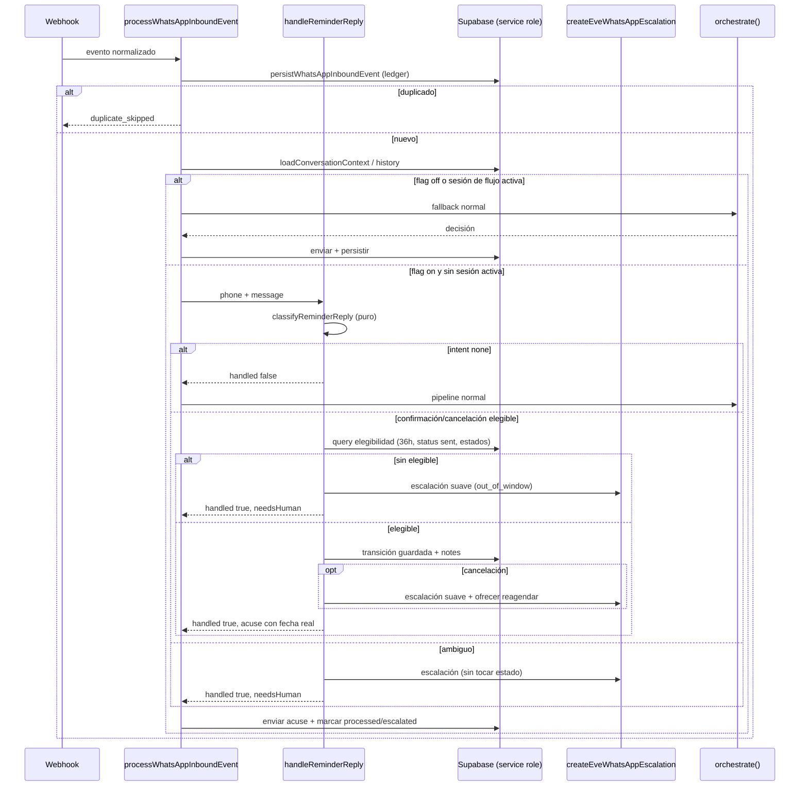

# Design: Confirmación de cita en un toque desde el recordatorio

## Contexto y objetivo

Este documento fija las decisiones técnicas para cerrar el ciclo de los
recordatorios de #86: interpretar de forma **determinista** la respuesta entrante
del paciente (confirmar / cancelar / ambiguo), aplicar transiciones de estado
acotadas, responder con la fecha y hora reales de la cita, dejar rastro auditable
y escalar a humano cuando corresponde. El LLM interpreta lenguaje; el backend
valida y ejecuta (`openspec/config.yaml` → `rules.design`). Este diseño cubre el
path **flow-engine/legacy**; el path Eve queda fuera de alcance.

Toda ruta y firma citada aquí fue verificada leyendo el código en este worktree.

---

## Decisiones

### 1. Módulo nuevo para respuesta a recordatorio (separación puro / I/O)

Se crean tres archivos bajo `src/lib/citas/`, más un helper de flag:

| Archivo | Rol | Contenido |
|---|---|---|
| `src/lib/citas/reminder-reply.ts` | **Puro** (sin I/O, sin `Date.now()` implícito) | Clasificación de intención, detección de ambigüedad clínica, elegibilidad, rastro, constantes de ventana. |
| `src/lib/citas/reminder-reply-messages.ts` | **Puro** | Plantillas deterministas es-MX con fecha/hora reales. |
| `src/lib/citas/reminder-reply-service.ts` | **I/O** | Query de elegibilidad, transición guardada, escalación, orquestación `handleReminderReply`. |
| `src/lib/citas/reminder-reply-flag.ts` | **Puro** | Lectura del feature flag (espejo de `src/lib/whatsapp/eve-flag.ts`). |

Contratos propuestos (nombres en inglés):

```ts
// src/lib/citas/reminder-reply.ts
export type ReminderReplyIntent = 'confirmation' | 'cancellation' | 'ambiguous' | 'none';

export const REMINDER_REPLY_WINDOW_HOURS = 36;
export const CONFIRM_ALLOWED_FROM = ['requested', 'pending'] as const;
export const CANCEL_ALLOWED_FROM = ['requested', 'pending', 'confirmed'] as const;

export function classifyReminderReply(message: string): ReminderReplyIntent;
export function isReminderReplyConfirmation(message: string): boolean;
export function isReminderReplyCancellation(message: string): boolean;
export function hasClinicalAmbiguity(message: string): boolean;

export function normalizePhoneValue(phone: string): string;
export function reminderReplyWindowStart(now: Date): Date;

export type ReminderReplyCandidate = {
  reminderId: string;
  appointmentId: string;
  sentAt: string;
  appointmentStatus: 'requested' | 'pending' | 'confirmed' | 'cancelled' | 'rescheduled' | 'no_show' | 'attended';
  patientName: string;
  patientPhoneE164: string;
  startAt: string;
  endAt: string;
  notes: string | null;
};

export function isEligibleReminderReplyCandidate(
  candidate: ReminderReplyCandidate,
  input: { phone: string; now: Date; to: 'confirmed' | 'cancelled' }
): boolean;
export function pickEligibleReminderReplyCandidate(
  candidates: ReminderReplyCandidate[],
  input: { phone: string; now: Date; to: 'confirmed' | 'cancelled' }
): ReminderReplyCandidate | null;

export function buildReminderReplyNotesEntry(input: {
  to: 'confirmed' | 'cancelled';
  occurredAt: Date;
  reasonText?: string;
}): string;
export function appendReminderReplyNotes(existing: string | null, entry: string): string;
```

Reglas puras clave:
- Elegibilidad de confirmación: `sentAt` dentro de `[now - 36h, now]`, estado en
  `CONFIRM_ALLOWED_FROM`. Elegibilidad de cancelación: mismos límites de ventana,
  estado en `CANCEL_ALLOWED_FROM`.
- `pickEligibleReminderReplyCandidate` elige el `sentAt` más reciente; en empate,
  el `startAt` más próximo (determinista, sin depender del orden de la query).
- El núcleo puro **nunca** lee `process.env` ni Supabase; recibe `now` y `phone`.

### 2. Punto exacto de inserción en el pipeline

**Decisión:** el pre-chequeo vive en `src/lib/whatsapp/inbound-service.ts`, dentro
de `processWhatsAppInboundEvent`, **después** de
`store.loadConversationContext` / `store.loadConversationHistory` y **antes** del
branch `if (isFlowEngineEnabled())` que rutea a `processWithFlowEngine` /
`processWithLegacy` (línea ~265 del archivo actual). Un solo punto de inserción
cubre ambos paths, como exige el delta `whatsapp-inbound-automation`.

Secuencia:

```ts
if (
  isReminderReplyEnabled() &&
  event.messageType === 'text' &&
  event.body &&
  !isFlowSessionActive(conversation.flowState ?? null, new Date())
) {
  const reminderReply = await handleReminderReply({ phone: event.fromPhone, message: event.body, persisted });
  if (reminderReply.handled) {
    const customerSend = await sendAndPersist({
      store, persisted, to: event.fromPhone, body: reminderReply.responseText,
      purpose: reminderReply.needsHuman ? 'customer_escalation' : 'auto_answer', sendText,
    });
    await store.updateConversationSummary({ conversationId: persisted.conversationId, summary: buildConversationSummary(conversation.summary, event.body, reminderReply.outcome) });
    await store.markInboundMessageProcessed({ messageId: persisted.messageId, status: reminderReply.needsHuman ? 'escalated' : 'responded' });
    return { providerMessageId: event.providerMessageId, action: reminderReply.needsHuman ? 'needs_human' : 'auto_answer', decision: buildReminderReplyDecision(reminderReply), customerSend };
  }
}
```

- **Gate por flag:** la primera condición es `isReminderReplyEnabled()`.
- **Precedencia de sesión:** `isFlowSessionActive(flowState, now)` se decide
  ANTES de cualquier I/O de recordatorio y con prioridad sobre el flag de path.
  Se exporta desde `src/lib/whatsapp/orchestrator.ts` como
  `export function isFlowSessionActive(flowState: FlowState | null, now: Date): boolean`
  (reutilizable por `orchestrate`), con la misma semántica que hoy tiene el bloque
  privado: `flowState != null && flowState.name !== 'complete' && !isFlowExpired(flowState, now)`
  y `FLOW_TIMEOUT_MINUTES = 30` (`src/lib/whatsapp/orchestrator.ts:42`).
  Se exportan también `isFlowExpired` y `FLOW_TIMEOUT_MINUTES` para reutilizar sin
  duplicar la constante.
- **Corto-circuito vs delega:** si `handleReminderReply` devuelve `handled: false`
  el mensaje sigue intacto hacia `orchestrate()` / `processWithLegacy`. Si
  devuelve `handled: true`, el hook cierra el turno (responde acuse o escalación)
  y no se llama al orquestador, evitando que el clasificador general reclasifique
  la respuesta.
- **Por qué no dentro de `processWithFlowEngine`:** haría falta duplicar el hook
  en `processWithLegacy`; el dispatch único cumple el requisito del spec y respeta
  que la sesión activa gane en cualquier path.
- La idempotencia por ledger ya ocurre antes: `persistWhatsAppInboundEvent`
  devuelve `inserted: false` y `processWhatsAppInboundEvent` retorna
  `duplicate_skipped` sin llegar al hook.

### 3. Query de elegibilidad

**Decisión:** en `src/lib/citas/reminder-reply-service.ts`, comenzar desde
`appointment_reminders` (que concentra `sent_at` y `status`) con embeds anidados;
el emparejamiento de teléfono se resuelve en JS replicando la normalización de la
BD.

```ts
const REMINDER_REPLY_SELECT =
  'id, appointment_id, sent_at, ' +
  'appointments!inner(id, patient_id, start_at, end_at, status, notes, ' +
  'patients!inner(full_name, phone_e164))';

const { data, error } = await getSupabaseAdmin()
  .from('appointment_reminders')
  .select(REMINDER_REPLY_SELECT)
  .eq('status', 'sent')
  .eq('dry_run', false)
  .gte('sent_at', reminderReplyWindowStart(now).toISOString())
  .in('appointments.status', ['requested', 'pending', 'confirmed'])
  .order('sent_at', { ascending: false })
  .limit(10);
```

Notas de exactitud:
- `appointment_reminders.status` es el enum `appointment_reminder_status`
  (`scheduled | sent | failed`, `0018_appointment_reminders.sql`); `sent_at` sólo
  se escribe cuando hay `provider_message_id`, y las filas dry-run quedan en
  `scheduled`. Filtrar `status = 'sent'` + `dry_run = false` excluye recordatorios
  simulados y fallidos.
- `patients.phone_e164` (UNIQUE, `0001_agenda_tables.sql`) se compara con
  `normalizePhoneValue(event.fromPhone)`, espejo JS de
  `normalize_whatsapp_phone` (`0006_whatsapp_inbound_command_center.sql:10`:
  `regexp_replace(coalesce(phone,''), '\D','','g')`), porque PostgREST no puede
  invocar la función SQL en un filtro `.eq`. `whatsapp_conversations` **no** tiene
  columna de teléfono; el teléfono vive en `whatsapp_contacts.phone_e164`. Se
  pasa `event.fromPhone` (ya disponible) y, opcionalmente, `persisted.contactId`
  como fast-path usando `whatsapp_contacts.linked_patient_id` (resuelto por el
  trigger `set_whatsapp_contact_linked_patient` con la misma normalización).
- La query acota por ventana y estado de cita en PostgREST; el filtro de teléfono
  y la elegibilidad final se aplican con `pickEligibleReminderReplyCandidate`.
- **RLS/service-role:** `appointment_reminders`, `appointments` y `patients`
  tienen RLS forzado con policies sólo para `authenticated`; el pipeline usa
  `getSupabaseAdmin()` (service role, `BYPASSRLS`, ver `0003_agenda_rls.sql`), por
  eso la lectura funciona sin añadir policies ni migración. La escritura sigue la
  misma vía.

### 4. Helper de transición de estado (append a `notes`)

**Decisión:** nuevo `src/lib/citas/appointment-status.ts` con un update
status-only, porque `updateAppointment` (`src/lib/admin/appointments.ts:214`) exige
un `AppointmentInput` completo y sobrescribiría la fila.

```ts
export type ReminderReplyTransitionResult =
  | { ok: true; status: 'confirmed' | 'cancelled' }
  | { ok: false; reason: 'not_found' | 'ineligible_status' };

export async function transitionAppointmentFromReminder(input: {
  appointmentId: string;
  to: 'confirmed' | 'cancelled';
  reasonText?: string;
  occurredAt: Date;
}): Promise<ReminderReplyTransitionResult>;
```

Implementación:
1. Leer `id, status, notes` de `appointments` con `.maybeSingle()`; si no existe →
   `{ ok:false, reason:'not_found' }`.
2. Si `status` es terminal o no está en el set permitido (`CONFIRM_ALLOWED_FROM`
   para `confirmed`; `CANCEL_ALLOWED_FROM` para `cancelled`) → `{ ok:false, reason:'ineligible_status' }`
   sin escribir (idempotente: una cita ya `confirmed`/`cancelled` no se revierte).
3. Calcular `notes` con `appendReminderReplyNotes(existing, buildReminderReplyNotesEntry(...))`.
4. `UPDATE appointments SET status = to, notes = ? WHERE id = ? AND status IN (allowed)`;
   si afecta 0 filas → releer y devolver `ineligible_status` (guarda de carrera).

**Formato exacto del rastro** (spec "Rastro auditable"): se usa el formato en
es-MX del `proposal.md`, que es el normativo:

```
[2026-09-05 12:30 America/Mexico_City] Confirmada desde recordatorio (quién: sistema/recordatorio)
[2026-09-05 12:30 America/Mexico_City] Cancelada desde recordatorio (quién: sistema/recordatorio). Motivo: no alcanzo, trabajo
```

- Marca de tiempo en `America/Mexico_City` con `Intl.DateTimeFormat('en-CA', { timeZone:'America/Mexico_City', year:'numeric', month:'2-digit', day:'2-digit', hour:'2-digit', minute:'2-digit', hour12:false })`, normalizada a `YYYY-MM-DD HH:mm`.
- `appendReminderReplyNotes` concatena con `' | '` (separador ya usado por
  `buildAppointmentNotes` en `inbound-service.ts`) cuando ya hay texto.
- El ejemplo del brief `[reminder-reply] confirmed_by_system at <iso>` **no** se
  usa: contradice el formato exigido por el spec (fecha local, "Confirmada /
  Cancelada desde recordatorio", "quién: sistema/recordatorio", motivo). El spec
  manda.
- `motivo` sale del texto libre del paciente solo en cancelación; se sanea
  (`.trim()`, colapsar saltos de línea, truncar a 200 chars) para no corromper
  `notes`.

### 5. Detector de ambigüedad

**Decisión:** la ambigüedad se evalúa primero (orden exigido: ambigüedad →
cancelación → confirmación):

```ts
export function classifyReminderReply(message: string): ReminderReplyIntent {
  const confirmation = isReminderReplyConfirmation(message);
  const cancellation = isReminderReplyCancellation(message);
  if (!confirmation && !cancellation) return 'none';
  if (hasClinicalAmbiguity(message)) return 'ambiguous';
  if (cancellation) return 'cancellation';
  return 'confirmation';
}
```

- `isReminderReplyConfirmation`: `detectConfirmation(message) === 'yes'` **más**
  una extensión propia `REPLY_AFFIRMATIVE = /^(1|va|ok|okay|s[ií]|confirmo|confirmar|dale|claro|por supuesto|afirmativo|yes)$/i`.
  Necesario porque `detectConfirmation` (`src/lib/flows/flow-control.ts:52`) no
  reconoce `"1"` ni `"va"`, que el spec sí exige.
- `isReminderReplyCancellation`: `detectCancellation(message) === true` **más**
  `REPLY_CANCELLATION = /\b(no puedo|no podr[eé]|no asistir[eé]?|no voy a poder|no alcanzo|cancelar|cancelo)\b/i`.
  Necesario porque `detectCancellation` usa `CANCEL_PATTERNS` con
  `\b(no quiero|ya no|...)\b` y **no** captura `"no puedo"`.
- `hasClinicalAmbiguity`: patrón propio que **extiende** los clínicos de
  `src/lib/whatsapp/eve-escalation.ts` (`CLINICAL_URGENT` /
  `HIGH_PRIORITY`, hoy privados):

  ```ts
  const CLINICAL_AMBIGUITY = /\b(dolor|duele|duel[ea]|urgenc|emergenc|infecci[oó]n|hinchaz[oó]n|sangrado|alerg|medicament|receta|antibi[oó]tico|analg[eé]sico)\b/i;
  ```

  Se añade `duele|dolor` genérico porque `CLINICAL_URGENT` exige
  `dolor\s+(fuerte|intenso|insoportable)` y el escenario del spec dice
  `"sí, me duele mucho"`, que no matchearía. `eve-escalation.ts` no se modifica en
  este cambio; la extensión vive en `reminder-reply.ts` y se documenta como
  candidata a unificación futura.
- Si el mensaje trae señal clínica pero **ni** confirmación **ni** cancelación, el
  clasificador devuelve `'none'` y el pipeline general escala por sí mismo
  (`classifyIntentSimple` mapea `dolor|urgencia|infección|...` a `support` →
  `needs_human`).

### 6. Mensajes de respuesta

**Decisión:** plantillas **deterministas** es-MX, sin LLM, en
`src/lib/citas/reminder-reply-messages.ts`, leyendo fecha y hora reales de la
cita con helpers existentes (`formatClinicDateLabel` de
`src/lib/citas/send-appointment-reminder.ts` y `clinicTimeLabel` de
`src/lib/admin/timezone.ts`):

```ts
export function buildReminderConfirmationAck(a: { startAt: string; patientName?: string }): string;
export function buildReminderCancellationAck(a: { startAt: string }): string;
export function buildReminderAmbiguityReply(): string;
export function buildReminderOutOfWindowReply(): string;
export function buildReminderAlreadyConfirmedReply(a: { startAt: string }): string;
```

Textos base:
- Confirmada: `"¡Listo! Tu cita quedó confirmada para el <fecha larga> a las <hora>. Te esperamos."`
- Cancelada: `"Entendido, cancelamos tu cita del <fecha larga> a las <hora>. Una persona del consultorio te contactará para reagendar."`
- Ambigua: `"Gracias por avisarnos. Para cuidarte bien, una persona del consultorio revisará tu mensaje y te dará seguimiento."`
- Fuera de ventana: `"Gracias por escribirnos. Una persona del consultorio revisará tu mensaje y te dará seguimiento."`

La escalación suave por cancelación **ofrece reagendar** en el texto al paciente y
en la alerta humana, reutilizando `createEveWhatsAppEscalation` (ver §4 del
proposal). No existe hoy un flujo automático de reagenda en el path WhatsApp
(`src/lib/flows/definitions/` sólo contiene `book-appointment.flow.ts`), así que
la oferta es textual y el reagendado real queda en manos de recepción o del flujo
de reserva existente; esto se declara explícitamente como no-goal de automatizar.

### 7. Fuera de ventana y sin coincidencia

- **Intención `'none'`** (no es confirmación ni cancelación): `handled: false`; el
  mensaje sigue el pipeline normal sin tocar estado. Es el caso "sin match" que el
  brief pide dejar intacto.
- **Intención confirmación/cancelación con cita elegible:** transición + acuse.
- **Intención confirmación/cancelación sin cita elegible** (fuera de ventana, sin
  recordatorio reciente, teléfono sin cita, o estado terminal): **no** se toca
  ninguna cita, **no** se aplica transición, y el módulo crea una escalación suave
  a humano vía `createEveWhatsAppEscalation` con `idempotencyKey`
  `${event.providerMessageId}:out_of_window`, prioridad `normal`, motivo
  `"Confirmación/Cancelación fuera de la ventana de recordatorio"`. El hook
  responde el texto de `buildReminderOutOfWindowReply()` y marca el mensaje como
  `escalated`.
  - **Reconciliación explícita con el brief:** el brief describe este caso como
    "normal pipeline continues untouched". Se mantiene intacto **el estado de la
    cita**, pero el mensaje se corto-circuita a escalación porque el spec (norma
    superior) exige `MUST escalar a humano`. Verificado en código:
    `classifyIntentSimple("1")` devuelve `intent: 'inquiry'` (default) y
    `handleKnowledgeQuery` responde genérico **sin** `needsHuman`; confiar en el
    pipeline no cumpliría el `MUST`. Solo la intención `'none'` deja el pipeline
    100% intacto.
- **Cita ya confirmada / ya cancelada (repetida, en ventana):** no-op sin
  transición; se responde un acuse corto ya confirmado (permitido por el spec:
  prohíbe revertir y duplicar escalación, no acusar) y **no** se duplica
  escalación.

### 8. Feature flag

- Nombre exacto: **`WHATSAPP_REMINDER_REPLY_ENABLED`**. Default **off**.
- Lectura: `src/lib/citas/reminder-reply-flag.ts` con
  `export function isReminderReplyEnabled(rawValue?: string | null): boolean`,
  copiando el patrón de `src/lib/whatsapp/eve-flag.ts`
  (`TRUTHY_VALUES = new Set(['true','1','yes'])`, `trim().toLowerCase()`; todo lo
  demás y `undefined` → `false`). No se extiende el `isFlowEngineEnabled` privado
  de `inbound-service.ts:72`, que mezcla `console.log` de debug y no es
  reutilizable.
- Documentación en `.env.local.example` con `WHATSAPP_REMINDER_REPLY_ENABLED=false`
  junto a `WHATSAPP_FLOW_ENGINE_ENABLED`.
- Apagado = comportamiento idéntico al actual (el hook ni se evalúa).

### 9. Plan de pruebas (mapeo escenario → archivo)

Todos los archivos usan Vitest (`npm run test`). Patrón de mock de Supabase
reutilizado de `src/lib/citas/__tests__/send-appointment-reminder.test.ts`
(`vi.mock('@/lib/supabase/server')` + `MockQuery`).

| Escenario del spec | Archivo | Tipo |
|---|---|---|
| Clasificación positiva/negativa/ambigua; tolerancia mayúsculas/acentos; afirmativos `1/sí/confirmo/va/ok` | `src/lib/citas/__tests__/reminder-reply.test.ts` | unit puro |
| Ambigüedad clínica: `"sí, me duele mucho"`, `"no puedo, tengo una infección"`, `"ok, pero recuérdame qué medicina tomo"` → `ambiguous` | `src/lib/citas/__tests__/reminder-reply.test.ts` | unit puro |
| Ventana 36h: dentro / fuera / sin recordatorio (`isEligibleReminderReplyCandidate`) | `src/lib/citas/__tests__/reminder-reply.test.ts` | unit puro |
| Rastro en `notes` (formatos con y sin motivo) | `src/lib/citas/__tests__/reminder-reply.test.ts` | unit puro |
| Mensajes con fecha/hora reales (no inventadas) | `src/lib/citas/__tests__/reminder-reply-messages.test.ts` | unit puro |
| Flag parsing (default off; `true/1/yes` on) | `src/lib/citas/__tests__/reminder-reply-flag.test.ts` | unit puro |
| Query de elegibilidad (filtros `status='sent'`, `dry_run=false`, ventana, estados) y transición guardada por estado origen | `src/lib/citas/__tests__/reminder-reply-service.test.ts` | unit con Supabase mockeado |
| Idempotencia: confirmación repetida no revierte; cancelación repetida no duplica escalación | `src/lib/citas/__tests__/reminder-reply-service.test.ts` | unit con mocks |
| Cancelación escala y ofrece reagendar (`createEveWhatsAppEscalation` invocado una vez, con `idempotencyKey`) | `src/lib/citas/__tests__/reminder-reply-service.test.ts` | unit con mocks |
| Ambigüedad escala y no cambia estado | `src/lib/citas/__tests__/reminder-reply-service.test.ts` | unit con mocks |
| Fuera de ventana escala a humano sin tocar estado | `src/lib/citas/__tests__/reminder-reply-service.test.ts` | unit con mocks |
| Confirmación reconocida antes de clasificar (hook responde y no llama a `orchestrate`) | `src/lib/whatsapp/__tests__/inbound-service-reminder-reply.test.ts` | integración con store mockeado |
| **Issue #87 acceptance:** parse positivos/negativos/ambiguos | `src/lib/citas/__tests__/reminder-reply.test.ts` | unit |
| **Issue #87 acceptance:** `"me duele mucho"` no confirma | `src/lib/whatsapp/__tests__/inbound-service-reminder-reply.test.ts` | integración con store mockeado |
| **Issue #87 acceptance:** sesión de flow engine activa gana (no hay transición ni escalación) | `src/lib/whatsapp/__tests__/inbound-service-reminder-reply.test.ts` | integración con store mockeado |
| Flag apagado conserva el pipeline actual | `src/lib/whatsapp/__tests__/inbound-service-reminder-reply.test.ts` | integración |
| Path legacy reconoce la respuesta (`WHATSAPP_FLOW_ENGINE_ENABLED` off) | `src/lib/whatsapp/__tests__/inbound-service-reminder-reply.test.ts` | integración |
| Duplicado por ledger | ya cubierto por `persistWhatsAppInboundEvent`; se añade aserción en el test de hook | integración |

Verificación global: `npm run test`, `npx tsc --noEmit`, `npm run lint`,
`npm run build` (`openspec/config.yaml`). TDD activo (`strict_tdd: true`):
RED → GREEN → triangular.

### 10. Explícitamente fuera de alcance

- **Path Eve** (`WHATSAPP_EVE_ENABLED`): `isEveWhatsAppEnabled` está definido en
  `src/lib/whatsapp/eve-flag.ts` pero no está cableado en
  `src/lib/whatsapp/inbound-service.ts`; el hook vive en el dispatch
  flow-engine/legacy. Sin cambios al prompt ni a las tools de Eve.
- **Sin migración nueva:** se reutiliza `appointments.notes` (0007) y el enum
  `appointment_status` (0001). No se añaden columnas, tablas ni policies RLS.
- **Sin reagenda automática:** no existe flujo `reschedule_appointment`; sólo
  `rescheduleAppointment` en `src/lib/booking/reschedule.ts` (uso admin). El
  reagendado desde el recordatorio es oferta textual + escalación humana.
- **Sin cambios al envío de recordatorios** (#86) ni a la plantilla Meta.
- **Sin nuevas funciones SQL/RPC**; la normalización de teléfono se replica en JS.

---

## Flujo (secuencia)



---

## Firmas verificadas y discrepancias vs. el resumen de exploración

Verificado leyendo el código de este worktree:

1. `createEveEscalation` **no existe**; la función real es
   `createEveWhatsAppEscalation(input: CreateEveEscalationInput)` en
   `src/lib/whatsapp/eve-escalation.ts:107`.
2. `src/lib/agent/tools/reschedule-appointment.ts` **no existe**. La única ruta de
   reagenda es `rescheduleAppointment(...)` en `src/lib/booking/reschedule.ts:33`
   (admin), y no hay definición de flujo `reschedule_appointment` en
   `src/lib/flows/definitions/`.
3. `detectConfirmation(message: string): 'yes' | 'no' | null` (flow-control.ts:52)
   no reconoce `"1"` ni `"va"`; `detectCancellation(message: string): boolean`
   (flow-control.ts:41) no reconoce `"no puedo"`. Ambos requieren extensión local.
4. `updateAppointment(id: string, input: AppointmentInput)` en
   `src/lib/admin/appointments.ts:214` es full-row validado → confirma la
   necesidad del helper status-only.
5. `whatsapp_conversations` no tiene columna de teléfono; el teléfono está en
   `whatsapp_contacts.phone_e164` (0006) y la BD normaliza con
   `normalize_whatsapp_phone`.
6. `appointment_reminders.status` es `scheduled | sent | failed`; `sent_at` sólo se
   escribe con `provider_message_id` y los dry-run quedan `scheduled`.
7. `isFlowEngineEnabled` es privado e inline en `inbound-service.ts:72`; el patrón
   limpio y testeable es `src/lib/whatsapp/eve-flag.ts`.
8. `isFlowExpired` y `FLOW_TIMEOUT_MINUTES = 30` son privados en
   `orchestrator.ts`; hay que exportarlos para reutilizar la precedencia sin
   duplicar.

## Riesgos

- **Append de `notes` no atómico:** leer-y-escribir `notes` en un `UPDATE` puede
  perder una edición concurrente de recepción. Mitigación: update guardado por
  estado + aceptar el riesgo MVP; una RPC `notes = coalesce(notes,'') || ...`
  queda como mejora futura (requiere migración, hoy fuera de alcance).
- **Doble fila inbound al escalar:** `createEveWhatsAppEscalation` persiste un
  evento sintético; es idempotente por `eve:escalation:<key>` pero añade una fila
  de mensaje. Se documenta como trade-off de reutilizar el helper de escalación.
- **Falso positivo por teléfono:** la comparación normalizada puede empatar
  teléfonos distintos con el mismo prefijo de país; se acota con ventana de 36 h,
  estado elegible y `pickEligible...` determinista.
